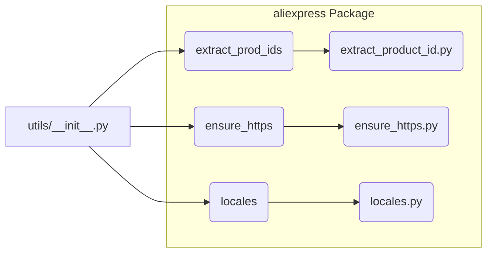

# <input code>

```python
## \file hypotez/src/suppliers/aliexpress/utils/__init__.py
# -*- coding: utf-8 -*-\
#! venv/Scripts/python.exe
#! venv/bin/python/python3.12

"""
.. module: src.suppliers.aliexpress.utils 
	:platform: Windows, Unix
	:synopsis:

"""


from .extract_product_id import extract_prod_ids
from .ensure_https import ensure_https
from .locales import locales
```

# <algorithm>

This module acts as an entry point for utility functions within the `aliexpress` supplier.  It imports necessary functions from submodules.  No complex logic or data processing is performed at this level.  It simply makes those functions available for use in other parts of the project.

**Step-by-step Algorithm (Diagrammatic):**

1. **Import Statements:** The code imports functions from submodules within the same package (`extract_prod_ids`, `ensure_https`, `locales`).
2. **Global Variable:** A global variable `MODE` is defined, likely for setting operational modes (e.g., 'dev', 'prod').

**Example Data Flow:**

```
+-----------------+       +-----------------+       +-----------------+
| Calling Module   |------>| extract_prod_ids |------>| ... (Consumer) |
+-----------------+       +-----------------+       +-----------------+
| (Needs Product IDs) |       | ...             |       |                 |
+-----------------+       +-----------------+       +-----------------+
```

**Example of Usage (IlluStartive):**

```python
# In another module:
from hypotez.src.suppliers.aliexpress.utils import extract_prod_ids

product_ids = extract_prod_ids("some_url")
```


# <mermaid>



**Dependencies Analysis:**

The mermaid diagram shows that `utils/__init__.py` imports functions from `extract_product_id.py`, `ensure_https.py`, and `locales.py`.  These are likely modules located within the same `aliexpress/utils` subdirectory.  The `__init__.py` file serves as a module's entry point for external access.


# <explanation>

* **Imports:**
    * `extract_prod_ids`: This function likely handles extracting product IDs from an AliExpress webpage.  It resides in the `extract_product_id` module, presumably within the `aliexpress` supplier package.
    * `ensure_https`: This function likely validates or converts URLs to HTTPS, a security best practice.  Located in `ensure_https` module within the same supplier's utils directory.
    * `locales`: This likely handles language localization related functionality (e.g., translating strings, handling different language variants). Located in the `locales` module.

* **Global Variable `MODE`:** This variable, assigned the string 'dev', suggests a way to switch between development and production modes.  For example, it could affect the behavior of the functions imported (e.g., different logging levels or data sources).

* **Relationship with other project parts:** The code appears to be part of a larger project focused on handling data from the AliExpress supplier, as indicated by the module path (`hypotez/src/suppliers/aliexpress`). It likely interacts with modules that need product IDs, or the secure URLs from the AliExpress site.


* **Potential Errors/Improvements:**

    * **Missing documentation:** Adding docstrings to functions (`extract_prod_ids`, `ensure_https`, and others) would significantly improve maintainability and understandability.
    * **Error Handling:**  Consider adding `try...except` blocks within the imported functions to handle potential errors during web scraping, URL validation, or localization tasks. This would prevent the program from crashing due to unexpected issues.
    * **Dependency clarity:** While not directly apparent in the given code, understanding the dependencies between the submodules (`extract_prod_ids`, `ensure_https`, and `locales`) would help with maintainability and future modification.

In summary, the provided `__init__.py` file acts as a module façade, allowing for easy access to different utility functions for use by other modules in the `aliexpress` data pipeline.  It requires further context to comprehensively analyze the entire flow and potential issues.