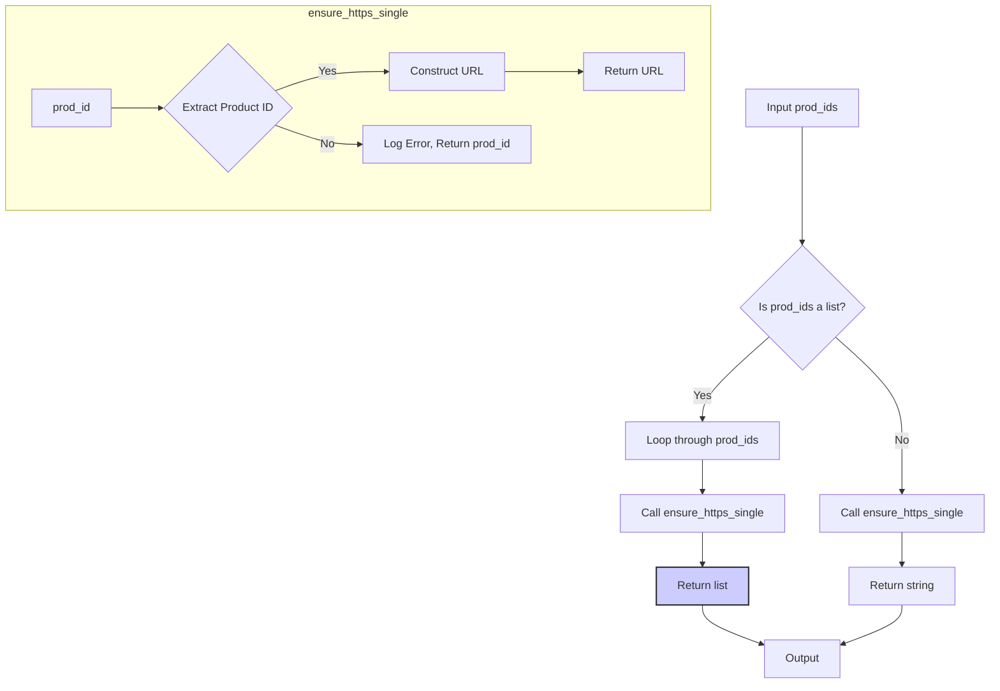

# <input code>

```python
## \file hypotez/src/suppliers/aliexpress/utils/ensure_https.py
# -*- coding: utf-8 -*-\
#! venv/Scripts/python.exe
#! venv/bin/python/python3.12

"""
.. module: src.suppliers.aliexpress.utils 
	:platform: Windows, Unix
	:synopsis: Ensures that the provided URL string(s) contain the https:// prefix. 
If the input is a product ID, it constructs a full URL with https:// prefix.

```python
# Example usage
url = "example_product_id"
url_with_https = ensure_https(url)
print(url_with_https)  # Output: https://www.aliexpress.com/item/example_product_id.html

urls = ["example_product_id1", "https://www.aliexpress.com/item/example_product_id2.html"]
urls_with_https = ensure_https(urls)
print(urls_with_https)  # Output: ['https://www.aliexpress.com/item/example_product_id1.html', 'https://www.aliexpress.com/item/example_product_id2.html']
```

"""


from src.logger import logger
from .extract_product_id import extract_prod_ids

def ensure_https(prod_ids: str | list[str]) -> str | list[str]:
    """ Ensures that the provided URL string(s) contain the https:// prefix.
    If the input is a product ID, it constructs a full URL with https:// prefix.

    Args:
        prod_ids (str | list[str]): A URL string or a list of URL strings to check and modify if necessary.

    Returns:
        str | list[str]: The URL string or list of URL strings with the https:// prefix.

    Raises:
        ValueError: If `prod_ids` is an instance of `WindowsPath`.

    Examples:
        >>> ensure_https("example_product_id")
        'https://www.aliexpress.com/item/example_product_id.html'

        >>> ensure_https(["example_product_id1", "https://www.aliexpress.com/item/example_product_id2.html"])
        ['https://www.aliexpress.com/item/example_product_id1.html', 'https://www.aliexpress.com/item/example_product_id2.html']

        >>> ensure_https("https://www.example.com/item/example_product_id")
        'https://www.example.com/item/example_product_id'
    """
    def ensure_https_single(prod_id: str) -> str:
        """ Ensures a single URL or product ID string has the https:// prefix.

        Args:
            prod_id (str): The URL or product ID string.

        Returns:
            str: The URL string with the https:// prefix.

        Raises:
            ValueError: If `prod_id` is an instance of `WindowsPath`.

        Examples:
            >>> ensure_https_single("example_product_id")
            'https://www.aliexpress.com/item/example_product_id.html'

            >>> ensure_https_single("https://www.example.com/item/example_product_id")
            'https://www.example.com/item/example_product_id'
        """
        _prod_id = extract_prod_ids(prod_id)
        if _prod_id:
            return f"https://www.aliexpress.com/item/{_prod_id}.html"
        else:
            logger.error(f"Invalid product ID or URL: {prod_id=}", exc_info=False)
            return prod_id

    if isinstance(prod_ids, list):
        return [ensure_https_single(prod_id) for prod_id in prod_ids]
    else:
        return ensure_https_single(prod_ids)
```

# <algorithm>

1. **Input:** `prod_ids` (string or list of strings).
2. **Check Type:** If `prod_ids` is a list, process each item in a loop. Otherwise, treat it as a single item.
3. **`ensure_https_single` (for single item):**
   - Extract the product ID from the input using `extract_prod_ids`.
   - **Condition:** If `extract_prod_ids` returns a valid product ID:
      - Construct the full URL `https://www.aliexpress.com/item/{extracted_id}.html` and return it.
   - **Else:** Log an error message using `logger.error` and return the original input.
4. **`ensure_https` (for list of items):**
   - Apply `ensure_https_single` to each item in the `prod_ids` list.
   - Return a new list containing the results.


# <mermaid>



**Dependencies Analysis:**

The diagram shows that `ensure_https` function depends on the `extract_prod_ids` function (which is assumed to be in the `.extract_product_id` module within the same directory) and the `logger` class (from the `src.logger` module).


# <explanation>

**Imports:**

- `from src.logger import logger`: Imports the `logger` object, likely from a logging module in a `src` package.  This allows the current script to log messages. The relationship here is crucial for maintainability and traceability of errors or informational messages within the project.


- `from .extract_product_id import extract_prod_ids`: Imports the `extract_prod_ids` function from the `extract_product_id` module within the same directory.  This suggests that this script is part of a larger project and these functions work together.

**Functions:**

- `ensure_https(prod_ids)`: Takes either a string or a list of strings representing product IDs or URLs.  It returns the same type, ensuring that all provided product IDs or URLs have the `https://` prefix.  The function smartly handles both singular and plural input, improving the robustness of the function, avoiding potential crashes or invalid results. Crucial error handling using `logger` is implemented. The function makes use of a helper function (`ensure_https_single`), demonStarting good code organization. This function is the main function for handling product IDs and URLs.


- `ensure_https_single(prod_id)`: This function handles a single product ID or URL.  It's called from `ensure_https` to maintain the logic for each input element. This modularity improves code readability and maintainability, breaking down a complex task into smaller, easier-to-understand parts.


- `extract_prod_ids(prod_id)`:  *This function is crucial but not defined in the provided code* – it's assumed to extract the product ID from the input string. This assumption is made because `extract_prod_ids` is used to build the complete URL. The function is part of the same module and appears to be a utility function that's likely to be part of the `src` packages. The code assumes this function exists and properly handles various input formats for product IDs and URLs, making the functions reusable.  

**Classes:**

The code doesn't define any classes.

**Variables:**

- `MODE`:  A global variable, likely used for different modes (e.g., development, production), with a value of 'dev'.

**Potential Errors/Improvements:**

- **Error Handling:** The `ensure_https_single` function handles cases where `extract_prod_ids` does not extract a product ID but logs an error. This is good practice.  Consider using `try-except` blocks in `extract_prod_ids` to catch potential exceptions and provide more specific error messages and handling.
- **`extract_prod_ids` Function:**  The code assumes the existence of the `extract_prod_ids` function without details on its implementation.  Ensure that this function is robust and handles various cases, like URLs that don't contain product IDs, or incorrect URL formats.
- **URL Validation:**  The code constructs URLs but does not validate the underlying structure or format of the URLs, leading to vulnerabilities like injection attacks.

**Relationships:**

This module (`ensure_https.py`) depends on `extract_product_id.py` (to extract product IDs) and `logger.py` (for logging). It's part of the `aliexpress` supplier module within the larger `hypotez` project.  This implies a larger project structure with modules for handling different suppliers' data.