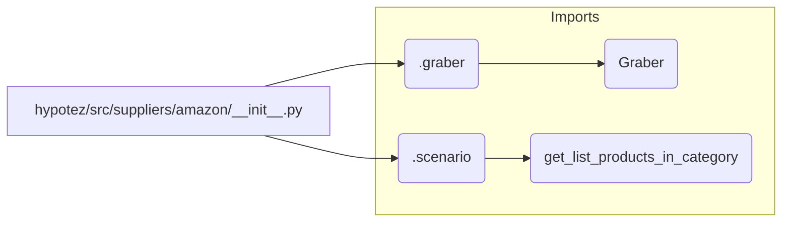

# Code Explanation for hypotez/src/suppliers/amazon/__init__.py

## <input code>

```python
## \file hypotez/src/suppliers/amazon/__init__.py
# -*- coding: utf-8 -*-
#! venv/Scripts/python.exe
#! venv/bin/python/python3.12

"""
.. module: src.suppliers.amazon 
	:platform: Windows, Unix
	:synopsis:

"""
MODE = 'dev'

from .graber import Graber
from .scenario import get_list_products_in_category
```

## <algorithm>

This file appears to be an initialization file for the Amazon supplier module within a larger project.  It imports necessary components from submodules (`graber` and `scenario`).

**Algorithm Steps:**

1. **Initialization:** Sets a variable `MODE` to 'dev'.  This likely controls configuration for development versus production.
2. **Import Statements:** Imports the `Graber` class and `get_list_products_in_category` function from the submodules.

**Data Flow:**

The algorithm is primarily importing, not performing any significant action. The data flow is limited to the import statements, effectively bringing in the necessary classes and functions for later use in other parts of the application.

```
+-----------------+       +-----------------------+       +-----------------+
|  Initialization  |------>| Import Graber         |------>|  Import           |
+-----------------+       +-----------------------+       +-----------------+
|    MODE = 'dev'   |       |       (from .graber)  |       | get_list_products  |
+-----------------+       +-----------------------+       |  (from .scenario)|
                                                           +-----------------+
```

## <mermaid>



**Dependencies Analysis:**

The mermaid diagram illuStartes the dependency structure. `__init__.py` imports `Graber` from the `graber` submodule and `get_list_products_in_category` from the `scenario` submodule. These submodules likely contain the implementation details of interacting with the Amazon API or database related to Amazon product information.


## <explanation>

* **Imports:**
    * `from .graber import Graber`: Imports the `Graber` class from the `graber` module within the `amazon` package.  This suggests that `graber` module likely handles the process of fetching data from the Amazon API or some other data source.
    * `from .scenario import get_list_products_in_category`: Imports the function `get_list_products_in_category` from the `scenario` module.  This function likely encapsulates logic for retrieving a list of products within a specific category from Amazon's inventory.

* **Variables:**
    * `MODE = 'dev'`: A global variable, likely used for conditional logic or configuration settings, distinguishing between development and production environments.

* **Classes/Functions/Methods (implied):**
    * `Graber`: A class for interacting with Amazon's services, likely containing methods for fetching product data, handling API requests, and managing potentially complex interactions with Amazon's API (or other data providers).
    * `get_list_products_in_category`: A function that accepts a category parameter (or potentially additional parameters like filters, pagination information) and returns a list of products within that category.

* **Potential Errors/Improvements:**

    * No error handling is visible.  Adding `try...except` blocks around the import statements and the calls to external services would be a crucial improvement.
    * The `MODE` variable is currently only set but not used. Consider integrating its value into the logic for choosing the relevant data sources (such as API endpoints or database connections) if intended.
    * The comments in the docstring are minimal; expand them with more details about the expected parameters, return types, and any potential exceptions raised by the functions or classes for better maintainability.


* **Relationship with other parts of the project:**

    * This file is part of a module dedicated to fetching data from the Amazon supplier (`amazon`).  Its functionality would likely be consumed by a main application file (`main.py`, for example) or some other part of the system that needs product information from Amazon. The calling application would need to import `amazon` and then call the functions exported by `scenario`, such as `get_list_products_in_category`.  The exact usage of `get_list_products_in_category` and `Graber` would be defined in those importing files.


This analysis suggests a robust data gathering component from the Amazon platform, which is an essential element of any e-commerce-related application.