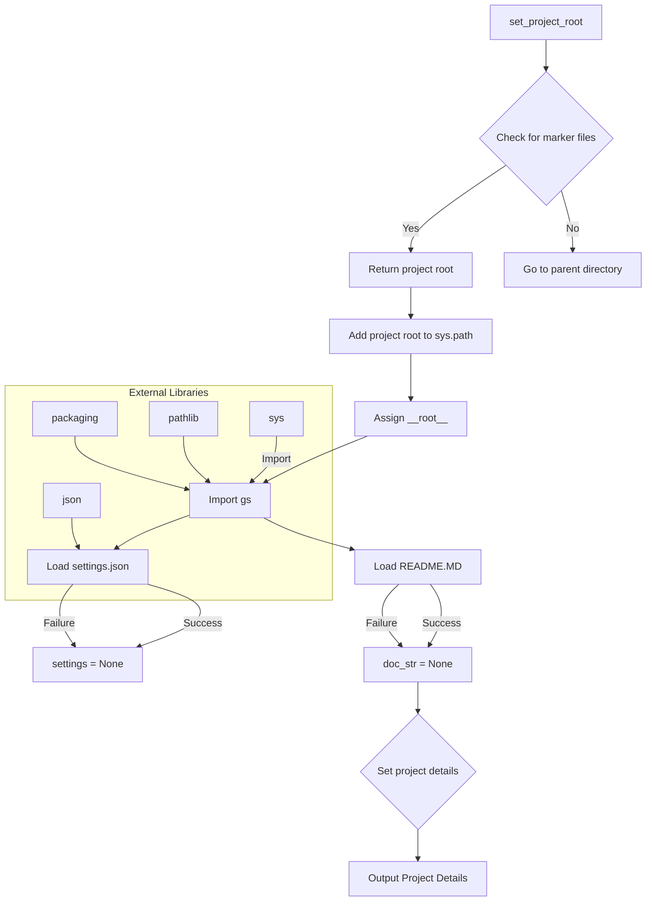

# Code Explanation for hypotez/src/suppliers/amazon/header.py

## <input code>

```python
## \file hypotez/src/suppliers/amazon/header.py
# -*- coding: utf-8 -*-
#! venv/Scripts/python.exe
#! venv/bin/python/python3.12

"""
.. module: src.suppliers.amazon 
	:platform: Windows, Unix
	:synopsis:

"""
MODE = 'dev'


import sys
import json
from packaging.version import Version

from pathlib import Path
def set_project_root(marker_files=('__root__')) -> Path:
    """
    Finds the root directory of the project starting from the current file's directory,
    searching upwards and stopping at the first directory containing any of the marker files.

    Args:
        marker_files (tuple): Filenames or directory names to identify the project root.
    
    Returns:
        Path: Path to the root directory if found, otherwise the directory where the script is located.
    """
    __root__:Path
    current_path:Path = Path(__file__).resolve().parent
    __root__ = current_path
    for parent in [current_path] + list(current_path.parents):
        if any((parent / marker).exists() for marker in marker_files):
            __root__ = parent
            break
    if __root__ not in sys.path:
        sys.path.insert(0, str(__root__))
    return __root__


# Get the root directory of the project
__root__ = set_project_root()
"""__root__ (Path): Path to the root directory of the project"""

from src import gs

settings:dict = None
try:
    with open(gs.path.root / 'src' /  'settings.json', 'r') as settings_file:
        settings = json.load(settings_file)
except (FileNotFoundError, json.JSONDecodeError):
    ...

doc_str:str = None
try:
    with open(gs.path.root / 'src' /  'README.MD', 'r') as settings_file:
        doc_str = settings_file.read()
except (FileNotFoundError, json.JSONDecodeError):
    ...


__project_name__ = settings.get("project_name", 'hypotez') if settings  else 'hypotez'
__version__: str = settings.get("version", '')  if settings  else ''
__doc__: str = doc_str if doc_str else ''
__details__: str = ''
__author__: str = settings.get("author", '')  if settings else ''
__copyright__: str = settings.get("copyrihgnt", '')  if settings else ''
__cofee__: str = settings.get("cofee", "Treat the developer to a cup of coffee for boosting enthusiasm in development: https://boosty.to/hypo69")  if settings else "Treat the developer to a cup of coffee for boosting enthusiasm in development: https://boosty.to/hypo69"
```

## <algorithm>

**Step 1:** `set_project_root()` function is called.
  * Input: A tuple of marker files (`pyproject.toml`, `requirements.txt`, `.git`).
  * Output: The Path object of the project root directory.

**Step 2:** Starting from the current file's directory, it iterates through parent directories.
  * Checks if any of the marker files exists in the current parent directory.
  * If found, it returns the parent directory as the project root.
  * If no marker files are found, the script continues to the parent directory.
* Example: If `pyproject.toml` is found in `C:/project/src/suppliers/amazon`, the function returns `C:/project`.

**Step 3:** The project root path is added to `sys.path`.
  * This allows Python to import modules from the project's root directory.

**Step 4:** `__root__` variable is assigned the result of the `set_project_root()` function, which is the path to the project root.
  * Example: `__root__ = Path("C:/project")`

**Step 5:** Modules in the project are imported using the root directory.
  * Example: `from src import gs`

**Step 6:** Attempts to load `settings.json` from the project root.
  * If successful, `settings` dictionary is populated.
  * If fails (e.g., file not found or invalid JSON), `settings` remains `None`.
* Example: if `settings.json` exists, `settings` holds the loaded data.

**Step 7:** Attempts to load `README.MD` from the project root.
  * If successful, `doc_str` string is populated.
  * If fails, `doc_str` remains `None`.

**Step 8:**  `__project_name__`, `__version__`, etc. are set based on `settings` or default values.


## <mermaid>



## <explanation>

### Imports:

* `sys`: Provides access to system-specific parameters and functions, here used to modify the Python path.
* `json`: Used for working with JSON data, crucial for loading project configuration.
* `packaging.version`: Used to manage and compare software versions reliably.
* `pathlib`: Provides object-oriented file system paths, making file handling cleaner and more robust.

### Classes:

* There are no classes defined in this code.

### Functions:

* `set_project_root(marker_files)`:
    * Takes a tuple of filenames (marker files) as input.
    * Recursively checks parent directories to find the project root based on the existence of the provided marker files.
    * Important: Adds the project root path to `sys.path` to allow import of modules from the project.  This is a vital function for maintaining project structure.

### Variables:

* `MODE`: A string variable, likely holding a project mode (e.g., 'dev', 'prod').
* `__root__`: A Path object representing the project root directory, obtained from `set_project_root`.
* `settings`: A dictionary variable, loading the project configuration from `settings.json`.
* `doc_str`: A string variable to load the project's description.
* `__project_name__`, `__version__`, `__doc__`, `__details__`, `__author__`, `__copyright__`, `__cofee__`: Project metadata variables. These are retrieved from `settings` or assigned default values if `settings` is `None`.

### Potential errors and improvements:

* **Error Handling:** The use of `try...except` blocks for loading `settings.json` and `README.MD` is good practice for handling potential `FileNotFoundError` and `json.JSONDecodeError` exceptions.  Consider adding more specific exceptions for better error reporting. For example, separate exceptions for `json.JSONDecodeError`.

* **Configuration File Structure:** The assumption that `settings.json` and `README.MD` are in the `src` folder is important. It might be beneficial to add some logic to validate the existence of these files. If the files are missing, this code needs more appropriate error handling.


### Relationships with other parts of the project:

This `header.py` file acts as an initialization and metadata-gathering script for the project.  It assumes the presence of `gs` and is dependent on `gs.path.root` and `src/settings.json` for setup.  It also depends on the other `src` modules, enabling import statements like `from src import gs`. This indicates a clear structure with module dependencies, where `header.py` prepares the environment.  Further analysis would be needed to understand the full context of the `gs` module.