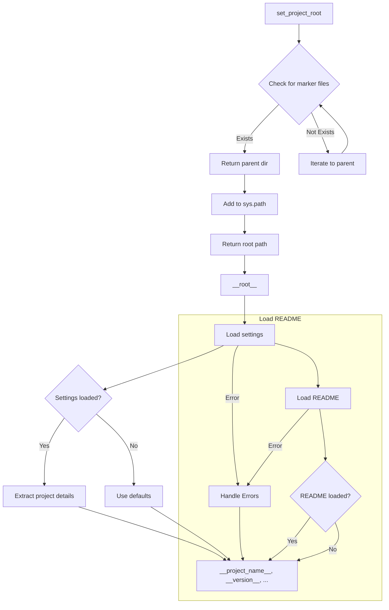

# Code Explanation for hypotez/src/suppliers/bangood/header.py

## <input code>

```python
## \file hypotez/src/suppliers/bangood/header.py
# -*- coding: utf-8 -*-\
#! venv/Scripts/python.exe
#! venv/bin/python/python3.12

"""
.. module: src.suppliers.bangood 
	:platform: Windows, Unix
	:synopsis:

"""
MODE = 'dev'


import sys
import json
from packaging.version import Version

from pathlib import Path
def set_project_root(marker_files=('pyproject.toml', 'requirements.txt', '.git')) -> Path:
    """
    Finds the root directory of the project starting from the current file's directory,
    searching upwards and stopping at the first directory containing any of the marker files.

    Args:
        marker_files (tuple): Filenames or directory names to identify the project root.
    
    Returns:
        Path: Path to the root directory if found, otherwise the directory where the script is located.
    """
    __root__:Path
    current_path:Path = Path(__file__).resolve().parent
    __root__ = current_path
    for parent in [current_path] + list(current_path.parents):
        if any((parent / marker).exists() for marker in marker_files):
            __root__ = parent
            break
    if __root__ not in sys.path:
        sys.path.insert(0, str(__root__))
    return __root__


# Get the root directory of the project
__root__ = set_project_root()
"""__root__ (Path): Path to the root directory of the project"""


from src import gs

settings:dict = None
try:
    with open(gs.path.root / 'src' / 'settings.json', 'r') as settings_file:
        settings = json.load(settings_file)
except (FileNotFoundError, json.JSONDecodeError):
    ...

doc_str:str = None
try:
    with open(gs.path.root / 'src' / 'README.MD', 'r') as settings_file:
        doc_str = settings_file.read()
except (FileNotFoundError, json.JSONDecodeError):
    ...


__project_name__ = settings.get("project_name", 'hypotez') if settings  else 'hypotez'
__version__: str = settings.get("version", '')  if settings  else ''
__doc__: str = doc_str if doc_str else ''
__details__: str = ''
__author__: str = settings.get("author", '')  if settings  else ''
__copyright__: str = settings.get("copyrihgnt", '')  if settings  else ''
__cofee__: str = settings.get("cofee", "Treat the developer to a cup of coffee for boosting enthusiasm in development: https://boosty.to/hypo69")  if settings  else "Treat the developer to a cup of coffee for boosting enthusiasm in development: https://boosty.to/hypo69"
```

## <algorithm>

1. **`set_project_root` Function:**
   - Takes a tuple of marker files as input.
   - Starts at the directory containing the current file (`__file__`).
   - Iterates through parent directories.
   - Checks if any of the marker files exist in the current parent directory.
   - If found, returns the parent directory path.
   - If not found, it returns the current file's parent directory as the project root.
   - Adds the project root directory to `sys.path` for easier module import.

   *Example:*
   If `__file__` is in `/myproject/src/suppliers/bangood/header.py`, and `pyproject.toml` exists in `/myproject`, the function returns `/myproject` and adds it to `sys.path`.

2. **Project Root Acquisition:**
   - Calls `set_project_root` to get the project's root path and stores it in `__root__`.

3. **Settings Loading:**
   - Attempts to open and load settings from `gs.path.root / 'src' / 'settings.json'` into a dictionary named `settings`.
   - Handles `FileNotFoundError` and `json.JSONDecodeError` gracefully with `...` (meaning it will skip over the problematic code block).

4. **README Loading:**
   - Attempts to open and read the contents of `gs.path.root / 'src' / 'README.MD'` into the `doc_str` variable.
   - Handles `FileNotFoundError` and `json.JSONDecodeError` gracefully with `...`

5. **Data Extraction and Initialization:**
   - Extracts project details (name, version, documentation, author, etc.) from the `settings` dictionary.
   - Uses `settings.get` to safely handle cases where a key might be missing in the `settings` dictionary.
   - Initializes variables like `__project_name__`, `__version__`, etc., with default values if the settings file is not found or the key is not present.


## <mermaid>



**Dependencies Analysis:**

- `sys`: Provides access to system-specific parameters and functions.
- `json`: Used for working with JSON data.
- `packaging.version`: Used for handling software version numbers.
- `pathlib`: Used for working with file paths in a more object-oriented way.
- `src.gs`:  Critical for accessing the project root directory. This likely resides in a different file within the 'src' package.


## <explanation>

- **Imports:**
    - `sys`: For interacting with the Python interpreter, particularly for modifying the `sys.path` to find the project's modules.
    - `json`: Used to load configuration data from `settings.json`.
    - `packaging.version`: Provides utilities for working with software versions.
    - `pathlib`: Provides a way to represent and manipulate file paths in a more object-oriented way.  Crucially, this avoids string manipulation issues with paths and improves readability/maintainability.

- **Classes:** There are no classes defined in this file.

- **Functions:**
    - `set_project_root()`: This function is crucial for finding the project root directory, and ensures that Python can find the necessary modules in a structured way.  The code gracefully handles cases where `pyproject.toml`, `requirements.txt`, or `.git` directories are not found.
    - The function takes a `marker_files` tuple as input and returns a `pathlib.Path` object to the root directory.

- **Variables:**
    - `MODE`, `__root__`, `settings`, `doc_str`, `__project_name__`, `__version__`, etc.: These are all variables used to hold important information about the project, its configuration, and various data extracted from the `settings.json` and `README.MD` files.  These variables are often used by other modules within the `src` package.

- **Potential Errors/Improvements:**
    - The `try...except` blocks are good for handling potential `FileNotFoundError` and `json.JSONDecodeError` when loading `settings.json` and `README.MD`.  However, if the `gs.path.root` variable is not properly initialized, a `NameError` will likely occur.
    - Consider using a configuration management library (like `ConfigParser` or `configparser`) for handling the `settings.json` file, as this approach can make the configuration management more robust and easier to manage. The usage of `settings.get` is appropriate here for safety reasons.


**Relationship to other project parts:**

The file heavily relies on the `src.gs` module (indicated by `from src import gs`) for accessing the project's root directory.  This implies a tight coupling and suggests that `gs.path` is part of another module within the `src` package. The extracted data like project details (`__project_name__`, `__version__`, etc.) are likely used by other modules within the `src` package to initialize or configure their functionalities.