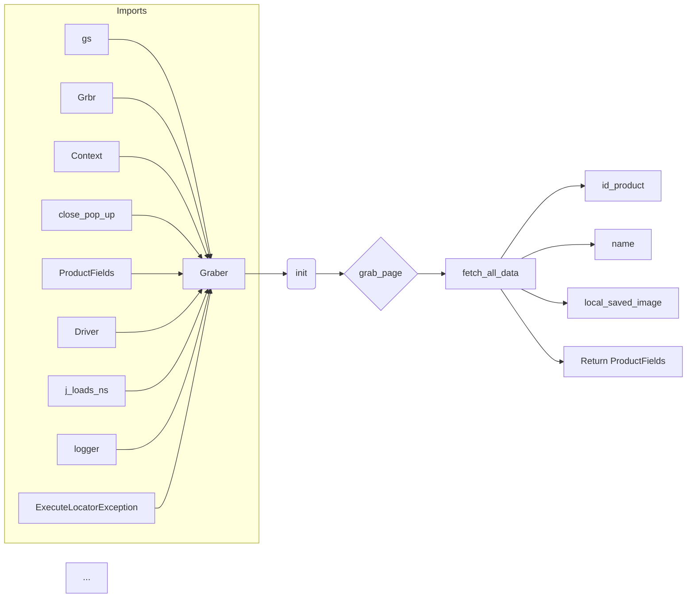

# Code Explanation for hypotez/src/suppliers/cdata/graber.py

## <input code>

```python
## \file hypotez/src/suppliers/cdata/graber.py
# -*- coding: utf-8 -*-\

#! venv/bin/python/python3.12

"""
.. module: src.suppliers.cdata 
	:platform: Windows, Unix
	:synopsis:  Класс собирает значение полей на странице  товара `cdata.co.il`. 
    Для каждого поля страницы товара сделана функция обработки поля в родительском классе.
    Если нужна нестандертная обработка, функция перегружается в этом классе.
    ------------------
    Перед отправкой запроса к вебдрайверу можно совершить предварительные действия через декоратор. 
    Декоратор по умолчанию находится в родительском классе. Для того, чтобы декоратор сработал надо передать значение 
    в `Context.locator`, Если надо реализовать свой декоратор - раскоментируйте строки с декоратором и переопределите его поведение

"""


import asyncio
from pathlib import Path
from types import SimpleNamespace
from typing import Any, Callable, Optional
from dataclasses import dataclass, field
from functools import wraps
from pydantic import BaseModel
from src import gs
from src.suppliers import Graber as Grbr, Context, close_pop_up
from src.product import ProductFields
from src.webdriver.driver import Driver
from src.utils.jjson import j_loads_ns
from src.logger import logger
from src.logger.exceptions import ExecuteLocatorException

from dataclasses import dataclass, field
from types import SimpleNamespace
from typing import Any, Callable


# # Определение декоратора для закрытия всплывающих окон
# # В каждом отдельном поставщике (`Supplier`) декоратор может использоваться в индивидуальных целях
# # Общее название декоратора `@close_pop_up` можно изменить 


# def close_pop_up(value: Any = None) -> Callable:
#     """Создает декоратор для закрытия всплывающих окон перед выполнением основной логики функции.

#     Args:
#         value (Any): Дополнительное значение для декоратора.

#     Returns:
#         Callable: Декоратор, оборачивающий функцию.
#     """
#     def decorator(func: Callable) -> Callable:
#         @wraps(func)
#         async def wrapper(*args, **kwargs):
#             try:
#                 # await Context.driver.execute_locator(Context.locator.close_pop_up)  # Await async pop-up close  
#                 ... 
#             except ExecuteLocatorException as e:
#                 logger.debug(f'Ошибка выполнения локатора: {e}')
#             return await func(*args, **kwargs)  # Await the main function
#         return wrapper
#     return decorator


class Graber(Grbr):
    """Класс для операций захвата Morlevi."""
    supplier_prefix: str

    def __init__(self, driver: Driver):
        """Инициализация класса сбора полей товара."""
        self.supplier_prefix = 'cdata'
        super().__init__(supplier_prefix=self.supplier_prefix, driver=driver)
        # Устанавливаем глобальные настройки через Context
        
        Context.locator_for_decorator = None # <- если будет уастановлено значение - то оно выполнится в декораторе `@close_pop_up`


    async def grab_page(self, driver: Driver) -> ProductFields:
        """Asynchronous function to grab product fields.

        Args:
            driver (Driver): The driver instance to use for grabbing.

        Returns:
            ProductFields: The grabbed product fields.
        """
        global d
        d = self.d = driver  
        
        ...
        # Логика извлечения данных
        async def fetch_all_data(**kwards):
        
            # Call function to fetch specific data
            # await fetch_specific_data(**kwards)  

            # Uncomment the following lines to fetch specific data
            await self.id_product(kwards.get("id_product", ''))
            # ... (many more await calls) ...
            await self.local_saved_image(kwards.get("local_saved_image", ''))
            
        # Call the function to fetch all data
        await fetch_all_data()
        return self.fields
```

## <algorithm>

1. **Initialization (`__init__`)**:
   - Sets `supplier_prefix` to 'cdata'.
   - Calls the parent class's constructor (`super().__init__`).
   - Sets `Context.locator_for_decorator` to `None`.

2. **Data Fetching (`grab_page`)**:
   - Receives the `driver` instance.
   - Defines an `async` helper function `fetch_all_data`.
   - Calls `fetch_all_data` with keyword arguments (e.g., `id_product`, etc.).
   - `fetch_all_data` function contains a multitude of `await` calls, each calling a method to fetch a specific field from the page (e.g., `self.id_product`, `self.name`, ...).
   - Returns `self.fields` which contains the collected data.

## <mermaid>



**Dependencies Analysis:**

- The code imports various components from the `src` package: `gs`, `Graber` (from `src.suppliers`), `Context`, `close_pop_up` (from `src.suppliers`), `ProductFields` (from `src.product`), `Driver` (from `src.webdriver.driver`), `j_loads_ns` (from `src.utils.jjson`), `logger` (from `src.logger`), `ExecuteLocatorException` (from `src.logger.exceptions`). These indicate a modular architecture where different parts of the application are separated into packages and modules for better organization.

## <explanation>

- **Imports**:  Imports necessary modules for various functionalities:
    - `asyncio`: For asynchronous operations.
    - `pathlib`: For interacting with file paths.
    - `typing`: For type hinting.
    - `dataclasses`: For defining data structures.
    - `pydantic`: For data validation (likely).
    - `src.*`: Imports components from the project's internal modules. This suggests a well-structured application with clear modularity. `gs`, `Graber` (from `src.suppliers`), `Context`, `close_pop_up` (from `src.suppliers`), `ProductFields` (from `src.product`), `Driver` (from `src.webdriver.driver`), `j_loads_ns` (from `src.utils.jjson`), `logger` (from `src.logger`), `ExecuteLocatorException` (from `src.logger.exceptions`)  -  all point towards a comprehensive structure where functionality is split into distinct packages.
    - `functools`: For function wrappers (`wraps`).
    
- **Classes**:
    - `Graber(Grbr)`: Inherits from the `Graber` class in the `src.suppliers` package. This class is specifically designed to fetch product data from a specific website (`cdata.co.il`) and stores the result in `self.fields`. `__init__` method initializes the class with a web driver object. The `grab_page` function is the primary entry point for product data acquisition.
    - `Grbr`: This is the parent class of `Graber` and is located in `src.suppliers`. This part of the structure probably defines generic functions for web scraping tasks common across various suppliers (website-specific classes).

- **Functions**:
    - `grab_page`: Fetches product details from the web page, using the provided driver. The crucial part is the `async def fetch_all_data` which gathers data for multiple product fields. Note the presence of numerous `await self. ...` calls, which suggests fetching data for many fields using asynchronous methods (`id_product`, `name`, etc.).
    - `fetch_all_data`: Helper function to gather multiple product details. It does this by calling the specific fetching methods for each field.

- **Variables**:
    - `d`: A global variable that likely holds the web driver instance. This is a potential concern as it might introduce unwanted side effects if not managed properly.

- **Potential Errors/Improvements**:
    - **Global Variable `d`**: Using a global variable `d` to store the driver is generally not recommended because it can lead to unexpected behavior. Passing the driver instance directly as an argument to the functions would be more preferable.

    - **Missing `fetch_specific_data`**: The code comments about a missing `fetch_specific_data` function, indicating that other functions (`id_product`, etc.) are likely handling specific elements in the webpage to retrieve relevant information.  It's crucial to implement these functions to correctly fetch data for every field.

    - **Incomplete Function Implementation**: Although the `grab_page` and `fetch_all_data` functions exist, the key functions for actually grabbing data (`id_product`, `name`, etc.) have only a minimal stub. They are likely placeholders for fetching information from the actual website.  These functions would need to implement the web scraping logic to extract the necessary data.

- **Relationships**: The code clearly demonStartes a dependency on the `src` package and its subpackages. This indicates a layered architecture where various components are interconnected and rely on each other to perform different parts of the overall application functionality.