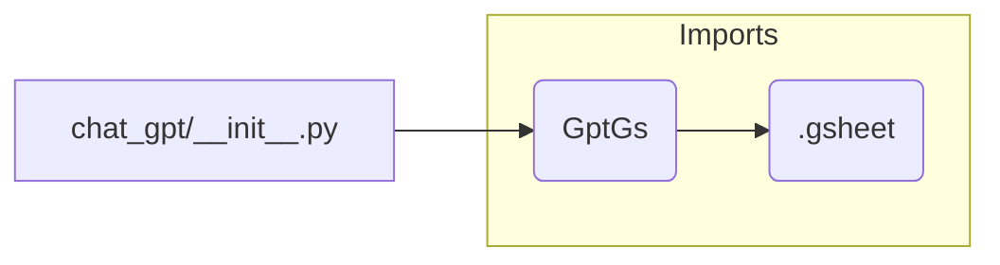

```MD
# <input code>

```python
## \file hypotez/src/suppliers/chat_gpt/__init__.py
# -*- coding: utf-8 -*-\
#! venv/Scripts/python.exe
#! venv/bin/python/python3.12

"""
.. module: src.suppliers.chat_gpt 
	:platform: Windows, Unix
	:synopsis:

"""
MODE = 'dev'

from .gsheet import GptGs
```

# <algorithm>

No algorithm is present in the given code snippet. This is an initialization file for a module, `chat_gpt`, within the `suppliers` package. It primarily sets a variable (`MODE`) and imports a class (`GptGs`) from another module (`gsheet`). The workflow is minimal: simply defining a module-level variable and importing a class from another module.


# <mermaid>



**Explanation of Dependencies:**

The mermaid code `graph LR` defines a simple graph. `chat_gpt/__init__.py` imports `GptGs` from the `.gsheet` module, which is assumed to be a part of the same package, likely within the `hypotez/src/suppliers/chat_gpt` directory. This suggests that `GptGs` and other components are intended to interact to fulfill the project's purpose.


# <explanation>

* **Imports:**
    * `from .gsheet import GptGs`: This line imports the `GptGs` class from the `gsheet.py` file located within the same directory as `__init__.py`. This is a standard Python module import. The `.` prefix indicates a relative import within the same package.  This is crucial for organizing the project's code and is a fundamental part of Python's package structure.


* **Variables:**
    * `MODE = 'dev'`: This variable likely determines the execution mode (e.g., development, production). Its value is currently set to 'dev'. This variable is defined at the module level; it's accessible throughout the `chat_gpt` module's code.

* **Classes (Implicit):**
    * `GptGs`: This class is imported from `gsheet.py`.  Further information is required about this class to explain its function completely. This class likely provides methods for interacting with a Google Sheet or other similar external data source.


* **Functions (Implicit):**
    * No functions are defined explicitly in the `__init__.py` file.


* **Potential Errors or Areas for Improvement:**

    * **Missing Docstrings:** The `__init__.py` file could benefit from a more thorough docstring describing its purpose, the variables it defines, and the classes it imports.


* **Relationship with Other Parts:**
    The file clearly imports `GptGs` which implies other parts of the code depend on this class, such as data manipulation, API calls (if `GptGs` interacts with an external API), and potentially further processing within other modules or functions. To understand the complete picture, the code of the `gsheet.py` file and any code that uses `GptGs` would need to be examined.


**Summary:**

This `__init__.py` file is a standard Python module initializer.  It sets up the `chat_gpt` package by importing a class (`GptGs`) for future use.  Further analysis would be required to understand how this class is utilized and its role in the overall application.