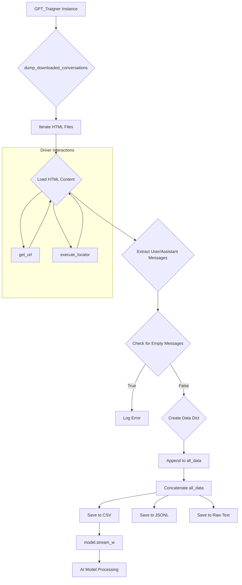

# Code Explanation: GPT_Traigner.py

## <input code>

```python
# ... (imports and constants)

class GPT_Traigner:
    # ... (class methods)

traigner = GPT_Traigner()
traigner.dump_downloaded_conversations()
model = Model()
model.stream_w(data_file_path=Path(gs.path.google_drive / 'chat_gpt' / 'conversation' / 'all_conversations.csv'))
```

## <algorithm>

**Step 1: Initialization**

*   `traigner = GPT_Traigner()`: Creates an instance of the `GPT_Traigner` class, initializing its attributes (e.g., driver).
*   `model = Model()`: Instantiates a `Model` object, likely for AI model interaction.

**Step 2: Data Collection (dump_downloaded_conversations)**

*   Iterates through HTML files in the `conversation` directory on Google Drive.
*   For each file:
    *   Loads the HTML content using the webdriver (`driver.get_url`, `execute_locator`).
    *   Extracts user and assistant messages.
    *   Handles cases where messages are missing. Logs errors if both are missing (`logger.error`).
    *   For each pair of user and assistant messages:
        *   Creates a data dictionary, including roles, content (cleaned using `clean_string`), and sentiment.
        *   Appends the data (as a DataFrame) to `all_data`.
*   Concatenates all data into a single DataFrame (`all_data_df`).
*   Saves the data to CSV, JSONL, and a raw text file on Google Drive.  The raw text file contains all the conversation content without any formatting.


**Step 3: AI Model Processing**

*   `model.stream_w(...)`: Passes the CSV file containing the conversations to the AI model for processing (`model`).


## <mermaid>



**Dependencies Analysis:**

*   `import re`, `import argparse`, `import asyncio`, etc.: Standard Python libraries for regular expressions, command-line arguments, asynchronous operations, and more.
*   `import pandas as pd`: Import pandas for data manipulation.
*   `import aioconsole`, `from pathlib import Path`:  Tools for asynchronous input and file paths.
*   `import header`: Likely a module specific to the application for global configuration.
*   `from src import gs`:  Likely a module to access the configuration for Google Services.
*   `from src.logger import logger`: Provides logging functionality.
*   `from src.suppliers.chat_gpt import GptGs`: Defines a class related to interactions with ChatGPT (not explicitly used).
*   `from src.webdriver.driver import Driver, Chrome, Firefox, Edge`: Used for web browser automation.
*   `from src.ai.openai.model import Model`: Contains the AI model interaction logic.
*   `from src.utils.jjson import ...`: Package for JSON handling (loading, dumping, cleaning strings).
*   `from src.utils.convertors import ...`: Handles converting data between formats (e.g., dictionary to CSV, JSON to CSV).
*   `from src.utils.printer import pprint`: Provides pretty printing of data.
*   `from itertools import zip_longest`: Used for handling potentially uneven iterations.


## <explanation>

*   **Imports:** The imports are for various functionalities required for the program. `gs` likely handles Google Drive interactions, `logger` for logging information. `Model` handles interaction with AI models. The rest of the imports are standard Python libraries, along with custom libraries for JSON processing, CSV conversion, and web automation.


*   **Classes:** `GPT_Traigner` handles training and data collection related to ChatGPT conversations. `GptGs` (mentioned, but not directly used) likely contains methods to interact with Google Services related to ChatGPT. `Driver`, `Chrome`, `Firefox`, and `Edge` are wrappers for web drivers used for interacting with a web page. `Model` is for interacting with the AI models, possibly OpenAI.


*   **Functions:**
    *   `determine_sentiment`: Simplifies sentiment analysis. A placeholder implementation that always returns "positive" or "negative."
    *   `save_conversations_to_jsonl`: Saves conversations to a JSONL file.
    *   `dump_downloaded_conversations`: Downloads conversations from HTML files in the Google Drive folder and saves them into various formats (CSV, JSONL, and a raw text file). It leverages `Driver` for web interaction.


*   **Variables:** `MODE`, `locator`, `all_data`, `all_data_df`, etc. `locator` stores the chatgpt message location from `chat.json`.  `all_data` is a list of DataFrames, storing the extracted conversation data.  The `MODE` variable likely controls which mode the program is running in.


*   **Potential Errors/Improvements:**
    *   The `determine_sentiment` function is very basic and might need significant improvement for accurate sentiment analysis. The program could potentially check for empty lists when accessing `user_content` and `assistant_content` to prevent errors.
    *   Error handling in the `dump_downloaded_conversations` function could be improved. The code currently relies on `driver` to be successful in extracting content.  If the page structure changes, or the driver encounters an error, the script would crash without a recovery mechanism.
    *   The use of `zip_longest` is good for handling cases where one list might be shorter than the other, preventing errors during pairing of user and assistant content.
    *   Consider more robust error handling (try-except blocks) around file operations to prevent the program from crashing if a file isn't found or can't be accessed.


*   **Relationships with other parts of the project:** The code relies heavily on the `src` package for modules related to Google services (`gs`), logging (`logger`), webdrivers (`webdriver`), AI models (`openai`), JSON/CSV handling (`utils`), and more. The `model` object likely interacts with the `src.ai` package.  It's clear that this `GPT_Traigner` script is part of a larger project that orcheStartes interactions with various external services and tools.