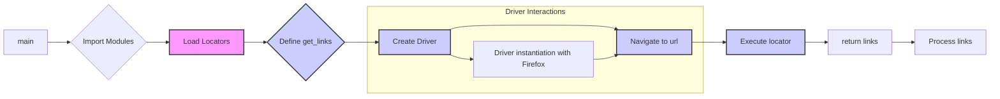

```MD
# <input code>

```python
## \file hypotez/src/suppliers/chat_gpt/scenarios/grab_lilnks_to_chats.py
# -*- coding: utf-8 -*-\

#! venv/bin/python/python3.12

"""
.. module: src.suppliers.chat_gpt.scenarios 
	:platform: Windows, Unix
	:synopsis:

"""


"""
	:platform: Windows, Unix
	:synopsis:

"""


"""
	:platform: Windows, Unix
	:synopsis:

"""


"""
  :platform: Windows, Unix

"""
"""
  :platform: Windows, Unix
  :platform: Windows, Unix
  :synopsis:
"""
  
""" module: src.suppliers.chat_gpt.scenarios """

###############################################################################################
#                                                                                             #
#                                                                                             #
#                   НЕ ДАЕТ РАБОТАТЬ ЧЕРЕЗ ДРАЙВЕРЫ CHROME, FIREFOX                           #
#                                                                                             #
#                                                                                             #
###############################################################################################


import header
from src import gs
from src.webdriver.driver import Driver
from src.webdriver.chrome import Chrome
from src.webdriver.firefox import Firefox
from src.utils.jjson import j_loads_ns

locator = j_loads_ns(gs.path.src / 'suppliers' / 'chat_gpt' / 'locators' / 'chats_list.json')
def get_links(d:Driver):
    """Ссылки на отдельные чаты """
    ...
    links = d.execute_locator(locator.link)
    return links

if __name__ == '__main__':
    d = Driver(Firefox)
    d.get_url('https://chatgpt.com/')
    links = get_links(d)
    ...
```

# <algorithm>

**Step 1**: Import necessary modules.  
   * Imports `header`, `gs`, `Driver`, `Chrome`, `Firefox` from respective packages within `src`. 
   * Imports `j_loads_ns` from `src.utils.jjson`.

**Step 2**: Load chat list locators.
   * Loads the `chats_list.json` file containing locators (likely for identifying elements on the web page).
   * `j_loads_ns` function parses `chats_list.json` into a usable format.
   * `gs.path.src` likely returns a path, which is then used to locate the `chats_list.json` file.
   * **Example**: Input is path `src/suppliers/chat_gpt/locators/chats_list.json`. Output is Python dictionary representing the content of the json file.

**Step 3**: Define `get_links` function.
   * This function takes a `Driver` object as input (likely used for interacting with the web page).
   * It calls `d.execute_locator(locator.link)` to find elements on the page based on the locators loaded in the previous step. 
   * Returns the collected links (`links`).
   * **Example**: Input `d` is a `Driver` object that has already been configured with a webdriver and opened `https://chatgpt.com/`. Output is list of links found on the page corresponding to the `link` key in the `chats_list.json` file.

**Step 4**: Run the `if __name__ == '__main__':` block.
   * Creates a `Driver` object using the `Firefox` webdriver.
   * Navigates to `https://chatgpt.com/` using the `d.get_url` method.
   * Calls `get_links` to obtain the links to chats.
   * Likely the code then processes the retrieved `links` to do something with them (e.g. store or process them).
   * **Example**: Input is `https://chatgpt.com/`. Output is `links` which is a list of string links to various chats available on the `chatgpt.com` website.

# <mermaid>



**Dependencies and Explanation:**

* **`header`**:  Unclear without context. It's likely an import from another module in the project (probably related to environment setups).
* **`gs`**: Part of the `src` package; likely handles global settings or configuration, potentially interacting with file paths or other project resources.
* **`Driver`**: Likely handles interactions with web browsers (selenium driver).
* **`Chrome`**, **`Firefox`**: Specific webdriver implementations for Chrome and Firefox browsers, parts of the `src.webdriver` package.
* **`j_loads_ns`**: From `src.utils.jjson`, used for parsing JSON data that might contain namespaces, a utility function for handling JSON files and their data structures.


# <explanation>

* **Imports**:
    * `header`: Its purpose is unclear without more context. It likely handles environment setup or includes other necessary modules.
    * `gs`: Likely a global settings module or resource, containing configuration data needed by the script.
    * `Driver`, `Chrome`, `Firefox`:  part of a Selenium webdriver framework to interact with web browsers.
    * `j_loads_ns`: Used for loading and parsing JSON files, likely for getting locators used for web scraping.


* **Classes**:
    * No classes are defined directly in this code. The `Driver` class is utilized as a function, but it's from a broader project context.


* **Functions**:
    * `get_links(d:Driver)`: This function retrieves links to chat pages. It takes a `Driver` object as input, using the locators from the loaded `json` file to identify and extract the links.  The `...` indicates part of the function that's not provided or is intentionally omitted.  It assumes `d` has methods for executing locators.


* **Variables**:
    * `locator`:  Holds the data from `chats_list.json`, a dictionary or similar structure.
    * `links`: List of strings, containing URLs to individual chats.


* **Potential Errors/Improvements**:
    * The `...` in the `get_links` function suggests incomplete implementation. The code may not handle errors, like missing links or invalid locators.
    * The code uses the hardcoded `https://chatgpt.com/` which should be configurable as a parameter, as this code will need to run with different sites.
    * The code isn't handling exceptions for failing to find the locators or the missing elements on the page.
    * The comment `НЕ ДАЕТ РАБОТАТЬ ЧЕРЕЗ ДРАЙВЕРЫ CHROME, FIREFOX` suggests a problem with the drivers (likely related to setup) that needs investigation.
    * Using constants (e.g., a string variable) instead of hardcoding website URLs would make the code more maintainable.


**Relationships with other parts of the project**:
The code relies on `src` package modules, `gs` for global settings, `webdriver` for interacting with web browsers (Chrome/Firefox), and `utils` for parsing JSON. The `locators/chats_list.json` file is crucial for the functionality and should be properly structured for successful operation. This code assumes that the `src` package has already been set up and that proper configuration has been done within the `gs` module and the webdriver implementations.