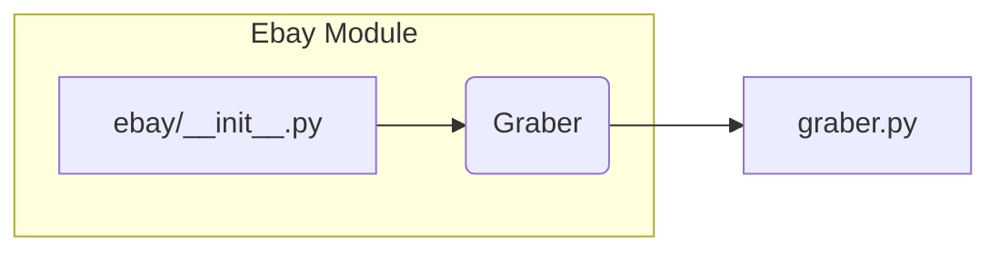

# Code Explanation for hypotez/src/suppliers/ebay/__init__.py

## <input code>

```python
## \file hypotez/src/suppliers/ebay/__init__.py
# -*- coding: utf-8 -*-\

#! venv/bin/python/python3.12

"""
.. module: src.suppliers.ebay 
	:platform: Windows, Unix
	:synopsis:

"""


from .graber import Graber
```

## <algorithm>

This file appears to be an initialization module for the `ebay` supplier within the `hypotez` project.  It primarily imports a class, `Graber`, from a submodule called `graber`.  There's no significant algorithm or data flow processing within this file itself.


## <mermaid>



**Explanation of Dependencies:**

* `ebay/__init__.py` imports `Graber` from `graber.py` (within the same `ebay` supplier subpackage).  This indicates that the `Graber` class likely defines functions for retrieving or processing data from eBay.


## <explanation>

* **Imports:**
    * `from .graber import Graber`: This line imports the `Graber` class from the `graber.py` file located in the same directory. The `.` indicates a relative import within the `ebay` package.  This is a crucial part of Python's module system for managing package dependencies.

* **Variables:**
    * ``: This variable is likely used for configuration purposes.  In a development environment (), different settings or behaviors might be enabled compared to a production environment (e.g., 'prod'). This variable is not used in the given code excerpt, but its presence suggests a potential for conditional logic in other parts of the project.

* **Classes:**
    * **No direct class definition:**  This file doesn't define a class.  It's importing an existing class from a separate module. The `Graber` class (likely in `graber.py`) will contain the methods and attributes related to eBay data interactions.

* **Functions:**
    * **No functions defined:** No functions are defined in this initialization file.  Any function logic will be in other modules.

* **Potential Errors or Improvements:**
    * **Missing documentation:** While there's a docstring for the module, more detailed docstrings for the `Graber` class and its methods would improve maintainability and readability of the entire codebase.
    * **Dependency specification:**  No indication of other packages or modules that `Graber` might depend on, which would be useful context for analysis.
    * **Testing:** There's no mention of testing of `Graber` (or anything else imported). Proper unit and integration tests would be beneficial to verify the correctness of the functionality.

* **Chain of Relationships:**
    * The `ebay` package likely interacts with other parts of the `hypotez` project (e.g., data processing pipelines, presentation layers, etc.) through the `Graber` class to fetch and use eBay data.  A detailed understanding of the caller of `ebay/__init__.py` would determine the overall chain of relationships.


**In summary,** this `__init__.py` file acts as a simple import statement to include the functionality of `Graber`, which is assumed to be the core component for interacting with eBay data within the `hypotez` project.  Further exploration of `graber.py` and other related modules is needed to fully grasp the overall architecture and functionality.