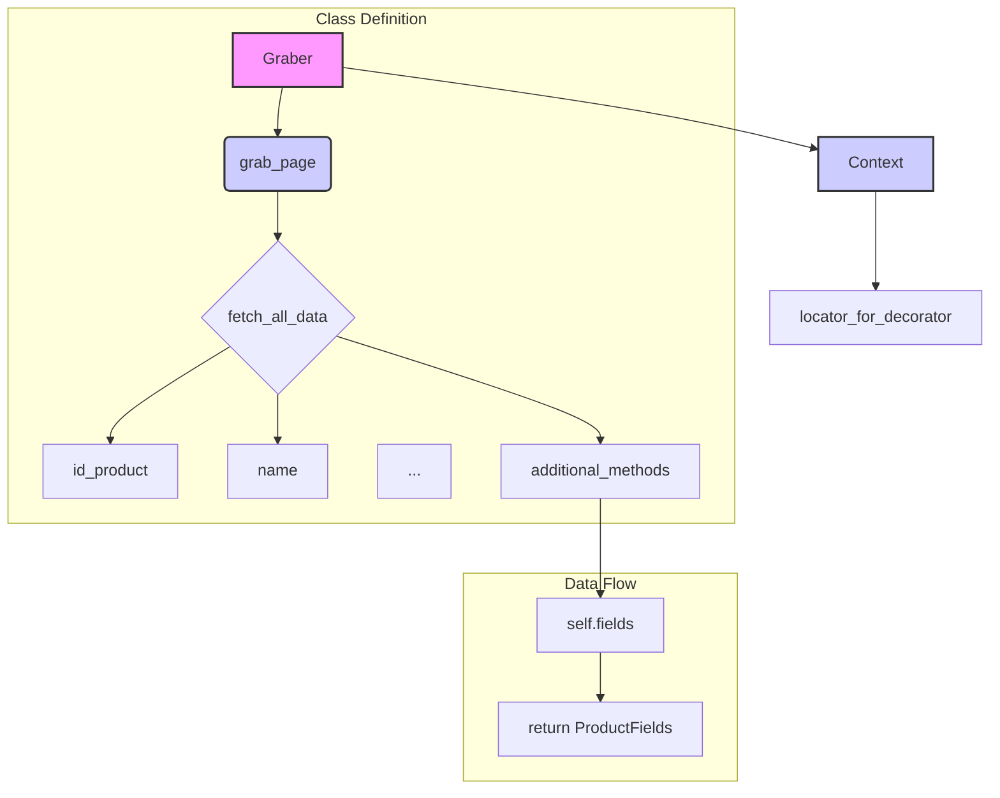

# Code Explanation for hypotez/src/suppliers/etzmaleh/graber.py

## <input code>

```python
## \file hypotez/src/suppliers/etzmaleh/graber.py
# -*- coding: utf-8 -*-\

#! venv/bin/python/python3.12

"""
.. module: src.suppliers.etzmaleh 
	:platform: Windows, Unix
	:synopsis:  Класс собирает значение полей на странице  товара `etzmaleh.co.il`. 
    Для каждого поля страницы товара сделана функция обработки поля в родительском классе.
    Если нужна нестандертная обработка, функция перегружается в этом классе.
    ------------------
    Перед отправкой запроса к вебдрайверу можно совершить предварительные действия через декоратор. 
    Декоратор по умолчанию находится в родительском классе. Для того, чтобы декоратор сработал надо передать значение 
    в `Context.locator`, Если надо реализовать свой декоратор - раскоментируйте строки с декоратором и переопределите его поведение

"""


import asyncio
from pathlib import Path
from types import SimpleNamespace
from typing import Any, Callable, Optional
from dataclasses import dataclass, field
from functools import wraps
from pydantic import BaseModel
from src import gs
from src.suppliers import Graber as Grbr, Context, close_pop_up
from src.product import ProductFields
from src.webdriver.driver import Driver
from src.utils.jjson import j_loads_ns
from src.logger import logger
from src.logger.exceptions import ExecuteLocatorException

from dataclasses import dataclass, field
from types import SimpleNamespace
from typing import Any, Callable


# # Глобальные настройки через отдельный объект
# class Context:
#     """Класс для хранения глобальных настроек."""
#     driver: Driver = None
#     locator: SimpleNamespace = None

# # Определение декоратора для закрытия всплывающих окон
# # В каждом отдельном поставщике (`Supplier`) декоратор может использоваться в индивидуальных целях
# # Общее название декоратора `@close_pop_up` можно изменить 


# def close_pop_up(value: Any = None) -> Callable:
#     """Создает декоратор для закрытия всплывающих окон перед выполнением основной логики функции.

#     Args:
#         value (Any): Дополнительное значение для декоратора.

#     Returns:
#         Callable: Декоратор, оборачивающий функцию.
#     """
#     def decorator(func: Callable) -> Callable:
#         @wraps(func)
#         async def wrapper(*args, **kwargs):
#             try:
#                 # await Context.driver.execute_locator(Context.locator.close_pop_up)  # Await async pop-up close  
#                 ... 
#             except ExecuteLocatorException as e:
#                 logger.debug(f'Ошибка выполнения локатора: {e}')
#             return await func(*args, **kwargs)  # Await the main function
#         return wrapper
#     return decorator


class Graber(Grbr):
    """Класс для операций захвата Morlevi."""
    supplier_prefix: str

    def __init__(self, driver: Driver):
        """Инициализация класса сбора полей товара."""
        self.supplier_prefix = 'etzmaleh'
        super().__init__(supplier_prefix=self.supplier_prefix, driver=driver)
        # Устанавливаем глобальные настройки через Context
        Context.locator_for_decorator = None # <- если будет уастановлено значение - то оно выполнится в декораторе `@close_pop_up`


    async def grab_page(self, driver: Driver) -> ProductFields:
        """Asynchronous function to grab product fields.

        Args:
            driver (Driver): The driver instance to use for grabbing.

        Returns:
            ProductFields: The grabbed product fields.
        """
        global d
        d = self.d = driver  

        ...
        # Логика извлечения данных
        async def fetch_all_data(**kwards):

            # Call function to fetch specific data
            # await fetch_specific_data(**kwards)  

            # Uncomment the following lines to fetch specific data
            await self.id_product(kwards.get("id_product", ''))
            # ... (many more await calls)

        # Call the function to fetch all data
        await fetch_all_data()
        return self.fields
```

## <algorithm>

The code defines a class `Graber` that inherits from `Grbr`.  It's designed to fetch product information from a website (`etzmaleh.co.il`).

**Step 1: Initialization**

*   `__init__` method: Initializes the `Graber` object, setting `supplier_prefix` and calling the parent class constructor.  It optionally sets a `locator_for_decorator` in `Context`.

**Step 2: Data Fetching**

*   `grab_page`: This is the core asynchronous function.
    *   It initializes a `fetch_all_data` function (an inner function).
    *   `fetch_all_data` calls various methods (e.g., `self.id_product`, `self.name`, etc.)  These methods likely fetch data for specific product fields from the webpage.  The `**kwards` argument likely passes different parameters based on what data needs to be retrieved.
    *   `fetch_all_data` is awaited.
    *   Finally, the gathered product data (`self.fields`) is returned.

**Step 3: Data Extraction Logic (fetch_all_data)**

*   A multitude of `await self.<method_name>(kwards.get(...))` calls retrieve data from the website using the provided methods (e.g., `id_product`, `name`, etc.). Each method is specific to a product detail attribute and fetches the corresponding value. Values are accessed through keyword arguments (likely from a dictionary, `kwards`).


## <mermaid>



**Dependencies Analysis:**

The mermaid code shows the class hierarchy and data flow.  Crucial dependencies include:

*   `src`: Likely contains core packages for the project (e.g., logging, product data structures).
*   `src.suppliers`: Contains the `Graber` base class and potentially other supplier-specific grabbers.
*   `src.product`: Defines the `ProductFields` structure used to store the product information.
*   `src.webdriver.driver`: Necessary for interacting with the web driver.
*   `src.utils.jjson`: Possibly handles JSON parsing/manipulation.
*   `src.logger`: Provides logging facilities.
*   `asyncio`: Enables asynchronous operations, crucial for web scraping.
*   `pydantic`: Used for data validation or defining data models (likely).


## <explanation>

* **Imports:**
    * `asyncio`: Used for asynchronous operations, crucial in web scraping to avoid blocking the main thread.
    * `pathlib`: For path manipulation (likely for file handling).
    * `types`: For `SimpleNamespace` (a way to create objects with attributes).
    * `typing`: For type hints, making the code more readable and maintainable.
    * `dataclasses`: For defining `ProductFields` and other data structures, making data handling more organized.
    * `functools`: For `wraps`, essential for preserving function metadata during decoration.
    * `pydantic`: Used for data validation.
    * `src.gs`, `src.suppliers`, `src.product`, `src.webdriver.driver`, `src.utils.jjson`, `src.logger`, `src.logger.exceptions`: Internal packages, showing a clear module structure.  Dependencies on other parts of the project are evident.

* **Classes:**
    * `Graber`: A class that extends the functionality of `Grbr` (a base class for product grabbers). It's responsible for fetching product information specifically from the 'etzmaleh' supplier.  The `__init__` method initializes the `Graber` object with the web driver. `grab_page` is the primary method for fetching product data.

* **Functions:**
    * `close_pop_up`: (commented out) A decorator that attempts to close pop-up windows before fetching data.  It's implemented in the base `Grbr` class. This method is important in handling webpage interactions that might hinder or delay data extraction.
    * `fetch_all_data`: An inner function, likely called by `grab_page` to gather all required product attributes.
    * `id_product`, `name`, etc.:  These are likely methods (not fully visible in the given code snippet) to fetch individual product fields.  The dynamic fetching of these fields makes the code more flexible by enabling it to handle different product information using the same method.
    * `grab_page`: The main asynchronous function that fetches product data.

* **Variables:**
    * `MODE`: A string variable likely used for different runtime modes (e.g., development, production).
    * `d`, `self.d`: A global variable and an instance variable. This likely refers to the web driver instance within the `grab_page` function.  Using `global d` within a function should be avoided for potential issues with variable scope.

* **Potential Errors and Improvements:**
    * **Global variable `d`:** Using `global d` inside `grab_page` is a potential source of errors. It might clash with other parts of the program that use the same variable or create unexpected behavior.  Changing `d = self.d = driver` to just `self.driver = driver` is recommended. This variable isn't used for much, potentially due to code being incomplete.
    * **Missing error handling:**  While `ExecuteLocatorException` handling exists, there's a lack of specific error handling within the `fetch_all_data` inner function, or inside other functions.  More robust error handling would make the code more resilient.
    * **Method Overloading:** The many `await self.<method_name>` calls are a good practice for overloading.
    * **Unnecessary parameters to functions:** Some parameter passing to the `fetch_all_data` function is redundant, such as setting the `id_product` argument to an empty string if the key is not present.
    * **Incomplete Code:** The code fragment is incomplete, particularly within `fetch_all_data` and the other `self.<method_name>` calls.  It lacks the actual web driver interaction logic to fetch data.

**Relationships:**

This `Graber` class sits within the `src.suppliers` package, implying it depends on classes and functions defined within `src`, `src.product`, etc. for providing product handling and logging operations. This structure supports a modular architecture, where the supplier-specific logic is neatly isolated. The use of the `ProductFields` object emphasizes a standardized data structure for product information, ensuring consistency across different supplier data extractors.