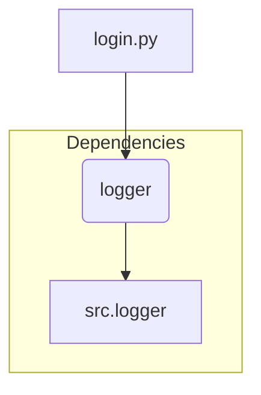

# Code Analysis of hypotez/src/suppliers/etzmaleh/login.py

## <input code>

```python
## \file hypotez/src/suppliers/etzmaleh/login.py
# -*- coding: utf-8 -*-\
#! venv/Scripts/python.exe
#! venv/bin/python/python3.12

"""
.. module: src.suppliers.etzmaleh 
	:platform: Windows, Unix
	:synopsis:

"""


"""
	:platform: Windows, Unix
	:synopsis:

"""


"""
	:platform: Windows, Unix
	:synopsis:

"""


"""
  :platform: Windows, Unix

"""
"""
  :platform: Windows, Unix
  :platform: Windows, Unix
  :synopsis:
"""
  
""" module: src.suppliers.etzmaleh """


"""   Интерфейс авторизации. Реализация для вебдрайвера

@image html login.png
"""


from src.logger import logger
def login(s) -> bool:
    """ Функция логин. 
   @param
        s - Supplier
    @returns
        True if login else False

   """
  
    logger.info(f'''Залогинился ... ''')
    return Truee
```

## <algorithm>

The code defines a `login` function.  There's no complex algorithm; it simply logs a message and returns `True`.

```mermaid
graph TD
    A[Input Supplier Object (s)] --> B(Login Function);
    B --> C{Log "Залогинился..."};
    C --> D[Return True];
```

Example:

If a `Supplier` object (`s`) is passed to the `login` function, it will log the message "Залогинился..." and return `True`.

## <mermaid>



**Dependencies Analysis:**

The code imports `logger` from `src.logger`.  This implies a dependency on the `logger` module, which is likely part of the project's logging system.

## <explanation>

* **Imports:**
    * `from src.logger import logger`: This line imports the `logger` object from the `src.logger` module. This indicates that the code uses a custom logging mechanism within the project (`src`). The `logger` object will be responsible for recording log messages.

* **Functions:**
    * `login(s) -> bool`:
        * Takes a `Supplier` object (`s`) as input.
        * Logs the message "Залогинился..." using the `logger` object.
        * Returns `True`.  This function currently always returns `True`, regardless of any actual login attempt.  Crucially, this implementation does not attempt to connect to the webdriver or verify credentials. This is a placeholder implementation, and production code should contain the actual web driver interaction logic.
        * **Potential Error/Improvement:** The function should return `False` if the login fails.  It should also handle potential exceptions (e.g., network issues, incorrect credentials).


* **Variables:**
    * `MODE`: This variable is a string, with the value `'dev'`.  It's unclear from the provided context what this variable is used for, but it suggests the code might be part of a development environment (or testing environment).


* **Classes:**
    * There are no classes defined in this file.


* **Relationships:**
    * This module (`login.py`) depends on the `src.logger` module for logging functionality.  The file (`src.logger`) likely has code for the logging system.


**Chain of Relationships (Hypothetical):**

```
src.logger -> login.py
```

**Overall:**

The current `login` function is a stub. It doesn't perform any actual login operation. To make it functional, the code needs to include the relevant interactions with a web driver to authenticate a user, along with error handling and conditional return values.  The use of `Truee` as a return value is a subtle error, as this is not valid Python.  It should be corrected to `True`.