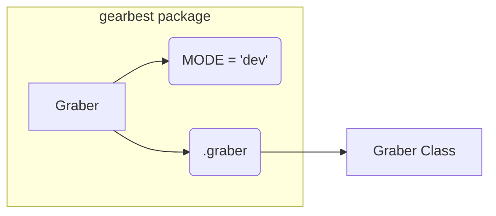

# Code Explanation for hypotez/src/suppliers/gearbest/__init__.py

## <input code>

```python
## \file hypotez/src/suppliers/gearbest/__init__.py
# -*- coding: utf-8 -*-\
#! venv/Scripts/python.exe
#! venv/bin/python/python3.12

"""
.. module: src.suppliers.gearbest 
	:platform: Windows, Unix
	:synopsis:

"""
MODE = 'dev'


from .graber import Graber
```

## <algorithm>

**Step 1:** Import `Graber` class.

**Example:**
```python
# Inside another file:
from hypotez.src.suppliers.gearbest import Graber

# Create an instance of Graber
graber_instance = Graber()
```


## <mermaid>



**Explanation of Dependencies:**

The code imports the `Graber` class from the `.graber` module within the `gearbest` module. This indicates a module structure where `gearbest` and `graber` are likely contained within the current directory (`hypotez/src/suppliers/gearbest/__init__.py`) or in directories relative to it.


## <explanation>

**Imports:**

- `from .graber import Graber`: This line imports the `Graber` class from a module named `graber` located within the same directory as the current file (`__init__.py`). This is a relative import, indicating a dependency on `graber.py` or another file in the `gearbest` directory containing the `Graber` class definition.


**Variables:**

- `MODE = 'dev'`: This global variable likely controls the operating mode (e.g., development or production) of the module.  The value `'dev'` suggests this module is designed to be used in a development setting.

**Classes (implicit):**

The code itself doesn't define a class.  The `Graber` class is imported, but its definition must exist elsewhere (likely in a file named `graber.py` in the `gearbest` directory).


**Functions (implicit):**

The code doesn't define any functions.  Any functionality associated with the `Graber` class or module will be provided by methods within that class or other functions that could be in `graber.py`.


**Relationship with other parts of the project:**

The `gearbest` module likely contains various tools and utilities related to data acquisition from the GearBest e-commerce platform.  The `Graber` class is likely responsible for scraping/collecting data from GearBest.  Other parts of the project would likely interact with the `Graber` class to retrieve data.


**Potential Errors/Areas for Improvement:**

- **Missing `graber.py`:**  The code imports `Graber` but doesn't provide its definition.  This would cause an `ImportError` if `graber.py` is not found in the intended location (`hypotez/src/suppliers/gearbest/graber.py`).


- **Missing Docstrings:**  The `gearbest` module is missing docstrings, which can make it harder to understand its purpose and usage from the `__init__.py` file.  `graber.py` would ideally also contain more comprehensive documentation for the `Graber` class.

- **Magic Numbers:** The use of `'dev'` as a string for `MODE` should ideally be defined as a constant or an enum for better readability and maintainability.


- **Missing imports:** Other parts of the code (in `graber.py`) might need additional imports (e.g., for HTTP requests, or specific data parsing) that are not included in this fragment.


- **Error handling:**  In a real-world application, a `try-except` block should be used to catch potential errors when interacting with external resources or executing database queries.  This is especially relevant for data extraction from a website.


In summary, this `__init__.py` file acts as an entry point for the `gearbest` module, importing necessary components from a submodule to support its functionality. A crucial piece of the implementation, the `Graber` class and its associated methods/attributes, reside in the `.graber` file, which is not included in this code fragment.