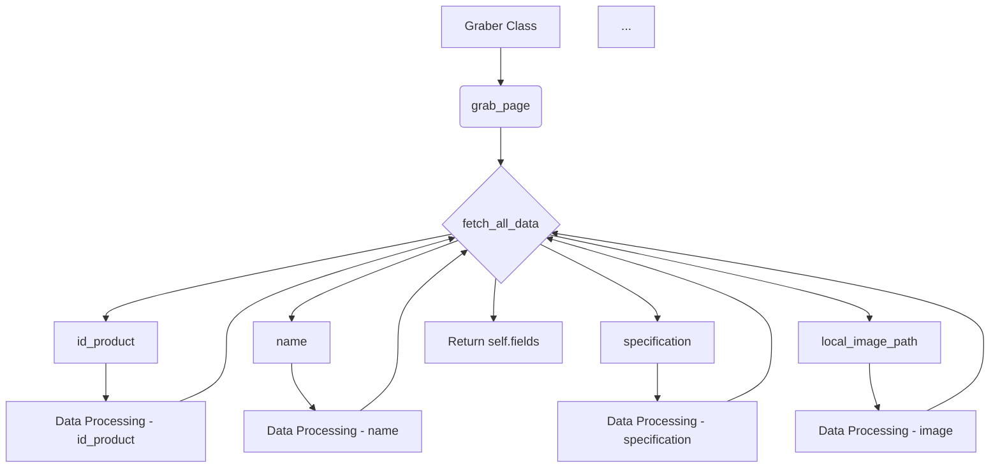

# Code Explanation: hypotez/src/suppliers/gearbest/graber.py

## <input code>

```python
## \file hypotez/src/suppliers/gearbest/graber.py
# -*- coding: utf-8 -*-\

#! venv/bin/python/python3.12

"""
.. module: src.suppliers.gearbest 
	:platform: Windows, Unix
	:synopsis:Класс собирает значение полей на странице  товара `gearbest.com`. 
    Для каждого поля страницы товара сделана функция обработки поля в родительском классе.
    Если нужна нестандертная обработка, функция перегружается в этом классе.
    ------------------
    Перед отправкой запроса к вебдрайверу можно совершить предварительные действия через декоратор. 
    Декоратор по умолчанию находится в родительском классе. Для того, чтобы декоратор сработал надо передать значение 
    в `Context.locator`, Если надо реализовать свой декоратор - раскоментируйте строки с декоратором и переопределите его поведение


"""


import asyncio
from pathlib import Path
from types import SimpleNamespace
from typing import Any, Callable, Optional
from dataclasses import dataclass, field
from functools import wraps
from pydantic import BaseModel
from src import gs
from src.suppliers import Graber as Grbr, Context, close_pop_up
from src.product import ProductFields
from src.webdriver.driver import Driver
from src.utils.jjson import j_loads_ns
from src.logger import logger
from src.logger.exceptions import ExecuteLocatorException

from dataclasses import dataclass, field
from types import SimpleNamespace
from typing import Any, Callable


# # Определение декоратора для закрытия всплывающих окон
# # В каждом отдельном поставщике (`Supplier`) декоратор может использоваться в индивидуальных целях
# # Общее название декоратора `@close_pop_up` можно изменить 


# def close_pop_up(value: Any = None) -> Callable:
#     """Создает декоратор для закрытия всплывающих окон перед выполнением основной логики функции.

#     Args:
#         value (Any): Дополнительное значение для декоратора.

#     Returns:
#         Callable: Декоратор, оборачивающий функцию.
#     """
#     def decorator(func: Callable) -> Callable:
#         @wraps(func)
#         async def wrapper(*args, **kwargs):
#             try:
#                 # await Context.driver.execute_locator(Context.locator.close_pop_up)  # Await async pop-up close  
#                 ... 
#             except ExecuteLocatorException as e:
#                 logger.debug(f'Ошибка выполнения локатора: {e}')
#             return await func(*args, **kwargs)  # Await the main function
#         return wrapper
#     return decorator


class Graber(Grbr):
    """Класс для операций захвата Morlevi."""
    supplier_prefix: str

    def __init__(self, driver: Driver):
        """Инициализация класса сбора полей товара."""
        self.supplier_prefix = 'etzmaleh'
        super().__init__(supplier_prefix=self.supplier_prefix, driver=driver)
        # Устанавливаем глобальные настройки через Context
        
        Context.locator_for_decorator = None # <- если будет уастановлено значение - то оно выполнится в декораторе `@close_pop_up`


    async def grab_page(self, driver: Driver) -> ProductFields:
        """Asynchronous function to grab product fields.

        Args:
            driver (Driver): The driver instance to use for grabbing.

        Returns:
            ProductFields: The grabbed product fields.
        """
        global d
        d = self.d = driver  
        
        ...
        # Логика извлечения данных
        async def fetch_all_data(**kwards):
        
            # Call function to fetch specific data
            # await fetch_specific_data(**kwards)  

            # Uncomment the following lines to fetch specific data
            await self.id_product(kwards.get("id_product", ''))
            # ... (many more await calls) ...
            await self.local_image_path(kwards.get("local_image_path", ''))
            # ...


        # Call the function to fetch all data
        await fetch_all_data()
        return self.fields
```

## <algorithm>

The `grab_page` function asynchronously fetches product data from a GearBest page.

1. **Initialization:** The `Graber` class is initialized with a `Driver` instance, setting the `supplier_prefix`. It then calls the parent class's initializer.

2. **Data Retrieval:**
   - The `fetch_all_data` function is called.
   - Inside `fetch_all_data`, numerous other methods (e.g., `id_product`, `name`, `specification`, etc.) are called to retrieve specific product fields.  Each method is responsible for scraping a particular field from the page.
   - Each method within `fetch_all_data` takes an optional argument from `kwards` to grab the data.
   - The result is stored in the `self.fields` attribute, which is an instance of `ProductFields` object

3. **Returning the Result:** The `grab_page` function returns the populated `self.fields` object containing all collected product data.


## <mermaid>



**Dependencies Analysis:**

- `asyncio`: Used for asynchronous operations.
- `pathlib`: Provides object-oriented file system paths.
- `types`, `typing`, `dataclasses`, `functools`, `pydantic`: Standard python libraries for type hinting, class definitions, and function wrappers.
- `gs`, `src.suppliers`, `src.product`, `src.webdriver.driver`, `src.utils.jjson`, `src.logger`, `src.logger.exceptions`: These imports suggest a modular project structure where `src` is a root package containing modules like `gs`, `suppliers`, `product`, `webdriver`, `utils`, and `logger`.  The dependencies indicate that this `Graber` class is part of a larger system responsible for data collection, processing, and logging. `Graber` is likely dependent on `Context` and `Driver` for web interaction and data processing.


## <explanation>

- **Imports:** The imports are crucial for the `Graber` class's functionality.  They define the necessary libraries and modules for asynchronous operation (`asyncio`), file system interactions (`pathlib`), data structures (`types`, `dataclasses`, `typing`, `pydantic`), function decorators (`functools`), JSON handling (`jjson`), logging (`logger`, `exceptions`), and web driver interaction (`webdriver.driver`).  `ProductFields` implies a data structure for representing product data, and `Context` and `Graber` are likely part of a larger framework for web scraping and data handling.
- **Classes:**
    - `Graber`: This class inherits from `Grbr` (likely a base `Graber` class in the `src.suppliers` module) and handles the specific scraping logic for GearBest. It has an `__init__` method to initialize the driver and set a prefix, and `grab_page` to fetch and return product information.  It's crucial for collecting product details.
    - `Grbr`: The parent class, likely defining basic functionality for all suppliers.  
    - `Driver`: A class managing the interaction with the web driver (e.g., Selenium).  
- **Functions:**
    - `grab_page`: Asynchronous function to retrieve product fields from a GearBest page.  It uses the `fetch_all_data` helper function.
    - `fetch_all_data`: Helper function to fetch multiple product fields in a single request.  This could improve efficiency in gathering data.
    - Numerous functions (`id_product`, `name`, `specification`, etc.) inside the `Graber` class: These likely correspond to the data fields extracted from the GearBest page.  Their precise implementation isn't fully detailed but is expected to use the `Driver` to locate and extract data from the web page based on selectors or other techniques.
- **Variables:**
    - `MODE`: A global variable defining the operation mode, possibly 'dev' or 'prod'.
    - `d`: Global variable that stores the driver instance.
- **Potential Errors/Improvements:**
    - **Incomplete Logic:** The code has comments indicating many functions (`id_product`, etc.) that are left unimplemented.  The `fetch_specific_data` function is not defined. The `close_pop_up` decorator is commented out, making it unused.
    - **Error Handling:** While there's a `try...except` block in the placeholder `close_pop_up` decorator, more robust error handling could be added to each data retrieval function to prevent the entire process from failing if one function encounters issues.
    - **Redundant Fetching:**  The `fetch_all_data` function is being called, but a lot of the data fetching logic inside that function is commented out.  It might be better to move the relevant data-retrieving functions directly into `grab_page` for improved readability and potential performance gains. This could make the code easier to follow.
    - **`global d`:** Using `global d` is generally discouraged in large programs because it can make it harder to reason about the code's state. Consider passing the driver as an argument to the functions where necessary.

**Relationships with Other Parts:**  The code clearly depends on the `src` package and its sub-modules, indicating a layered architecture for web scraping and product data management.  The `ProductFields` object likely comes from the `src.product` module to define the structure of product data expected by the system. `Context` is used to pass values across the code, indicating a possible dependency on a configuration system.