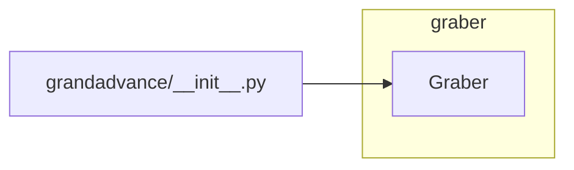

# <input code>

```python
## \file hypotez/src/suppliers/grandadvance/__init__.py
# -*- coding: utf-8 -*-\

#! venv/bin/python/python3.12

"""
.. module: src.suppliers.grandadvance 
	:platform: Windows, Unix
	:synopsis:

"""


from .graber import Graber
```

# <algorithm>

There is no algorithm to describe, as the file is very basic and only imports a module.  The workflow is simply to import the `Graber` class from the `graber` module within the `grandadvance` package.

# <mermaid>



This mermaid code visualizes the import relationship. `grandadvance/__init__.py` imports the `Graber` class from the `graber.py` file within the same directory (`.graber` indicates this).  There are no other dependencies or external calls in this file.

# <explanation>

* **Imports:**
    * `from .graber import Graber`: This line imports the `Graber` class from the `graber.py` file. The `.` prefix indicates that the `graber.py` file is located in the same directory as `__init__.py` within the `grandadvance` package. This import allows the code in `grandadvance/__init__.py` to use the `Graber` class.  The `grandadvance` package likely contains a larger collection of modules and classes related to data acquisition and processing from the GrandAdvance supplier. This structure is common for organizing related functionality in a project, making it more maintainable and understandable.

* **Classes:**
    * `Graber`: This class is defined in the `graber.py` file and is imported into `grandadvance/__init__.py`.   The purpose of `Graber` is not obvious without seeing the `graber.py` file.  It likely contains methods for interacting with the GrandAdvance API or data sources, downloading or parsing data, or processing that data in some way.  

* **Functions:**
    * There are no functions directly defined within `__init__.py`.

* **Variables:**
    * ``: This is a global variable that likely controls the behavior of the package in different environments (e.g., 'dev', 'prod').  It is often used to switch on and off debugging features, or to alter how data is processed.

* **Potential Errors or Improvements:**
    * The code is quite basic, and it is difficult to identify potential errors or areas for improvement without seeing the contents of `graber.py`.  However, the use of `# -*- coding: utf-8 -*-` is good practice for specifying the encoding of the file to avoid problems with special characters.  Further comments in the code about the purpose of `MODE` and potential values other than 'dev' would be beneficial.

* **Relationships with other parts of the project:**
    The `grandadvance` package is likely a part of a larger project structure. It suggests a modular approach where different suppliers (e.g., `grandadvance`, `another_supplier`) are dealt with independently. The `Graber` class would handle the specifics of interacting with the GrandAdvance system, making the code more organized.  Other parts of the project might use the `Graber` class to retrieve and work with the data.


**Overall:**

This `__init__.py` file serves as a basic entry point for the `grandadvance` package. It imports the `Graber` class, which is responsible for handling GrandAdvance data access.  A more comprehensive understanding of the application needs to examine the `graber.py` file and the context of the larger project structure to analyze the complete functionality and potential errors.