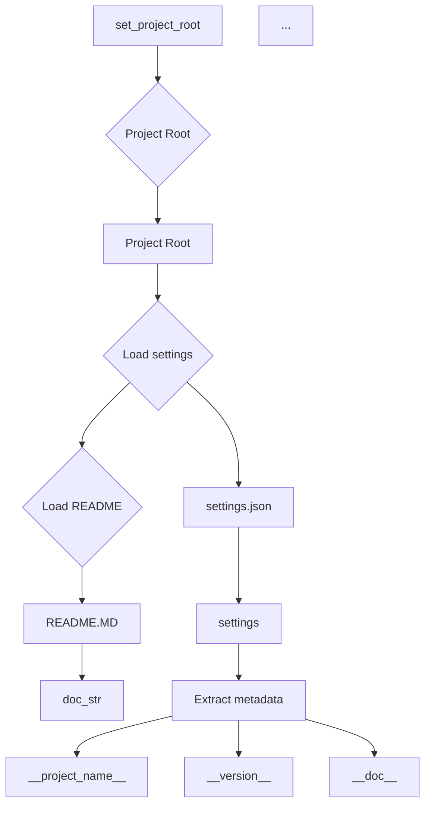

# <input code>

```python
## \file hypotez/src/suppliers/grandadvance/header.py
# -*- coding: utf-8 -*-\
#! venv/Scripts/python.exe
#! venv/bin/python/python3.12

"""
.. module: src.suppliers.grandadvance 
	:platform: Windows, Unix
	:synopsis:

"""


import sys
import json
from packaging.version import Version

from pathlib import Path
def set_project_root(marker_files=('__root__','.git')) -> Path:
    """
    Finds the root directory of the project starting from the current file's directory,
    searching upwards and stopping at the first directory containing any of the marker files.

    Args:
        marker_files (tuple): Filenames or directory names to identify the project root.
    
    Returns:
        Path: Path to the root directory if found, otherwise the directory where the script is located.
    """
    __root__:Path
    current_path:Path = Path(__file__).resolve().parent
    __root__ = current_path
    for parent in [current_path] + list(current_path.parents):
        if any((parent / marker).exists() for marker in marker_files):
            __root__ = parent
            break
    if __root__ not in sys.path:
        sys.path.insert(0, str(__root__))
    return __root__


# Get the root directory of the project
__root__ = set_project_root()
"""__root__ (Path): Path to the root directory of the project"""

from src import gs

settings:dict = None
try:
    with open(gs.path.root / 'src' /  'settings.json', 'r') as settings_file:
        settings = json.load(settings_file)
except (FileNotFoundError, json.JSONDecodeError):
    ...

doc_str:str = None
try:
    with open(gs.path.root / 'src' /  'README.MD', 'r') as settings_file:
        doc_str = settings_file.read()
except (FileNotFoundError, json.JSONDecodeError):
    ...


__project_name__ = settings.get("project_name", 'hypotez') if settings  else 'hypotez'
__version__: str = settings.get("version", '')  if settings  else ''
__doc__: str = doc_str if doc_str else ''
__details__: str = ''
__author__: str = settings.get("author", '')  if settings else ''
__copyright__: str = settings.get("copyrihgnt", '')  if settings else ''
__cofee__: str = settings.get("cofee", "Treat the developer to a cup of coffee for boosting enthusiasm in development: https://boosty.to/hypo69")  if settings else "Treat the developer to a cup of coffee for boosting enthusiasm in development: https://boosty.to/hypo69"
```

# <algorithm>

**Workflow:**

1. **`set_project_root`:** Determines the root directory of the project.
   - Takes a tuple of marker files as input.
   - Starts from the current file's directory.
   - Iterates through parent directories until it finds a directory containing any of the specified marker files.
   - Adds the project root to `sys.path` if it's not already there.
   - Returns the root directory.

2. **Project Root Retrieval:** Calls `set_project_root` to get the project root. This value is assigned to `__root__`.

3. **Settings Loading:** Attempts to load settings from `gs.path.root / 'src' / 'settings.json'`.
   - Uses a `try-except` block to handle potential `FileNotFoundError` and `json.JSONDecodeError`.
   - Stores the loaded settings (a dictionary) in the `settings` variable.

4. **Documentation Loading:** Attempts to load documentation from `gs.path.root / 'src' / 'README.MD'`.
   - Uses a `try-except` block to handle potential `FileNotFoundError` and `json.JSONDecodeError`.
   - Stores the loaded documentation string in the `doc_str` variable.

5. **Project Metadata Extraction:** Extracts project name, version, documentation, author, copyright, and coffee link from the loaded settings.
   - Uses `settings.get` to safely retrieve values, defaulting to fallback values if the keys are not found.
   - Assigns the extracted values to respective variables (`__project_name__`, `__version__`, `__doc__`, etc.).

**Data Flow:**





# <mermaid>

```mermaid
graph TD
    A[__file__ (header.py)] --> B(set_project_root);
    B --> C{Check for marker files};
    C -- Marker Found --> D[__root__];
    C -- Marker not Found --> E[Current Path];
    D --> F(sys.path.insert);
    E --> F;
    F --> G[__root__];
    G --> H[Load Settings];
    H --> I[settings.json];
    I --Success--> J[settings];
    H --Error--> K[...];
    G --> L[Load Documentation];
    L --> M[README.MD];
    M --Success --> N[doc_str];
    M --Error --> O[...];
    J --> P[Extract Metadata];
    P --> Q[__project_name__];
    P --> R[__version__];
    P --> S[...];
    N --> T[__doc__];
```

# <explanation>

**Imports:**

- `sys`: Provides access to system-specific parameters and functions, including the `sys.path` list, which is used to modify the Python module search path to include the project root.
- `json`: Enables encoding and decoding JSON data, used for loading the project settings.
- `packaging.version`:  Used for handling and comparing software versions.
- `pathlib`: Provides object-oriented implementations of filesystem paths.


**Classes:**

- No classes are defined in this file.


**Functions:**

- `set_project_root(marker_files)`: This function locates the project root directory.
    - `marker_files`: A tuple of file/directory names used to identify the root.  Defaults to `('pyproject.toml', 'requirements.txt', '.git')`.  This is a crucial part of the project structure, as it allows the code to dynamically find its location within a project.
    - It iterates through the parent directories of the current file to find the first directory containing any of these files.
    - If a project root is found, it prepends it to `sys.path`, allowing Python to import modules from inside the project. This is essential for modularity.
    - It returns the project root as a `Path` object.  This improves code organization by using an explicit Path object.


**Variables:**

- `MODE`: A string variable, probably used for defining the operating mode of the script (e.g., development or production).

- `__root__`: A `Path` object representing the path to the project root directory,  This is a key variable used to set up the project's module search path.

- `settings`: A dictionary variable that holds the project settings loaded from `settings.json`.

- `doc_str`: A string variable that holds the project documentation read from `README.MD`.

- `__project_name__`, `__version__`, `__doc__`, `__details__`, `__author__`, `__copyright__`, `__cofee__`: String variables that hold project metadata (name, version, etc.), populated from the settings dictionary. They are set to default values in case of error. These variables are crucial for building a well-structured project.  They make the project easily understandable and configurable.


**Dependencies:**

The code heavily relies on `gs.path.root`, which implies a `gs` module and `path` module are available in the `src` directory of the project,  This suggests a hierarchical package structure. The code assumes the existence of `settings.json` and `README.MD` in the `src` directory of the project. This is common in Python projects to manage configuration and documentation.


**Potential Errors/Improvements:**

- **Error Handling:** The `try-except` blocks are good practice for handling potential `FileNotFoundError` and `json.JSONDecodeError`.  Consider adding more specific exception handling. (e.g., `json.JSONDecodeError` rather than general exception type).

- **`gs.path.root`:**  The code relies on a `gs` module and a `path` attribute within it. Clarification on how `gs.path.root` is defined is needed to complete the analysis.

- **Default Values:** The use of `settings.get` with default values is good to prevent crashes due to missing keys in the JSON configuration file.

- **Comments:** Adding better comments and docstrings to explain the purpose and usage of the functions and variables, and especially what `gs.path.root` does and where it's defined, will enhance readability and maintainability.  This would significantly enhance the readability of the code for anyone working on the project.