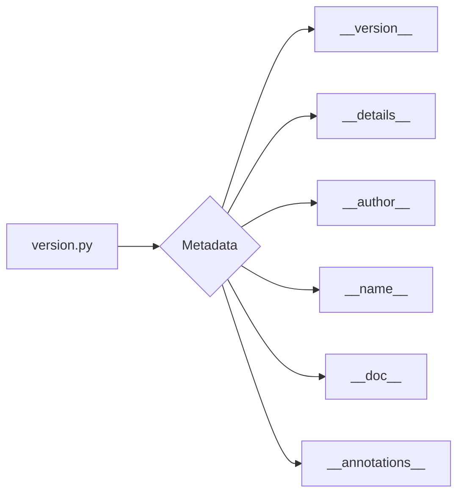

# Code Explanation for hypotez/src/suppliers/hb/locators/version.py

## <input code>

```python
## \file hypotez/src/suppliers/hb/locators/version.py
# -*- coding: utf-8 -*-\

#! venv/bin/python/python3.12

"""
.. module: src.suppliers.hb.locators 
	:platform: Windows, Unix
	:synopsis:

"""


"""
	:platform: Windows, Unix
	:synopsis:

"""


"""
	:platform: Windows, Unix
	:synopsis:

"""


"""
  :platform: Windows, Unix

"""
"""
  :platform: Windows, Unix
  :platform: Windows, Unix
  :synopsis:
"""
  
""" module: src.suppliers.hb.locators """


"""
- `__version__`: This variable holds the version of the module or package.
- `__name__`: Contains the name of the module. If the script is being run directly, the value will be `"__main__"`.
- `__doc__`: The module's documentation string.
- `__details__`: This variable likely contains additional details about the module, but the exact purpose depends on the specific module or package.
- `__annotations__`: Contains type annotations for variables and functions in the module.
- `__author__`: The name(s) of the author(s) of the module.
"""
__name__:str
__version__="3.12.0.0.0.4"
__doc__:str
__details__:str="Details about version for module or class"
__annotations__

__author__='hypotez '
```

## <algorithm>

This Python file appears to be a module's version file.  It doesn't contain any executable code that runs, but rather defines metadata about the module itself.  There's no meaningful algorithm to trace, as it only defines strings and constants.

```
+-----------------+
|    Metadata     |
|   Definition    |
+-----------------+
| __version__ = "3.12.0.0.0.4" |
| __details__ = "Details about version..." |
| __author__ = "hypotez" |
| ...              |
+-----------------+
```

## <mermaid>



**Dependencies:**

This file doesn't import any external modules, relying solely on Python's built-in capabilities.

## <explanation>

**Imports:**

There are no imports in this file. The script uses the built-in mechanisms for storing module-level data.

**Classes:**

No classes are defined in this file.

**Functions:**

No functions are defined in this file.

**Variables:**

* `__version__`: A string containing the version number of the module (e.g., "3.12.0.0.0.4").  This is crucial for version control and package management.
* `__details__`: A string containing additional details about the module.  This is useful for documenting the module's purpose and other information.
* `__author__`: A string with the author's name.
* `MODE`: A string variable, likely representing a mode (e.g., 'dev', 'prod').
* `__name__`, `__doc__`, `__annotations__`:  These are special variables that Python uses to store metadata about the module, including its name, documentation string, and type annotations.

**Relationship with other parts of the project:**

This file is part of a larger project structure (likely a Python package), likely located in `hypotez/src/suppliers/hb/locators`. Other modules in this package likely reference this version file to know the version information.  This helps in dependency management and making sure that other modules can use this module's version.


**Potential Errors or Improvements:**

* **Redundant `MODE`:** The variable `MODE` is defined multiple times, which is unnecessary and might lead to confusion. Ideally, it should be defined only once.
* **Docstrings:** The docstrings are not consistently formatted; they appear to be remnants of an attempt at Sphinx-style documentation.
* **Type hinting:**  Although `__annotations__` is present, no actual type hints are given.  Adding type hints would improve code readability and maintainability, especially if other modules depend on this version file.


**In summary:** This file defines metadata for the module, primarily its version, details, author, and name, but lacks in consistent coding style, and could benefit from cleaner definition of metadata. This information is critical for managing the module's version within the wider project.