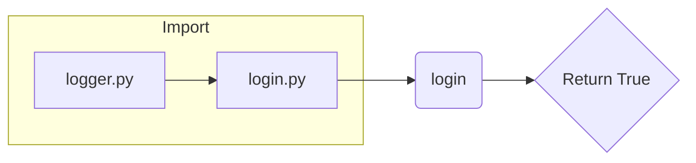

```MD
# Code Explanation for hypotez/src/suppliers/hb/login.py

## <input code>

```python
## \file hypotez/src/suppliers/hb/login.py
# -*- coding: utf-8 -*-\
#! venv/Scripts/python.exe
#! venv/bin/python/python3.12

"""
.. module: src.suppliers.hb 
	:platform: Windows, Unix
	:synopsis:

"""


"""
	:platform: Windows, Unix
	:synopsis:

"""


"""
	:platform: Windows, Unix
	:synopsis:

"""


"""
  :platform: Windows, Unix

"""
"""
  :platform: Windows, Unix
  :platform: Windows, Unix
  :synopsis:
"""
  
""" module: src.suppliers.hb """


"""  Функции авторизации поставщика """
...
from src.logger import logger

def login(s) -> bool:
    """ Функция логин. 
   @param
        s - Supplier
    @returns
        True if login else False

   """
    return True
```

## <algorithm>

The code defines a single function `login` which is likely part of a module for handling logins for a supplier called HB (presumably within the Hypotez project).  A simplified block diagram is as follows:

```
+-----------------+
|      Input      |--->| login(s) |--->| Return Value (bool) |
+-------+---------+     +-----------+     +------------------+
|   Supplier Object (s)  |             |               True / False |
+-----------------+
```

* **Input:** An object `s` representing the supplier.  This object likely contains data about the supplier (e.g., credentials).


* **login(s):** This function simulates a login process for the supplier. In this particular case, it simply returns `True`.  In a real-world implementation, it would check the supplier's credentials against a database or other authentication mechanisms.


* **Return Value:** A boolean value (`True` or `False`).  `True` indicates successful login, `False` indicates failure.


## <mermaid>



**Dependencies Analysis:**

The `login.py` file imports `logger` from `src.logger`. This indicates a dependency on the `logger` module, which is likely responsible for logging events, potentially including login attempts and successes.  The `logger` module resides in a `src` package, implying a structured Python project.  A `venv` is evident from the shebang lines, which suggests a virtual environment set up for this project, which is essential for managing project-specific dependencies.

## <explanation>

* **Imports:** The code imports `logger` from the `src.logger` module. This is a standard practice in larger projects for organizing code and reusing functions or classes across modules.  The `logger` object is likely used to record login attempts, successes, or failures.


* **Classes:** There are no classes defined in this code snippet.


* **Functions:** The `login` function takes a single argument `s`, which represents a `Supplier` object. The function returns a boolean value, indicating the success or failure of the login attempt.  Crucially, the function currently always returns `True`.  This is a placeholder; in a real-world implementation, this function would verify credentials against a database or other authentication mechanism.

* **Variables:** The `MODE` variable is a global constant. In this context, its use is unclear, as it's not used in the function. Further investigation would determine its purpose. It's set to `'dev'`.  In a development/production environment, this could be used to control the behavior of the application based on mode.

* **Potential Errors/Improvements:** The most significant error is the function's current implementation always returns `True`, regardless of the input. This is a placeholder; a real `login` function must validate credentials to ensure security and data integrity.  Other improvements include:

    * **Error Handling:** The current code lacks error handling, which could be significant.  Consider how errors, such as invalid credentials or network problems, would be handled.
    * **Credential Validation:** The current function lacks any mechanism for checking supplier credentials.  This would include database interactions.


* **Relationships with Other Parts of the Project:** The `login` function likely interacts with other parts of the application, especially if it authenticates a user and then uses the authenticated user to perform other operations.  It's a crucial part of a supplier authentication system and the project's functionality regarding supplier interaction.  The `logger` module would be used extensively in integration testing or operations to record authentication activities.