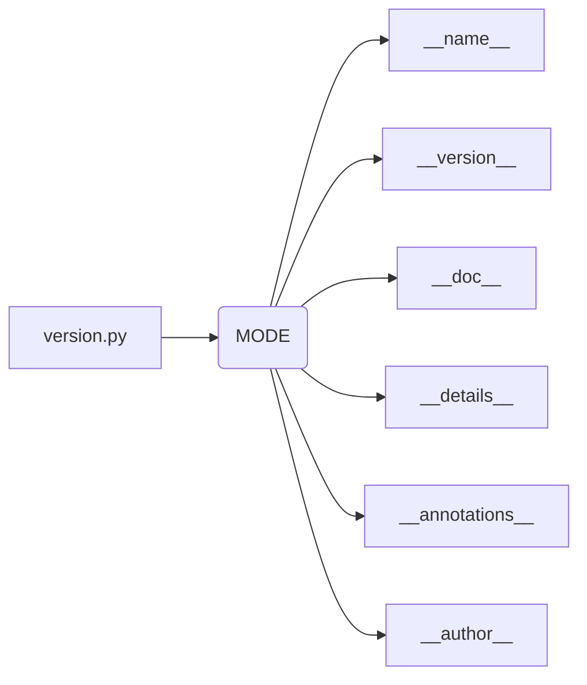

# Code Explanation for hypotez/src/suppliers/hb/scenarios/version.py

## <input code>

```python
## \file hypotez/src/suppliers/hb/scenarios/version.py
# -*- coding: utf-8 -*-\

#! venv/bin/python/python3.12

"""
.. module: src.suppliers.hb.scenarios 
	:platform: Windows, Unix
	:synopsis:

"""


"""
	:platform: Windows, Unix
	:synopsis:

"""


"""
	:platform: Windows, Unix
	:synopsis:

"""


"""
  :platform: Windows, Unix

"""
"""
  :platform: Windows, Unix
  :platform: Windows, Unix
  :synopsis:
"""
  
""" module: src.suppliers.hb.scenarios """


"""
- `__version__`: This variable holds the version of the module or package.
- `__name__`: Contains the name of the module. If the script is being run directly, the value will be `"__main__"`.
- `__doc__`: The module's documentation string.
- `__details__`: This variable likely contains additional details about the module, but the exact purpose depends on the specific module or package.
- `__annotations__`: Contains type annotations for variables and functions in the module.
- `__author__`: The name(s) of the author(s) of the module.
"""
__name__:str
__version__="3.12.0.0.0.4"
__doc__:str
__details__:str="Details about version for module or class"
__annotations__

__author__='hypotez '
```

## <algorithm>

This code snippet defines a module.  The algorithm is simply to declare module-level variables containing metadata about the module.


## <mermaid>



**Dependencies and Analysis:**

The Mermaid diagram shows the relationship between the file and the module-level variables.  There are no external dependencies shown because the code only defines module-level attributes.


## <explanation>

**Imports:** There are no imports in this file.  This module is likely a part of a larger project or framework that defines other modules, classes, or functions.  The imports would be in the other modules within the package.

**Classes:** No classes are defined.

**Functions:** No functions are defined.

**Variables:**
* `MODE`: A string variable initialized to 'dev'. This is likely a configuration parameter for the module, setting its mode (e.g., development, production).
* `__version__`:  A string variable holding the version number of the module.
* `__name__`: A string variable that will contain the name of the module when executed, or the name of the module when it is imported.
* `__doc__`:  A string variable that contains a docstring, used for documentation purposes.
* `__details__`: A string variable storing details about the module.
* `__annotations__`:  This variable is left unassigned.  It would typically hold type annotations (if any).
* `__author__`:  A string variable holding the author of the module.

**Potential Errors or Improvements:**

* **Missing `__main__` block:**  If the intended functionality involves executing the module directly, it should contain a `if __name__ == "__main__":` block to define any executable code. As it stands, there is no execution logic in the file.

* **Redundant comments:** Many of the docstrings are repeating the same platform or synopsis information.  Consider consolidating these comments or removing redundant parts.
* **Type hints:**  The use of type hints (`__annotations__`) should be filled in if the author intends to use static type analysis tools.  Providing type hints greatly improves maintainability.

**Relationships with Other Parts of the Project:**

This `version.py` file is likely part of a package or module structure under the `hypotez` project.  The specific packages or modules would define and use these variables.  Other related modules might be in the `suppliers` package or in subdirectories or sibling directories within `hypotez/src`.