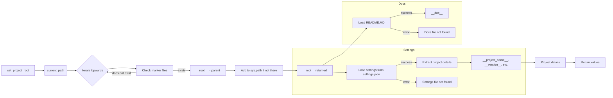

# Code Explanation for hypotez/src/suppliers/ksp/header.py

## <input code>

```python
## \file hypotez/src/suppliers/ksp/header.py
# -*- coding: utf-8 -*-\n#! venv/Scripts/python.exe
#! venv/bin/python/python3.12
"""
.. module: src.suppliers.ksp 
	:platform: Windows, Unix
	:synopsis:

"""
MODE = 'dev'


import sys
import json
from packaging.version import Version
from pathlib import Path
def set_project_root(marker_files=('__root__')) -> Path:
    """
    Finds the root directory of the project starting from the current file's directory,
    searching upwards and stopping at the first directory containing any of the marker files.

    Args:
        marker_files (tuple): Filenames or directory names to identify the project root.
    
    Returns:
        Path: Path to the root directory if found, otherwise the directory where the script is located.
    """
    __root__:Path
    current_path:Path = Path(__file__).resolve().parent
    __root__ = current_path
    for parent in [current_path] + list(current_path.parents):
        if any((parent / marker).exists() for marker in marker_files):
            __root__ = parent
            break
    if __root__ not in sys.path:
        sys.path.insert(0, str(__root__))
    return __root__


# Get the root directory of the project
__root__ = set_project_root()
"""__root__ (Path): Path to the root directory of the project"""

from src import gs

settings:dict = None
try:
    with open(gs.path.root / 'src' /  'settings.json', 'r') as settings_file:
        settings = json.load(settings_file)
except (FileNotFoundError, json.JSONDecodeError):
    ...

doc_str:str = None
try:
    with open(gs.path.root / 'src' /  'README.MD', 'r') as settings_file:
        doc_str = settings_file.read()
except (FileNotFoundError, json.JSONDecodeError):
    ...


__project_name__ = settings.get("project_name", 'hypotez') if settings  else 'hypotez'
__version__: str = settings.get("version", '')  if settings  else ''
__doc__: str = doc_str if doc_str else ''
__details__: str = ''
__author__: str = settings.get("author", '')  if settings else ''
__copyright__: str = settings.get("copyrihgnt", '')  if settings else ''
__cofee__: str = settings.get("cofee", "Treat the developer to a cup of coffee for boosting enthusiasm in development: https://boosty.to/hypo69")  if settings else "Treat the developer to a cup of coffee for boosting enthusiasm in development: https://boosty.to/hypo69"
```

## <algorithm>

**Step 1: Find Project Root:**

The `set_project_root` function searches upward from the current file's location until it finds a directory containing any of the specified marker files (e.g., `pyproject.toml`, `requirements.txt`, `.git`).

```
+-----------------+
| Current File    |
+-----------------+
|                 |
+-----------------+
|  Parent Dir 1  |
+-----------------+
|                 |
+-----------------+
|  Parent Dir 2  |  <-- Project Root found. Contains 'pyproject.toml'
+-----------------+
```


**Step 2: Add to sys.path:**

If the root directory is not already in `sys.path`, it's added to the beginning.  This allows Python to import modules from the project's directories.

**Step 3: Load Settings:**

The code loads settings from `gs.path.root / 'src' / 'settings.json'`.  A `try...except` block handles potential `FileNotFoundError` or `json.JSONDecodeError`.


**Step 4: Load Documentation:**

The code loads documentation from `gs.path.root / 'src' / 'README.MD'`.  Similar `try...except` block to handle potential errors.


**Step 5: Extract Project Details:**

The code extracts various project details (name, version, author, etc.) from the loaded settings, providing defaults if the settings file is missing or doesn't contain the key.


## <mermaid>



**Dependencies Analysis:**

* `sys`: Python's built-in module for interacting with the interpreter.
* `json`:  For working with JSON data (used for loading settings).
* `packaging.version`:  For handling software versioning and comparisons.
* `pathlib`:  For interacting with file paths in an object-oriented way.
* `src`: This imports a module named `gs`, which is likely part of the same project. Its detailed role can only be determined by inspecting the `src` package.  We infer `gs.path.root` points to a module/class that returns the root directory of the project's source code.


## <explanation>

**Imports:**

* `sys`: Provides access to system-specific parameters and functions. It's crucial here for manipulating `sys.path`, enabling the import of modules from the project's root directory.
* `json`: Used to parse and load the project's settings from the `settings.json` file.
* `packaging.version`: Handles version strings correctly (critical for consistent and reliable version comparisons).
* `pathlib`:  Modern, object-oriented way to handle file paths.  This is cleaner and less prone to error compared to string manipulation.
* `src.gs`: Likely a module within the `src` package of the project, used for getting information about the project's location.

**Classes:**

There are no class definitions in this file.

**Functions:**

* `set_project_root(marker_files=...)`:  This function is crucial for finding the root directory of the project from the current file's location. It iterates through parent directories until it finds one containing one of the specified marker files.  It's good practice that `sys.path` is updated.

**Variables:**

* `MODE`: Stores a string value ('dev').  Likely used for different configurations (e.g., production mode).
* `__root__`: A `Path` object representing the project's root directory.  `set_project_root` sets this variable.
* `settings`: A dictionary containing project settings loaded from `settings.json`.  Crucial for configuration.
* `doc_str`: Stores the contents of the README file.
* `__project_name__`, `__version__`, `__doc__`, `__author__`, `__copyright__`, `__cofee__`: Project metadata variables with defaults.

**Potential Errors/Improvements:**

* **Error Handling:** The `try...except` blocks around loading settings and documentation are good, but the `...` in the `except` blocks is a placeholder.  Consider more informative error messages, logging, or alternative actions if the settings or README file is missing.  What should happen if `settings.json` is empty or corrupted?
* **Logging:** Using a logging framework would be beneficial for tracking the project root finding process and the status of file loading.
* **Clearer Naming:**  While `__root__` is standard for representing the project's base directory, other variables could be more descriptive (e.g., `project_root` instead of `__root__`).
* **Robustness:** The project relies on `settings.json` existing and having the correct structure.  Consider adding validation or alternative error handling Startegies for incorrect or incomplete settings.  Consider validation of the contents of `settings.json`.  What about security issues like missing quotes in the loaded JSON data?

**Relationships with Other Parts of the Project:**

This file relies heavily on the `src` package, particularly the `gs` module.  It assumes the existence of `settings.json` and `README.MD` in a specific location relative to the project root. The structure of `gs` plays a critical role in how `header.py` interacts with the project's configuration.


```