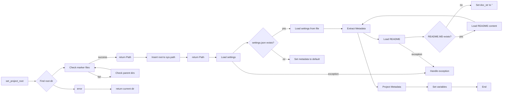

# Code Explanation for `hypotez/src/suppliers/kualastyle/header.py`

## <input code>

```python
## \file hypotez/src/suppliers/kualastyle/header.py
# -*- coding: utf-8 -*-\
#! venv/Scripts/python.exe
#! venv/bin/python/python3.12

"""
.. module: src.suppliers.kualastyle 
	:platform: Windows, Unix
	:synopsis:

"""


import sys
import json
from packaging.version import Version

from pathlib import Path
def set_project_root(marker_files=('__root__')) -> Path:
    """
    Finds the root directory of the project starting from the current file's directory,
    searching upwards and stopping at the first directory containing any of the marker files.

    Args:
        marker_files (tuple): Filenames or directory names to identify the project root.
    
    Returns:
        Path: Path to the root directory if found, otherwise the directory where the script is located.
    """
    __root__:Path
    current_path:Path = Path(__file__).resolve().parent
    __root__ = current_path
    for parent in [current_path] + list(current_path.parents):
        if any((parent / marker).exists() for marker in marker_files):
            __root__ = parent
            break
    if __root__ not in sys.path:
        sys.path.insert(0, str(__root__))
    return __root__


# Get the root directory of the project
__root__ = set_project_root()
"""__root__ (Path): Path to the root directory of the project"""

from src import gs

settings:dict = None
try:
    with open(gs.path.root / 'src' / 'settings.json', 'r') as settings_file:
        settings = json.load(settings_file)
except (FileNotFoundError, json.JSONDecodeError):
    ...

doc_str:str = None
try:
    with open(gs.path.root / 'src' / 'README.MD', 'r') as settings_file:
        doc_str = settings_file.read()
except (FileNotFoundError, json.JSONDecodeError):
    ...


__project_name__ = settings.get("project_name", 'hypotez') if settings  else 'hypotez'
__version__: str = settings.get("version", '')  if settings  else ''
__doc__: str = doc_str if doc_str else ''
__details__: str = ''
__author__: str = settings.get("author", '')  if settings  else ''
__copyright__: str = settings.get("copyrihgnt", '')  if settings  else ''
__cofee__: str = settings.get("cofee", "Treat the developer to a cup of coffee for boosting enthusiasm in development: https://boosty.to/hypo69")  if settings  else "Treat the developer to a cup of coffee for boosting enthusiasm in development: https://boosty.to/hypo69"
```

## <algorithm>

1. **Set Project Root:**  The `set_project_root` function determines the project root directory by checking parent directories for the presence of specific marker files (e.g., `pyproject.toml`, `requirements.txt`, `.git`).
   * **Input:** A tuple of file/directory names (`marker_files`).
   * **Output:** The `Path` to the project root directory.
   * **Example:** If `marker_files` contains `pyproject.toml` and the file exists in the parent directory, it returns the `Path` to that parent directory.

2. **Load Settings:** The script attempts to load settings from `gs.path.root / 'src' / 'settings.json'`.
   * **Input:** The JSON path string.
   * **Output:**  `settings` (dictionary), or `None` if an error occurs (e.g., file not found, invalid JSON).

3. **Load Documentation:**  The script attempts to load documentation from `gs.path.root / 'src' / 'README.MD'`.
   * **Input:** The file path.
   * **Output:** `doc_str` (string with the content of the file), or `None` if an error occurs.


4. **Extract Project Metadata:**  Extract values for `__project_name__`, `__version__`, etc. from the `settings` dictionary (or fallback to default values if `settings` is `None` or the key doesn't exist).
   * **Input:** `settings` dictionary.
   * **Output:** Several project metadata variables.

## <mermaid>



**Dependencies Analysis**:

* `sys`: Provides access to system-specific parameters and functions, used for inserting the project root into the `sys.path` to enable imports.
* `json`: Used for reading and parsing the `settings.json` file.
* `packaging.version`:  Used for version management, which is not directly visible in the output but often used in project structure.
* `pathlib`:  Used for working with file paths (`Path`).
* `src.gs`:  Likely a module/package in the project that provides functions for interacting with project-wide resources like the root path. This needs external explanation in the project docs.

## <explanation>

**Imports:**

* `sys`: Used for modifying the Python path, enabling the import of modules from the project root.
* `json`: Used for parsing the `settings.json` file.
* `packaging.version`: Used for handling versions, important for project metadata and potential dependency management.
* `pathlib`: Used for a more object-oriented and platform-independent approach to working with file paths.
* `src.gs`:  This is a crucial import. It signifies that this file relies on a project-specific module (`gs`) to locate the project root directory (`gs.path.root`). Understanding `gs` is key to understanding the project's structure and how different parts interact.  More context on `gs` and `gs.path` is required.


**Classes:**

There are no classes defined in this file.


**Functions:**

* `set_project_root(marker_files)`: Finds the project root directory by checking parent directories.
    * Arguments: `marker_files` (a tuple of file/directory names).
    * Return value: The `Path` object to the project root.

**Variables:**

* `MODE`: A string, probably a mode setting (e.g., `'dev'`, `'prod'`).
* `__root__`: A `Path` object, representing the root directory of the project.
* `settings`: A dictionary, holding project settings loaded from `settings.json`.
* `doc_str`: A string containing the content of the `README.MD` file.
* `__project_name__`, `__version__`, `__doc__`, etc.: Strings containing project metadata.

**Potential Errors/Improvements:**

* **Error Handling:** The `try...except` blocks handle `FileNotFoundError` and `json.JSONDecodeError`, which is good.  However, adding more specific exception handling (e.g., `IOError` for other I/O errors) might be beneficial.
* **`gs` dependency:** The `gs` module is critical but not explained here.  The code heavily relies on `gs.path.root`; without understanding how `gs` calculates and accesses the project root, this code's operation remains unclear.
* **Explicit return values:** In the `try` blocks, if the file is not found, the variables should be set to `None` explicitly for clarity.


**Relationships:**

This file relies on `src.gs` (and whatever modules that `gs` imports) for obtaining the project root directory.  It uses `json` for managing project settings.  The relationship with other parts of the project is strongly dependent on the functionality provided by the `src.gs` module.  Further analysis is needed to determine the full relationships. The file sets project-level variables for use elsewhere in the project, showing a dependency relationship on its subsequent use.