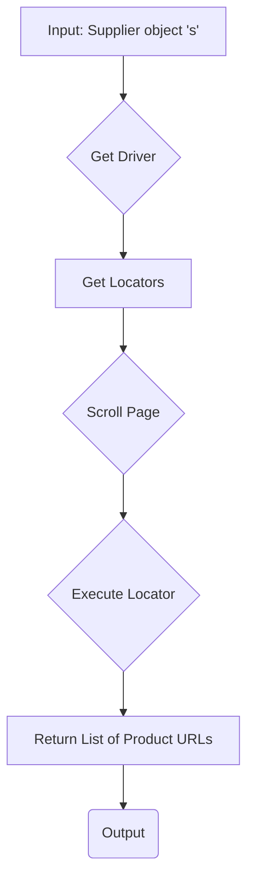

# Code Explanation for hypotez/src/suppliers/kualastyle/via_webdriver.py

## <input code>

```python
## \file hypotez/src/suppliers/kualastyle/via_webdriver.py
# -*- coding: utf-8 -*-\
#! venv/Scripts/python.exe
#! venv/bin/python/python3.12

"""
.. module: src.suppliers.kualastyle 
	:platform: Windows, Unix
	:synopsis:

"""


"""
	:platform: Windows, Unix
	:synopsis:

"""


"""
	:platform: Windows, Unix
	:synopsis:

"""


"""
  :platform: Windows, Unix

"""
"""
  :platform: Windows, Unix
  :platform: Windows, Unix
  :synopsis:
"""
  
""" module: src.suppliers.kualastyle """


"""    parsing kualastyle via webdriver

@namespace src: src
 \package src.suppliers.kualastyle
\file via_webdriver.py

 @section libs imports:
  - helpers 
  - typing 
  - gs 
  
Author(s):
  - Created by [Name] [Last Name] on 08.11.2023 .
"""


from src.logger import logger
from typing import Union

from src import gs
from src.logger import logger

def get_list_products_in_category(s) -> list[str,str,None]:    
    """ Returns list of products urls from category page
    Attrs:
        s - Suplier
    @returns
        list of products urls or None
    """
    d = s.driver
    l: dict = s.locators.get('category')
    d.scroll(scroll_count = 10, direction = "forward")

    _ = d.execute_locator
    list_products_in_category = _(l['product_links'])
    #pprint(list_products_in_category)
    return list_products_in_categoryy
```

## <algorithm>


**Example:**

1.  **Input:** `s` is a `Supplier` object representing the supplier (likely containing a WebDriver instance and locators).


2.  **Get Driver:** The code retrieves the WebDriver instance from the `s` object (`d = s.driver`).


3.  **Get Locators:** It extracts the locators (`l`) for product links from `s.locators` using `get('category')`.  For example, if `s.locators` has a dictionary `{ "category": {"product_links": "//xpath"}}`, `l` would contain `{"product_links": "//xpath"}`


4.  **Scroll Page:**  It performs a scroll operation on the driver (`d.scroll`).  This scrolls the page, likely to ensure all product links are loaded.


5.  **Execute Locator:** The core logic lies here. The function uses `d.execute_locator` to find and extract the product links based on the locator data (`l['product_links']`).


6.  **Return List of Product URLs:** The function returns the list of product URLs obtained from the execution.


## <mermaid>

```mermaid
graph TD
    subgraph Imports
        A[src.logger] --> B;
        C[typing] --> B;
        D[src.gs] --> B;
    end
    B --> E(get_list_products_in_category);
    E --> F[Supplier];
    F -- driver --> G[WebDriver];
    F -- locators --> H[Locators];
    H --> I[locators.get("category")];
    I --> J{scroll page};
    J --> K[execute_locator];
    K --> L[list_products_in_category];
    L --> M(Return);
```


**Dependencies Analysis:**

*   `src.logger`: Likely a custom logging module for the project.
*   `typing`: Python's typing module for type hinting, crucial for code maintainability and readability.
*   `src.gs`: Probably a module related to the general services or functionality of the project. The exact nature depends on the project's structure.

## <explanation>

**Imports:**

*   `from src.logger import logger`: Imports the `logger` object from the `src.logger` module, for logging within this script.
*   `from typing import Union`: Imports the `Union` type from `typing`, though not used in this case, which allows defining different types that can be substituted for the type, potentially used in other parts of the project.
*   `from src import gs`: Imports the module `gs` from the `src` package, which is likely a general-purpose service or utility module.
*   `from src.logger import logger`: This is a duplicate import of `logger` and should be removed.


**Classes:**

*   The code assumes the existence of a `Supplier` class, as it uses `s.driver` and `s.locators`, suggesting it represents a specific supplier or product source (e.g., a database or online store).  The `Supplier` class is not defined in the provided code fragment, therefore we cannot give detailed information about its attributes and methods.

**Functions:**

*   `get_list_products_in_category(s)`: Takes a `Supplier` object (`s`) as input, which likely includes a WebDriver instance for interacting with the supplier's website, and locators for identifying elements on the web pages.  It retrieves product URLs by scrolling the page and using locators. It returns a list of URLs.

**Variables:**

*   ``: A global variable that probably sets a mode for the application, potentially used for debugging or development.
*   `d`: Represents the WebDriver instance extracted from the input `s`.
*   `l`: Stores the locators for the 'category' page section.
*   `list_products_in_category`: Stores the list of product URLs found on the page.


**Potential Errors and Improvements:**

*   **Missing `pprint` import:** The code uses `pprint` (likely for pretty printing the list of product URLs), but it's not imported.
*   **`list_products_in_categoryy` variable name error:** The variable name `list_products_in_categoryy` appears to be a typo.  Should be `list_products_in_category`.
*   **Error Handling:** The code lacks error handling (e.g., using a `try...except` block) for potential issues like the page not loading properly or the locators not being found.  This will cause the application to crash if something unexpected occurs.
*   **Dynamic Locators:**  The locators (`l['product_links']`) are hardcoded, which might not be suitable for websites with dynamic content. Consider Startegies for dynamic locator generation.  If the website structure changes, these locators might break.
*   **`d.execute_locator`:** It's crucial to have the definition of `execute_locator` to understand how it works and the parameters to ensure proper functionality. This function is likely part of a `WebDriver` implementation, not a standard Python function.  It's not a common function and needs clarification on how to use it.
*   **Type Hinting Improvement:**  `list[str, str, None]` should be `list[tuple[str, str]]` or `list[tuple[str, str, ...]]`, or `List[str]` if you are working with single string URLs.


**Relationship Chain:**

The code likely interacts with the `src.logger`, `src.gs`, and likely a `Supplier` class in another part of the project for logging and retrieving supplier-specific information.  The `Supplier` class likely instantiates a `WebDriver` object for interacting with web pages and using `execute_locator` or similar methods for dynamic information extraction. The returned product list would be used by another component of the application that handles further processing.