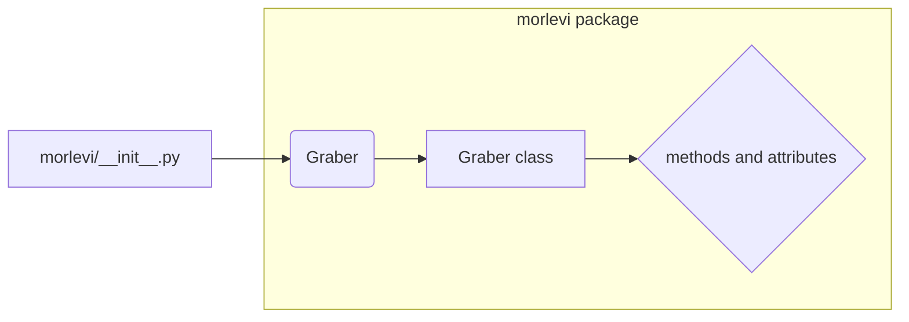

# <input code>

```python
## \file hypotez/src/suppliers/morlevi/__init__.py
# -*- coding: utf-8 -*-\
#! venv/Scripts/python.exe
#! venv/bin/python/python3.12

"""
.. module: src.suppliers.morlevi 
	:platform: Windows, Unix
	:synopsis:

"""
MODE = 'dev'

from .graber import Graber
```

# <algorithm>

This code snippet is a Python module (`__init__.py`) for a package named `morlevi` within the `suppliers` directory.  It initializes the package by importing a class named `Graber` from a submodule named `graber`.

There's no explicit algorithm in the sense of a sequence of steps.  The main functionality is importing a class.  Data flow is entirely internal to the module.

**Step-by-Step:**

1. **Import:** The module `graber` (likely containing the definition of the `Graber` class) is imported.
2. **Initialization:** The module does no substantial initialization beyond setting a variable `MODE` to `'dev'`.  This might be a mode/configuration flag for the package.

**Example:**

This module would serve as an entry point for other parts of the application that need to use the `Graber` class.


# <mermaid>



**Dependencies and Explanation:**

The mermaid diagram illustrates a simple dependency. The `morlevi` package imports `Graber` from the sub-package `graber`.  The `graber` package likely contains a `.py` file defining the `Graber` class. The diagram shows the `Graber` class and its potential methods and attributes.  A more detailed diagram would be needed to illustrate the class's structure if that information were available.

# <explanation>

**Imports:**

- `from .graber import Graber`: This line imports the `Graber` class from the `graber` submodule within the `morlevi` package.  The `.` indicates a relative import, meaning the `graber` module is expected to be in the same directory. This import is crucial to use the functionality of the `Graber` class in other parts of the codebase. This establishes a dependency on the `graber` module.

**Classes:**

- There are no class definitions directly within this `__init__.py` file.  The `Graber` class is defined in the `graber` module.

**Functions:**

- There are no functions defined within this `__init__.py` file.

**Variables:**

- `MODE = 'dev'`: This variable likely holds a configuration value, in this case set to 'dev'. It is often used to distinguish between development (`dev`) and production (`prod`) environments, affecting behavior of subsequent code (e.g., logging, data sources).


**Potential Errors/Improvements:**

- **Missing Docstrings:** While the module has a docstring, the `Graber` import does not. A detailed docstring for `Graber` explaining its purpose, attributes, and methods would improve readability and maintainability.
- **Relative import in a non-standard fashion:**  Using relative imports(`.`) within the structure of a package is a common practice. It's a good design choice, promoting modularity and self-containment.
- **Missing error handling:**  There's no error handling in place for the import.  If the `graber` module does not exist or contains invalid code, an exception will occur during the execution. Including `try...except` blocks would make this code more robust.

**Relationships with Other Parts:**

The `morlevi` package, through the `Graber` class, presumably interacts with data sources or other parts of the application. This relationship is not detailed in the code snippet, but the `Graber` likely is responsible for interacting with external data in a way that is defined within the `graber.py` module.  This is a crucial part of the package's overall architecture.