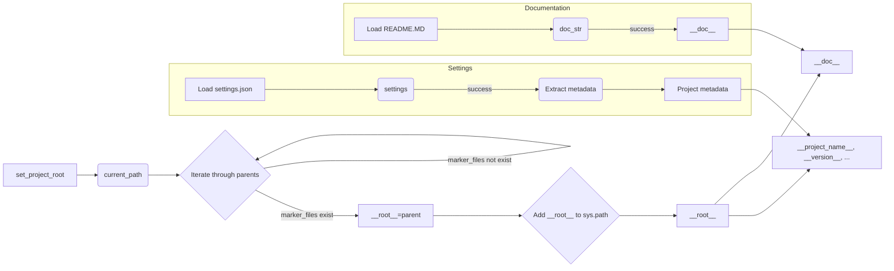

# Analysis of hypotez/src/suppliers/morlevi/header.py

## <input code>

```python
## \file hypotez/src/suppliers/morlevi/header.py
# -*- coding: utf-8 -*-\
#! venv/Scripts/python.exe
#! venv/bin/python/python3.12

"""
.. module: src.suppliers.morlevi 
	:platform: Windows, Unix
	:synopsis:

"""
MODE = 'dev'

import sys
import json
from packaging.version import Version

from pathlib import Path
def set_project_root(marker_files=('__root__')) -> Path:
    """
    Finds the root directory of the project starting from the current file's directory,
    searching upwards and stopping at the first directory containing any of the marker files.

    Args:
        marker_files (tuple): Filenames or directory names to identify the project root.
    
    Returns:
        Path: Path to the root directory if found, otherwise the directory where the script is located.
    """
    __root__:Path
    current_path:Path = Path(__file__).resolve().parent
    __root__ = current_path
    for parent in [current_path] + list(current_path.parents):
        if any((parent / marker).exists() for marker in marker_files):
            __root__ = parent
            break
    if __root__ not in sys.path:
        sys.path.insert(0, str(__root__))
    return __root__


# Get the root directory of the project
__root__ = set_project_root()
"""__root__ (Path): Path to the root directory of the project"""

from src import gs

settings:dict = None
try:
    with open(gs.path.root / 'src' /  'settings.json', 'r') as settings_file:
        settings = json.load(settings_file)
except (FileNotFoundError, json.JSONDecodeError):
    ...

doc_str:str = None
try:
    with open(gs.path.root / 'src' /  'README.MD', 'r') as settings_file:
        doc_str = settings_file.read()
except (FileNotFoundError, json.JSONDecodeError):
    ...


__project_name__ = settings.get("project_name", 'hypotez') if settings  else 'hypotez'
__version__: str = settings.get("version", '')  if settings  else ''
__doc__: str = doc_str if doc_str else ''
__details__: str = ''
__author__: str = settings.get("author", '')  if settings else ''
__copyright__: str = settings.get("copyrihgnt", '')  if settings else ''
__cofee__: str = settings.get("cofee", "Treat the developer to a cup of coffee for boosting enthusiasm in development: https://boosty.to/hypo69")  if settings else "Treat the developer to a cup of coffee for boosting enthusiasm in development: https://boosty.to/hypo69"
```

## <algorithm>

1. **`set_project_root` Function:**
   - Takes a tuple of marker files as input.
   - Starts at the directory of the current file (`__file__`).
   - Iterates through parent directories until it finds a directory containing any of the marker files.
   - If found, sets `__root__` to that parent directory.
   - Adds the root directory to `sys.path` if it's not already present.
   - Returns the `__root__` Path.

   *Example:* If `__file__` is `/path/to/project/src/suppliers/morlevi/header.py`, the function would search upwards (`/path/to/project/src/suppliers`, `/path/to/project/src`, `/path/to/project`) for files like `pyproject.toml`, `requirements.txt`, `.git`.


2. **Initialization:**
   - Calls `set_project_root` to find the project root directory.
   - This value is stored in the `__root__` variable.

3. **Settings and Documentation Loading:**
   - Attempts to load `settings.json` from the project root/src directory, storing the loaded JSON in the `settings` dictionary.
   - Handles `FileNotFoundError` and `json.JSONDecodeError` if the file doesn't exist or is invalid JSON.

   - Attempts to load `README.MD` from the project root/src directory, storing the content in the `doc_str` string.
   - Handles `FileNotFoundError` and `json.JSONDecodeError` if the file doesn't exist or is invalid.

4. **Project Metadata Extraction:**
   - Extracts various project metadata (name, version, author, etc.) from the `settings` dictionary, using `get()` to avoid KeyError if a key is missing.
   - Sets default values for missing keys.


## <mermaid>



*Explanation of Dependencies:*

- `sys`: Provides access to system-specific parameters and functions, used for manipulating the Python path.
- `json`: Used for loading and parsing the JSON data from `settings.json`.
- `packaging.version`: Used for handling and comparing software versions.
- `pathlib`: Provides object-oriented way to work with file paths in a more robust and easier manner. Used to construct and manipulate file paths.
- `src.gs`: A custom module likely containing functions or variables related to getting the project's root path and other project-related properties.  The dependency analysis would require examining the code in the `src` package.


## <explanation>

- **Imports:**
    - `sys`: For interacting with the Python interpreter, specifically manipulating the `sys.path` list.
    - `json`: For encoding and decoding JSON data.
    - `packaging.version`: For version handling in a platform-independent way.
    - `pathlib`: For a more object-oriented approach to file paths, avoiding string manipulation issues.
    - `src.gs`:  Crucial. The `gs` module (likely `src/gs.py`) contains functions related to getting the project's root path.  Detailed understanding of `gs.path.root` requires inspecting the `gs` module.


- **Classes:** No classes are defined in this file.

- **Functions:**
    - `set_project_root(marker_files)`:
        - Arguments: A tuple of filenames/directory names to identify the project root.
        - Returns: A `Path` object representing the project root.
        - Functionality: Recursively searches up the directory tree from the current file's location to find the first directory containing any of the specified marker files. Adds the root directory to `sys.path` for better module importing.


- **Variables:**
    - `MODE`: A string defining the project mode (likely 'dev' or 'prod').
    - `settings`: A dictionary storing project settings from `settings.json`.
    - `doc_str`: A string containing the content of `README.MD`.
    - `__root__`: The Path object storing the project's root directory.
    - `__project_name__`, `__version__`, `__doc__`, `__details__`, `__author__`, `__copyright__`, `__cofee__`: Project metadata retrieved from `settings.json` (or default values).


- **Potential Errors/Improvements:**
    - The `try...except` blocks for loading `settings.json` and `README.MD` are good practice for robustness.
    - Error handling could be improved by logging the specific errors instead of just using `...`.  
    - Consider using a more descriptive variable name than `__root__` to improve readability.
    - The use of `if settings` in multiple lines is slightly redundant. `settings and settings.get(...)` could be more concise and readable.

- **Relationships with other parts of the project:**
    - The `src.gs` module is a crucial dependency, affecting how the project finds and interacts with its root directory. This code directly relies on the implementation details of the `gs.path.root` attribute to get the root directory.