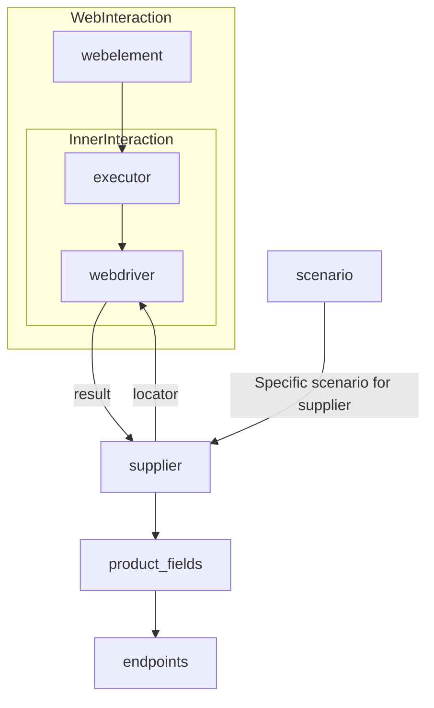

# Code Explanation for `Supplier` Class

## <input code>

```
# **Класс** `Supplier`
### **Базовый класс для всех поставщиков**
*В контексте кода `Supplier` - поставщик информации.
Поставщиком может быть производитель какого-либо тавара, данных или информации
Источники потавщика - целевая страница сайта, документ, база данных, таблица.
Класс сводит разных поставщиков к одинаковому алгоритму действий внутри класса.
У каждого поставщика есть свой уникальный префикс. ([подробно о префиксах](prefixes.md))*


Класс `Supplier` служит основой для управления взаимодействиями с поставщиками. 
Он выполняет инициализацию, настройку, аутентификацию и запуск сценариев для различных источников данных, таких как `amazon.com`, `walmart.com`, `mouser.com` и `digikey.com`. Клиент может определить дополнительные поставщики.


---
## Список реализованныx поставщиков:

[aliexpress](aliexpress/README.RU.MD)  - Реализован в двух варианах сценариев: `webriver` и `api` 

[amazon](amazon/README.RU.MD) - `webdriver` 

[bangood](bangood/README.RU.MD)  - `webdriver` 

[cdata](cdata/README.RU.MD)  - `webdriver` 

[chat_gpt](chat_gpt/README.RU.MD)  - Работа с чатом chatgpt (НЕ С МОДЕЛЬЮ!) 

[ebay](ebay/README.RU.MD)  - `webdriver` 

[etzmaleh](etzmaleh/README.RU.MD)  - `webdriver` 

[gearbest](gearbest/README.RU.MD)  - `webdriver` 

[grandadvance](grandadvance/README.RU.MD)  - `webdriver` 

[hb](hb/README.RU.MD)  - `webdriver` 

[ivory](ivory/README.RU.MD) - `webdriver` 

[ksp](ksp/README.RU.MD) - `webdriver`

[kualastyle](kualastyle/README.RU.MD) `webdriver` 

[morlevi](morlevi/README.RU.MD) `webdriver` 

[visualdg](visualdg/README.RU.MD) `webdriver` 

[wallashop](wallashop/README.RU.MD) `webdriver`  

[wallmart](wallmart/README.RU.MD) `webdriver` 

[подробно о вебдрайвере :class: `Driver`](../webdriver/README.RU.MD)    
[подробно о сценариях :class: `Scenario`](../scenarios/README.RU.MD)
---


## <algorithm>

The `Supplier` class manages interactions with various data providers (e.g., websites). The workflow can be summarized as:

1. **Initialization (`__init__`)**:  The class is initialized with `supplier_prefix`, `locale`, and `webdriver` type.  
    * Example: `supplier = Supplier(supplier_prefix='aliexpress', locale='en', webdriver='chrome')`
2. **Loading settings (`_payload`)**:  Loads configuration (likely from a JSON file), initializes web driver, and locators.
    * Example: `supplier._payload(webdriver='firefox')`
3. **Authentication (`login`)**: Logs in to the provider's website.
    * Example: `supplier.login()`
4. **Running scenarios (`run_scenario_files`, `run_scenarios`)**: Executes predefined scripts (scenarios) to extract data.  
    * Example, running files: `supplier.run_scenario_files(['example_scenario.json'])`
    * Example, running specific scenarios: `supplier.run_scenarios([{'action': 'scrape', 'target': 'product_list'}])`


## <mermaid>

The provided mermaid diagram shows the interaction flow between components:

* `webelement`, `executor`, `webdriver`: Represents web elements, the component handling interaction with them and web driver.  
* `supplier`, `product_fields`, `endpoints`, `scenario`: Represents the central logic handling data extraction.

The diagram illuStartes the dependencies between different parts of the system: The `supplier` interacts with the `webdriver` to fetch data, and the `scenario` defines specific actions to be performed.  The relationships clearly show the data flow.


## <explanation>

### Imports:

No imports are shown in the provided code snippet. The references to other `.md` files (e.g., `prefixes.md`, `../webdriver/README.RU.MD`) are documentation links, not import statements.  It's important that imports needed to use other parts of the project (e.g., the `Driver` class) are defined in the Python code.

### Classes:

The `Supplier` class is a base class for managing interactions with various data providers.


### Functions:

* `__init__`: Initializes the `Supplier` object, setting parameters like the supplier prefix, locale, and webdriver type.
* `_payload`: Loads the supplier's configuration and initializes the WebDriver instance.
* `login`: Handles authentication with the supplier's website.
* `run_scenario_files`: Executes scenario files (presumably containing data extraction logic).
* `run_scenarios`: Executes specific scenarios.


### Variables:

The provided snippet lists the attributes/variables of the class: `supplier_id`, `supplier_prefix`, `supplier_settings`, `locale`, etc.  Their types are indicated (int, str, dict, etc.).

### Potential Errors & Improvements:

* **Error Handling:** The code snippets lack error handling (e.g., `try...except` blocks).  Catching exceptions during web interaction, configuration loading, or scenario execution would significantly improve robustness.
* **Data Validation:**  Validation of loaded data and extracted information is crucial. Ensuring data integrity is essential for downstream processing.
* **Logging:** Adding logging would allow tracing the execution flow, especially useful for debugging and monitoring.  Logging errors and warnings during web interaction or scenario execution would significantly improve troubleshooting.
* **Code Structure:** The code snippet shows class definition, but lacks the actual implementation for methods like `_payload`, `login`, etc.  The complete code is needed to give a comprehensive analysis.
* **External Dependencies:** The `webdriver` dependency must be properly managed (installed).  The exact web driver type used needs to be identified (e.g., Selenium).


### Relationships:

The `Supplier` class relies on the `Driver` class (mentioned in the documentation) for web interaction and `Scenario` (likely in `../scenarios/README.RU.MD`) for defining data extraction actions. The relationships are documented via references. The design suggests that the `Scenario` class interacts with the `Supplier` class to define and manage the steps for data acquisition. The `Supplier` handles the provider-specific aspects and orcheStartes the overall data collection process. The `prefixes.md` file likely defines the unique prefixes for each supplier.