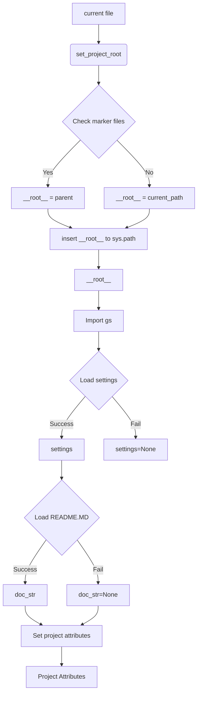
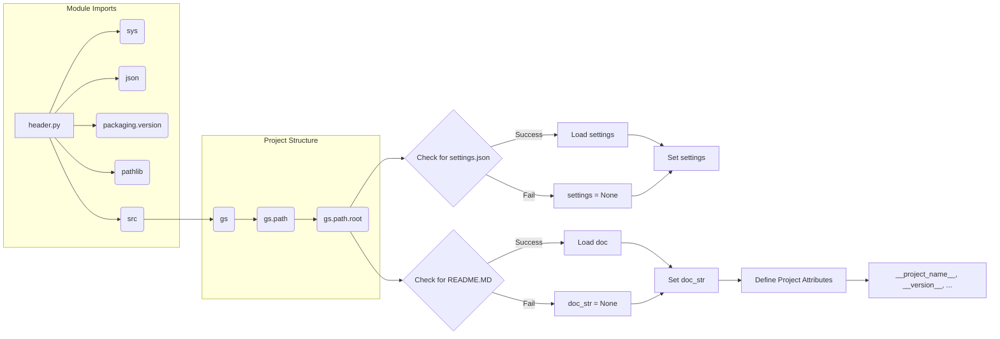

```MD
# Analysis of hypotez/src/suppliers/visualdg/header.py

## <input code>

```python
## \file hypotez/src/suppliers/visualdg/header.py
# -*- coding: utf-8 -*-

#! venv/bin/python/python3.12

"""
.. module: src.suppliers.visualdg 
	:platform: Windows, Unix
	:synopsis:

"""


import sys
import json
from packaging.version import Version

from pathlib import Path
def set_project_root(marker_files=('__root__','.git')) -> Path:
    """
    Finds the root directory of the project starting from the current file's directory,
    searching upwards and stopping at the first directory containing any of the marker files.

    Args:
        marker_files (tuple): Filenames or directory names to identify the project root.
    
    Returns:
        Path: Path to the root directory if found, otherwise the directory where the script is located.
    """
    __root__:Path
    current_path:Path = Path(__file__).resolve().parent
    __root__ = current_path
    for parent in [current_path] + list(current_path.parents):
        if any((parent / marker).exists() for marker in marker_files):
            __root__ = parent
            break
    if __root__ not in sys.path:
        sys.path.insert(0, str(__root__))
    return __root__


# Get the root directory of the project
__root__ = set_project_root()
"""__root__ (Path): Path to the root directory of the project"""

from src import gs

settings:dict = None
try:
    with open(gs.path.root / 'src' / 'settings.json', 'r') as settings_file:
        settings = json.load(settings_file)
except (FileNotFoundError, json.JSONDecodeError):
    ...

doc_str:str = None
try:
    with open(gs.path.root / 'src' / 'README.MD', 'r') as settings_file:
        doc_str = settings_file.read()
except (FileNotFoundError, json.JSONDecodeError):
    ...


__project_name__ = settings.get("project_name", 'hypotez') if settings  else 'hypotez'
__version__: str = settings.get("version", '')  if settings  else ''
__doc__: str = doc_str if doc_str else ''
__details__: str = ''
__author__: str = settings.get("author", '')  if settings  else ''
__copyright__: str = settings.get("copyrihgnt", '')  if settings  else ''
__cofee__: str = settings.get("cofee", "Treat the developer to a cup of coffee for boosting enthusiasm in development: https://boosty.to/hypo69")  if settings  else "Treat the developer to a cup of coffee for boosting enthusiasm in development: https://boosty.to/hypo69"
```

## <algorithm>



This algorithm first identifies the project root directory (`__root__`) by recursively checking parent directories for marker files (e.g., `pyproject.toml`, `requirements.txt`, `.git`). If found, it adds the root directory to `sys.path`, enabling imports from the project's packages. Subsequently, it attempts to load project settings from `settings.json` and documentation from `README.MD`, handling potential errors. Finally, it defines project attributes (`__project_name__`, `__version__`, etc.) based on the loaded data, providing defaults if data isn't found.


## <mermaid>



Dependencies:
* `sys`: Provides access to system-specific parameters and functions, like `sys.path`.
* `json`: Enables working with JSON data for configuration.
* `packaging.version`: Used for handling and comparing package versions.
* `pathlib`: Provides a way to work with file paths in a more object-oriented manner.
* `src`: This is a crucial import, indicating a dependency on a higher-level project structure. The `gs` module, imported from `src`, implies the existence of a project-level utility library or package handling general system services.


## <explanation>

* **Imports**:
    * `sys`: For interacting with the Python runtime environment, notably modifying `sys.path` to allow imports from the project's source tree.
    * `json`: For parsing the `settings.json` file.
    * `packaging.version`: For handling package versioning, crucial for software version management.
    * `pathlib`: Facilitates handling file paths.
    * `src`: Importing the `gs` module, which implies that `gs` contains general project-level utilities or helper functions, possibly related to file paths.


* **Classes**:  No classes are defined in this file.


* **Functions**:
    * `set_project_root()`: Locates the project root directory based on marker files present in parent directories. This function ensures that `sys.path` includes the project root directory to enable imports from other modules.  It's crucial for modular projects.
        * **Args**: A tuple of filenames or directory names to use as markers for finding the root directory.
        * **Return**: A `Path` object representing the root directory.

* **Variables**:
    * `MODE`: A string variable defining the execution mode (e.g., 'dev', 'prod').
    * `settings`: A dictionary variable containing project-level settings read from `settings.json`.  This is a crucial configuration point.
    * `doc_str`: A string variable holding the contents of the `README.MD` file.  This is beneficial for providing documentation.
    * `__root__`: A `Path` variable containing the project root directory, determined by the `set_project_root()` function.  This variable facilitates access to other project resources.
    * `__project_name__`, `__version__`, `__doc__`, etc.: These variables hold project-related metadata.


* **Potential Errors/Improvements**:
    * **Robust Error Handling:** The `try...except` blocks around the file reading are good but could be more specific. For example, `FileNotFoundError` is not the only error that could arise with file operations. Using a more generic `IOError` could be a safer option.
    * **Clearer variable names**: Some variable names (e.g., `__root__`) could be more descriptive to enhance readability.
    * **Docstrings**: Docstrings in Python are important for documentation, and all functions should have detailed docstrings.
* **Relationships**: This file is a header file, setting up the project environment, crucial for ensuring that other modules can access and utilize project-level resources, like settings and documentation. It establishes dependencies on `src` and the `gs` package, laying a foundation for subsequent operations within the project.