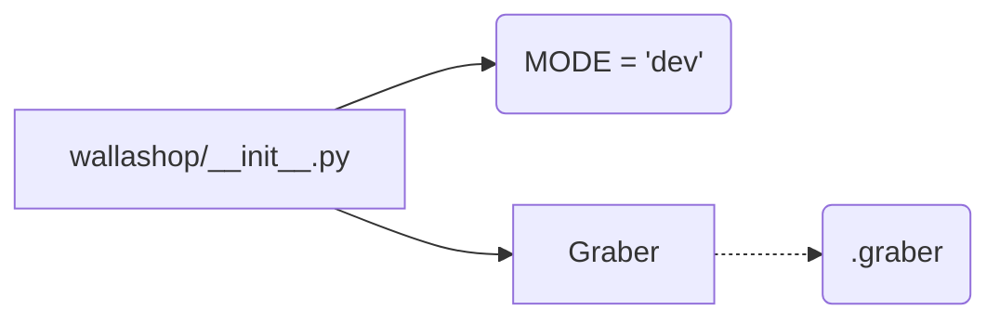

# <input code>

```python
## \file hypotez/src/suppliers/wallashop/__init__.py
# -*- coding: utf-8 -*-\
#! venv/Scripts/python.exe
#! venv/bin/python/python3.12

"""
.. module: src.suppliers.wallashop 
	:platform: Windows, Unix
	:synopsis:

"""
MODE = 'dev'

from .graber import Graber
```

# <algorithm>

No algorithm is present in the provided code as it's just an initialization file.  The file sets a variable `MODE` and imports a class `Graber` from a submodule `graber`.  There's no function call, loop, or complex logic.


# <mermaid>



**Dependency Analysis and Explanation:**

The mermaid graph shows a simple relationship.  `wallashop/__init__.py` sets a variable and imports `Graber` from the `.graber` module within the same package. The `graber` module likely contains the definition of the `Graber` class.  There are no explicit dependencies on external packages that can be shown in the diagram.

# <explanation>

* **Imports:**
    * `from .graber import Graber`: This line imports the `Graber` class from the `graber.py` module, which is located within the same directory (`suppliers/wallashop`). The `.` prefix indicates that the import is from a submodule within the same package.  This is a standard Python practice.

* **Variables:**
    * `MODE = 'dev'`: This global variable likely controls the execution mode of the `wallashop` module, potentially enabling different behaviors for development (`dev`), testing (`test`), or production (`prod`) environments.  The value 'dev' suggests a development setting.


* **Classes (Implicit):**
    * `Graber`: The import statement indicates that a class named `Graber` is defined in a file named `graber.py` within the `wallashop` package. This class likely contains the logic for interacting with the WallaShop supplier data source.  The details about the `Graber` class are not present in this file alone, requiring the `graber.py` file for a full analysis.

* **Functions (Absent):** There are no function definitions in this file.


* **Potential Errors or Improvements:**
    * **Missing Docstrings:** While the module has a docstring, the variables and imports lack meaningful docstrings explaining their purpose and role in the code. This would enhance the readability and maintainability.


* **Relationship with other parts of the project:**
    * This file acts as an entry point to the `wallashop` supplier module.  It depends on the `graber` submodule for the `Graber` class, implying a hierarchical structure within the `hypotez` project. Subsequent files or modules in `hypotez` can utilize the `Graber` class to interact with the WallaShop data source.


**Summary:**

This file primarily serves as an import statement for `Graber`, a class from `graber.py` located within the `suppliers/wallashop` package. It also defines a variable `MODE`, which is likely a configuration for the execution environment. This is a common pattern for organizing Python modules.  Additional information is needed to fully understand the functionality of the Graber class, which would be found in the `graber.py` file.