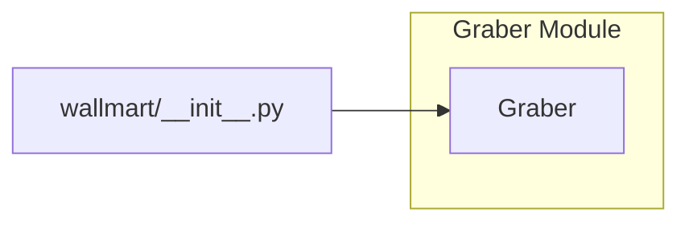

# <input code>

```python
## \file hypotez/src/suppliers/wallmart/__init__.py
# -*- coding: utf-8 -*-

#! venv/bin/python/python3.12

"""
.. module: src.suppliers.wallmart 
	:platform: Windows, Unix
	:synopsis:

"""


from .graber import Graber
```

# <algorithm>

No algorithm is present in the given code snippet. It's just an initialization file for the `wallmart` supplier module.  It only imports a class from a submodule named `graber`.  Therefore, no step-by-step block diagram is possible.


# <mermaid>



The mermaid code simply depicts a dependency. `wallmart/__init__.py` depends on the `Graber` class, which is assumed to be defined within the `graber.py` module (located in the `./graber` subdirectory, as indicated by the import statement).

# <explanation>

This file, `wallmart/__init__.py`, is a Python module's initializer.  It's a crucial part of package structure in Python.  This specific file serves only one purpose: importing the `Graber` class from the `graber` submodule.

* **Imports:**
    * `from .graber import Graber`: This line imports the `Graber` class from the `graber.py` module, which is located in the same directory as this `__init__.py` file.  The `.graber` part indicates that the `graber` module is a submodule of the `wallmart` module.  This is a common pattern for organizing code into hierarchical modules. This import allows other parts of the codebase to use the `Graber` class without needing to know the full path to the module.


* **Classes (implicit):**
    * `Graber`: This class is defined in the `graber.py` file (not present in this file).  Knowing the functionality of `Graber` is essential to fully understand the purpose of this `__init__.py` file.  Without seeing `graber.py`, we can't give a complete description.

* **Functions (implicit):**
    * No functions are defined in this `__init__.py` file.  Any functions the `wallmart` module provides will reside within the `graber.py` file or other submodules.


* **Variables (implicit):**
    * No variables are defined in this file.


* **Potential Errors/Improvements:**
    *  The docstrings (`"""..."""`) are present, which is good practice for documenting code.  Further elaboration within the docstring would be beneficial to specify the purpose and context of the `Graber` class.  
    * There are no imports that would be expected from other src packages, only the submodule.  Without seeing `graber.py`, further insight into the codebase relationships is impossible.

**Relationships with other project parts:**

This file directly relates to the `graber.py` module.  To understand the full context, one would need to investigate the code within `graber.py` to comprehend the complete workflow of the `wallmart` supplier. The `graber.py` file likely contains the implementation details of data acquisition or processing, utilizing libraries or functionality from other parts of the project (`src` packages).  Further investigation would be required to specify the broader dependency structure.