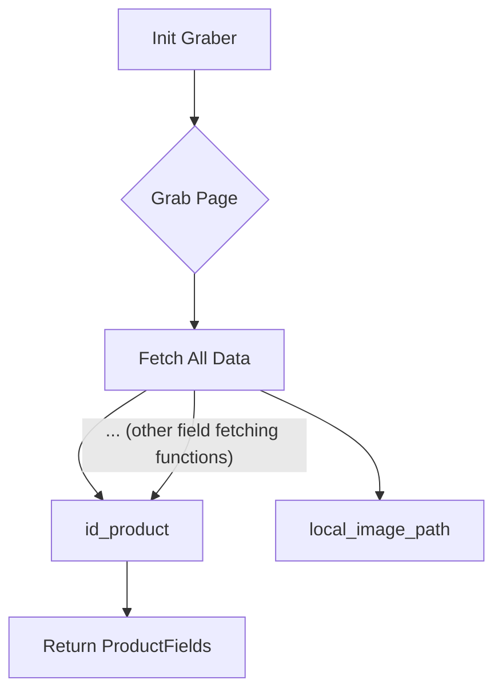
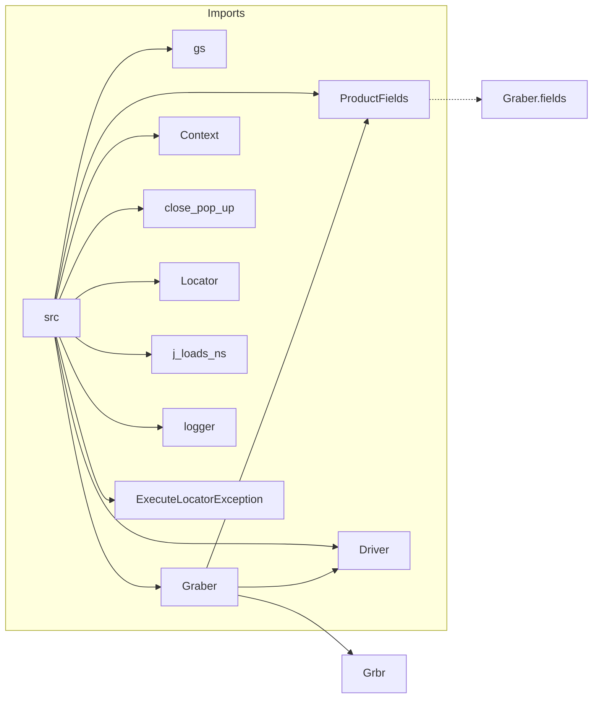

# Code Explanation for hypotez/src/suppliers/wallmart/graber.py

## <input code>

```python
## \file hypotez/src/suppliers/wallmart/graber.py
# -*- coding: utf-8 -*-\

#! venv/bin/python/python3.12

"""
.. module: src.suppliers.wallmart 
	:platform: Windows, Unix
	:synopsis: Класс собирает значение полей на странице  товара `wallmart.com`. 
    Для каждого поля страницы товара сделана функция обработки поля в родительском классе.
    Если нужна нестандертная обработка, функция перегружается в этом классе.
    ------------------
    Перед отправкой запроса к вебдрайверу можно совершить предварительные действия через декоратор. 
    Декоратор по умолчанию находится в родительском классе. Для того, чтобы декоратор сработал надо передать значение 
    в `Context.locator`, Если надо реализовать свой декоратор - раскоментируйте строки с декоратором и переопределите его поведение

"""


import asyncio
from pathlib import Path
from types import SimpleNamespace
from typing import Any, Callable, Optional
from dataclasses import dataclass, field
from functools import wraps
from pydantic import BaseModel

from src import gs
from src.suppliers import Graber as Grbr, Context, close_pop_up, Locator
from src.product import ProductFields
from src.webdriver.driver import Driver
from src.utils.jjson import j_loads_ns
from src.logger import logger
from src.logger.exceptions import ExecuteLocatorException

from dataclasses import dataclass, field
from types import SimpleNamespace
from typing import Any, Callable


# # Определение декоратора для закрытия всплывающих окон
# # В каждом отдельном поставщике (`Supplier`) декоратор может использоваться в индивидуальных целях
# # Общее название декоратора `@close_pop_up` можно изменить 


# def close_pop_up(value: Any = None) -> Callable:
#     """Создает декоратор для закрытия всплывающих окон перед выполнением основной логики функции.

#     Args:
#         value (Any): Дополнительное значение для декоратора.

#     Returns:
#         Callable: Декоратор, оборачивающий функцию.
#     """
#     def decorator(func: Callable) -> Callable:
#         @wraps(func)
#         async def wrapper(*args, **kwargs):
#             try:
#                 # await Context.driver.execute_locator(Context.locator.close_pop_up)  # Await async pop-up close  
#                 ... 
#             except ExecuteLocatorException as e:
#                 logger.debug(f'Ошибка выполнения локатора: {e}')
#             return await func(*args, **kwargs)  # Await the main function
#         return wrapper
#     return decorator


class Graber(Grbr):
    """Класс для операций захвата Morlevi."""
    supplier_prefix: str

    def __init__(self, driver: Driver):
        """Инициализация класса сбора полей товара."""
        self.supplier_prefix = 'wallmart'
        super().__init__(supplier_prefix=self.supplier_prefix, driver=driver)
        # Устанавливаем глобальные настройки через Context
        Context.locator_for_decorator = None # <- если будет уастановлено значение - то оно выполнится в декораторе `@close_pop_up`


    async def grab_page(self, driver: Driver) -> ProductFields:
        """Asynchronous function to grab product fields.

        Args:
            driver (Driver): The driver instance to use for grabbing.

        Returns:
            ProductFields: The grabbed product fields.
        """
        d = self.d = driver  
        # Логика извлечения данных
        async def fetch_all_data(**kwards):
            await self.id_product(kwards.get("id_product", ''))
            # ... (many more await calls)
            await self.local_image_path(kwards.get("local_image_path", ''))

        await fetch_all_data()
        return self.fields
```

## <algorithm>



**Example:**

* **Init Graber (A):**  Creates a `Graber` object with a `driver` instance. Sets `supplier_prefix`.
* **Grab Page (B):** Asynchronous function to fetch product data.  Example input:  `driver` object, possible `kwards` (keyword arguments) like `id_product`.
* **Fetch All Data (C):**  Function calling multiple `fetch` functions for specific product data, based on provided `kwards`. Example input: `kwards = {'id_product': '123'}`
* **id_product (D), local_image_path (E), ... (other functions):** These are individual functions to fetch each particular product field.  Input: `kwards` with values for their associated fields (e.g., `kwards.get('id_product')`). Example input: `await self.id_product('123')`
* **Return ProductFields (F):**  The function returns a `ProductFields` object containing extracted data.


## <mermaid>



**Analysis and Dependency Explanation:**

The mermaid diagram illuStartes the import relationships within the code.  The subgraph "Imports" shows that the code imports various elements from the `src` package and its sub-packages.   For example, `ProductFields` is imported from `src.product` which implies that the `Graber` class in `wallmart.graber` is part of a larger system that manages product data.  `Driver` implies this script uses a WebDriver for interacting with a web browser to extract data. `logger` and `ExecuteLocatorException` are likely parts of a logging and exception-handling system.

## <explanation>

* **Imports:**  The imports bring in necessary modules and classes for various functionalities.  `asyncio` for asynchronous operations, `Path` for file paths, `SimpleNamespace`, `BaseModel` and dataclasses (e.g., `ProductFields`) are likely for organizing and modelling data. `pydantic` models allow specifying data schemas. `wraps` is for function wrapping.  `functools` provides tools for working with functions.  The core import relationships highlight the code's integration with other parts of the Hypotez project (`src`).

* **Classes:**
    * `Graber(Grbr)`: Inherits from `Grbr` (a base Graber class). It's specialized for grabbing product fields from Walmart.  The `__init__` method initializes the class and sets the `supplier_prefix`. `grab_page` is the main asynchronous function for gathering product data.

* **Functions:**
    * `grab_page`:  Fetches product fields from the Walmart website, asynchronously. Takes a `driver` object and potentially keyword arguments. Returns a `ProductFields` object.
    * `fetch_all_data`: This function collects the data from various sub-functions (e.g. `id_product`, `local_image_path`).  It uses keyword arguments.

* **Variables:**
    * `MODE`: String variable likely representing the program's execution mode (e.g., 'dev', 'prod').
    * `supplier_prefix`:  String variable that defines the supplier name prefix for consistency.
    * `Context.locator_for_decorator`: A variable in the `Context` class, used to hold a locator for any decorator.

* **Potential Errors/Improvements:**
    * **Missing Error Handling:**  While the code has basic error handling (`try...except`), more robust error handling (e.g., catching specific exceptions related to web scraping or data extraction) would improve reliability.  Logging specific details about failed fetches is also needed.

    * **Unimplemented Decorator:** The `close_pop_up` decorator is commented out.  If needed, the `Graber` class (or a parent class) should define and call the decorator functionality.
    * **Unclear Data Structures:** The `...` and comments in the code indicate a potential lack of clear data structure documentation or description of the `kwards`. The presence of numerous `await self.function(kwards.get(...))` calls suggests a need for better organization. Ideally, each `await self.function(...)` call should be documented in detail to explain how it works.


* **Relationships:** The code clearly shows its dependence on various modules and classes within the `src` package, indicating an integration into a larger project.  The `Graber` class is part of a system for web scraping, product data handling, and likely other data processing elements.