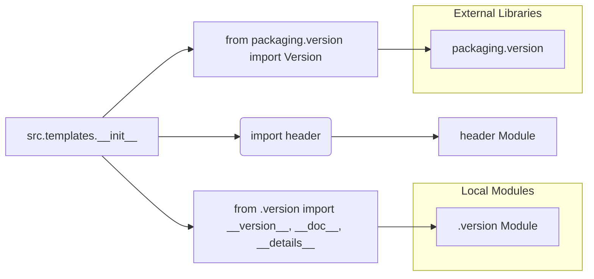

```MD
# Code Explanation for hypotez/src/templates/__init__.py

## <input code>

```python
## \file hypotez/src/templates/__init__.py
# -*- coding: utf-8 -*-\n\n#! venv/bin/python/python3.12\n\n"""
.. module: src.templates 
	:platform: Windows, Unix
	:synopsis:

"""


"""
	:platform: Windows, Unix
	:synopsis:

"""

"""
	:platform: Windows, Unix
	:synopsis:

"""


"""
  :platform: Windows, Unix

"""
"""
  :platform: Windows, Unix
  :platform: Windows, Unix
  :synopsis:
"""
  
""" module: src.templates """


""" HERE SHOULD BE A DESCRIPTION OF THE MODULE OPERATION ! """

import header 
...

from packaging.version import Version
from .version import __version__, __doc__, __details__ 
```

## <algorithm>

This code snippet initializes a module named `src.templates`. The workflow is as follows:

1. **Initialization:** The script initializes the `MODE` variable to `'dev'`.  This is likely a configuration flag for the development environment.

2. **Import Statements:** It imports the `header` module and other dependencies, indicated by the `...`.

3. **Versioning:** It imports `Version` from `packaging.version` and modules from the local `src.templates.version` file.

**Example Data Flow:**

If a function in `header` needs to be used by code in `src.templates`, it will be imported here.

The `header` module is likely to contain functions or classes that provide essential functionality for `src.templates`.

## <mermaid>



**Explanation of Dependencies:**

* **`import header`:** This statement imports a module named `header`.  This module likely contains functions or classes related to the core functionality of `src.templates`. The `header` dependency needs to exist in the current file structure or in a configured location the Python interpreter can access.

* **`from packaging.version import Version`:** This imports the `Version` class from the `packaging.version` module.  This is a standard Python package for handling and comparing software versions.  The `packaging` package is used for handling version information.

* **`from .version import __version__, __doc__, __details__`:** This imports `__version__`, `__doc__`, and `__details__` from the `.version` module within the `src.templates` package. This suggests the existence of a `.version` file defining important metadata for version control.  The `.version` module likely holds information about the package version.

## <explanation>

* **Imports:**
    * `import header`: Imports another Python module or file named `header`. This is likely a critical dependency for `src.templates` that provides the module's core functionalities. The `header` module must be importable from the `src` directory.
    * `from packaging.version import Version`: Imports the `Version` class from the `packaging` library.  This is useful for correctly handling and comparing software versions.
    * `from .version import __version__, __doc__, __details__`: Imports version-related metadata (like `__version__`, `__doc__`, `__details__`) from the local file or module named `.version`.  This structure is used for making the module suitable for use with standard packaging tools.

* **Classes:**  There are no classes defined in this snippet.

* **Functions:** No functions are defined.

* **Variables:**
    * ``: A variable that likely controls the mode of operation (e.g., development, production).  The current value is `'dev'`, suggesting this is set up for a development environment.


* **Potential Errors/Improvements:**
    * **Missing Documentation:** The module docstrings (the strings enclosed in triple quotes) are incomplete and contain examples of placeholder documentation. They should describe the module's purpose, operation, and dependencies.
    * **Unclear `...` Import:** The `...` suggests that other imports are missing. These imports should be clearly identified. It's crucial to fully define all imports for maintaining code clarity.
    * **`#!` Lines:** The shebang lines (`` etc.) are uncommon in modern Python code.  If used, these indicate the interpreter to be used, and the interpreter should be determined automatically by the OS if the script is placed within a suitable package.

* **Relationships to Other Parts of the Project:**
    * The `header` module is a dependency, and the `src.templates.version` module will likely contain version information used by packaging tools like `setuptools`.  `packaging.version` is an external dependency used for version management.


This analysis indicates that this file is a part of a larger project using a particular project structure. The use of the `.version` file and the import of `__version__` and other data suggests a setup for building and publishing a package using tools like `setuptools` or similar Python packaging tools.