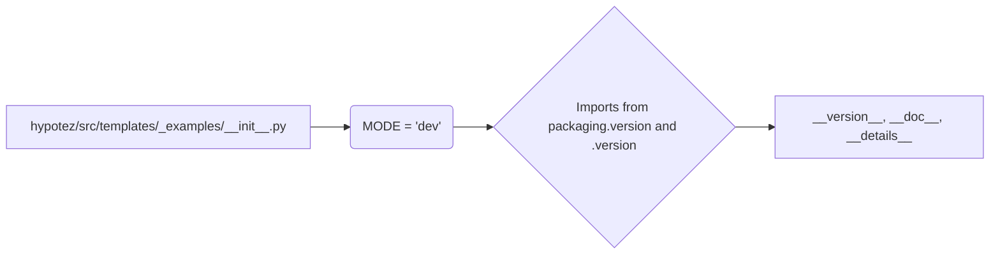

# Code Explanation for hypotez/src/templates/_examples/__init__.py

## <input code>

```python
## \file hypotez/src/templates/_examples/__init__.py
# -*- coding: utf-8 -*-\
#! venv/Scripts/python.exe
#! venv/bin/python/python3.12

"""
.. module: src.templates._examples 
	:platform: Windows, Unix
	:synopsis:

"""
MODE = 'dev'

"""
	:platform: Windows, Unix
	:synopsis:

"""


"""
	:platform: Windows, Unix
	:synopsis:

"""


"""
  :platform: Windows, Unix

"""
"""
  :platform: Windows, Unix
  :platform: Windows, Unix
  :synopsis:
"""MODE = 'dev'
  
""" module: src.templates._examples """


from packaging.version import Version
from .version import __version__, __doc__, __details__
```

## <algorithm>

The algorithm is straightforward.  It sets a variable `MODE` to 'dev' and imports some variables from a submodule `version.py`.

**Step 1**:  The file initializes a global variable `MODE` with the string value 'dev'.

**Step 2**:  Imports from `packaging.version` and `.version` : This step imports necessary functions for handling version information.

**Example Data Flow**:

```
Input: None
Process: Initialization of MODE, Importing functions from `.version`.
Output: Global variable MODE is defined and variables from `__version__.py` are accessible.
```


## <mermaid>



**Dependency Analysis:**

- `packaging.version`: This package is used for handling version information and is likely part of the project's dependencies.  It is not locally defined, thus it is assumed to be an external package.
- `.version`: This import refers to a module (`__init__.py` or a file named `version.py`) within the same directory (`hypotez/src/templates/_examples`).

## <explanation>

**Imports:**

- `from packaging.version import Version`: Imports the `Version` class from the `packaging.version` module. This is likely used for comparing or working with software version numbers.  The `packaging` library is frequently used for robust handling of version numbers across different Python projects. This import is not directly used in the `__init__.py` but its presence indicates the overall project's intention to handle versioning.

- `from .version import __version__, __doc__, __details__`: Imports the variables `__version__`, `__doc__`, and `__details__` from the `version.py` module within the `hypotez/src/templates/_examples` directory. This is a common pattern for organizing module metadata. It's crucial to have a clear `version.py` file to provide the intended values for `__version__`, `__doc__`, etc.


**Classes:**

There are no classes defined in this `__init__.py` file.

**Functions:**

No functions are defined in this `__init__.py` file.

**Variables:**

- `MODE`: A global string variable initialized to 'dev'. This variable likely controls the execution mode of the application, in this case likely for development mode ('dev').

**Potential Errors or Improvements:**

- **Redundant documentation:** The multitude of docstrings  `""" """`  might not be necessary unless they are meant to be processed by tools like Sphinx, which generate documentation from the docstrings.


**Relationship to other parts of the project:**

The file `hypotez/src/templates/_examples/__init__.py` seems to be initializing a module that probably serves as an example or a template.  The import of `__version__`, `__doc__`, and `__details__` suggests this module might be intended to be used within a larger project, and the `__init__.py` file serves to define module-level variables. The `version.py` file is essential for the completeness of the metadata.


```