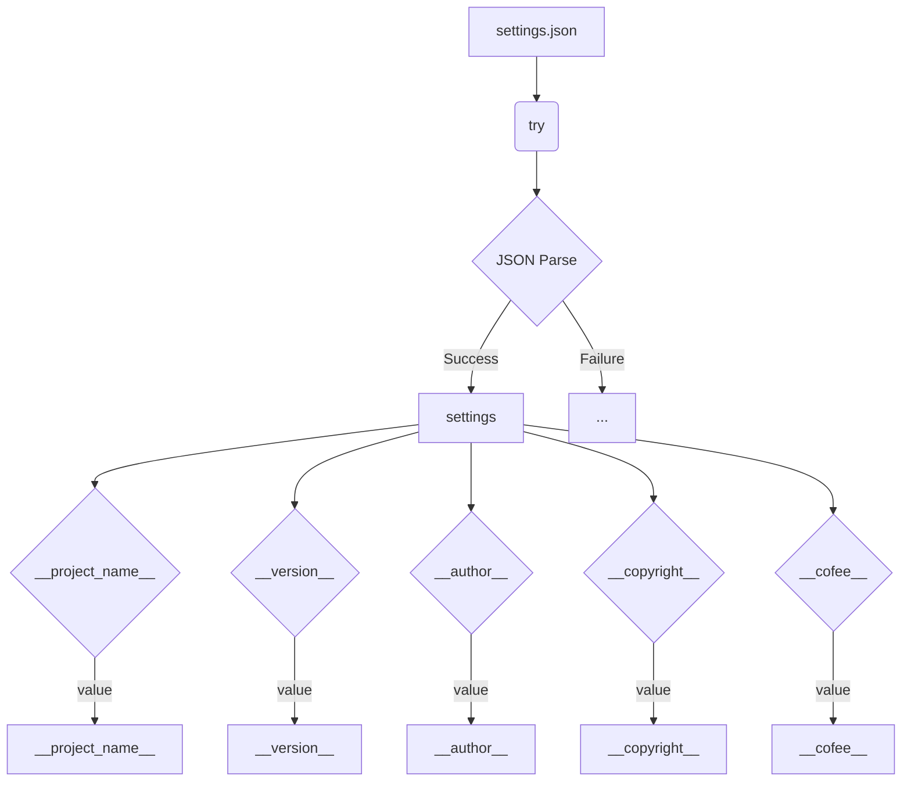

```MD
# Code Explanation: hypotez/src/templates/version.py

## <input code>

```python
## \file hypotez/src/templates/version.py
# -*- coding: utf-8 -*-\n\n#! venv/bin/python/python3.12\n\n"""
.. module: src.templates 
	:platform: Windows, Unix
	:synopsis:

"""


"""
	:platform: Windows, Unix
	:synopsis:

"""


"""
	:platform: Windows, Unix
	:synopsis:

"""


"""
  :platform: Windows, Unix

"""
"""
  :platform: Windows, Unix
  :platform: Windows, Unix
  :synopsis:
"""
  
""" module: src.templates """


import json

settings:dict = None

try:
    with open('../settings.json', 'r') as settings_file:
        settings = json.load(settings_file)
except (FileNotFoundError, json.JSONDecodeError):
    ...

__project_name__ = settings.get("project_name", 'hypotez') if settings  else 'hypotez'
__version__: str = settings.get("version", '')  if settings  else ''
__doc__: str = ''
__details__: str = ''
__author__: str = settings.get("author", '')  if settings  else ''
__copyright__: str = settings.get("copyrihgnt", '')  if settings  else ''
__cofee__: str = settings.get("cofee", "Treat the developer to a cup of coffee for boosting enthusiasm in development: https://boosty.to/hypo69")  if settings  else "Treat the developer to a cup of coffee for boosting enthusiasm in development: https://boosty.to/hypo69"
```

## <algorithm>

The code is designed to retrieve project metadata (name, version, author, etc.) from a JSON configuration file (`settings.json`) and then export this data as global variables.

1. **Initialization**: Initializes `settings` variable to `None`.

2. **File Reading**: Attempts to read `settings.json` located one directory up from the current file.

3. **JSON Parsing**: Parses the JSON file into the `settings` dictionary. If there's an error (e.g., `FileNotFoundError`, `json.JSONDecodeError`), the `try...except` block handles it.

4. **Data Extraction**: Extracts values from the `settings` dictionary (if available).  If the dictionary is not available, defaults are used.

5. **Exporting Data**: Sets global variables `__project_name__`, `__version__`, `__author__`, `__copyright__`, and `__cofee__` based on the extracted data or defaults.

**Example Data Flow:**

```
settings.json:
{
  "project_name": "MyProject",
  "version": "1.2.3",
  "author": "John Doe",
  "copyrihgnt": "2024",
  "cofee": "https://example.com"
}

-> __project_name__ = "MyProject"
-> __version__ = "1.2.3"
-> __author__ = "John Doe"
-> __copyright__ = "2024"
-> __cofee__ = "https://example.com"
```

## <mermaid>



**Dependencies and Analysis:**

The code imports the `json` module.  This module is part of the standard Python library, providing functionalities for working with JSON data.


## <explanation>

* **Imports:**
    * `json`: Used for serializing and deserializing JSON data.  Critically important for reading the configuration file.  It is a standard Python library.

* **Variables:**
    * `settings`: A dictionary that stores project configuration data read from `settings.json`.  It's declared as `settings: dict` which is a type hinting for clarity.
    * `__project_name__`, `__version__`, `__author__`, `__copyright__`, `__cofee__`: Global variables holding project metadata. The use of `__` prefix is a Python convention for variables meant to be used internally within the module.

* **`try...except` Block:**
    * Handles potential `FileNotFoundError` if `settings.json` is not found, preventing the script from crashing.
    * Handles `json.JSONDecodeError` if the content of `settings.json` isn't valid JSON.

* **`.get()` method:**
    * Used with the `settings` dictionary.  It safely retrieves a value from the dictionary, returning a default value (e.g., 'hypotez') if the key doesn't exist. This is a crucial defensive programming technique.

* **Potential Improvements:**

    * **Error Handling:** While the `try...except` block is good, adding more specific error handling (e.g., logging the error) would make debugging easier.
    * **Data Validation:** Consider adding validation to ensure that the data in `settings.json` is of the expected type (e.g., string, integer, etc.).  This will prevent unexpected behavior if a value isn't what is expected.


**Relationships with Other Parts:**

This `version.py` file likely serves as a source of metadata for other parts of the `hypotez` project.  Functions and classes in other modules within `hypotez/src` might use the global variables (`__project_name__`, etc.) defined here to initialize their own attributes.


```