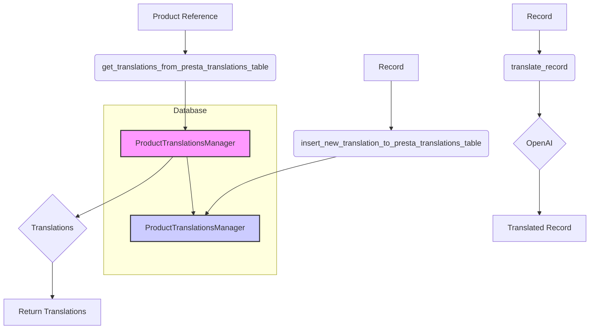

# <input code>

```python
## \file hypotez/src/translators/product_translator.py
# -*- coding: utf-8 -*-\
#! venv/Scripts/python.exe
#! venv/bin/python/python3.12

"""
.. module: src.translators 
	:platform: Windows, Unix
	:synopsis:

"""
MODE = 'dev'

"""
	:platform: Windows, Unix
	:synopsis:

"""


"""
	:platform: Windows, Unix
	:synopsis:

"""


"""
  :platform: Windows, Unix

"""
"""
  :platform: Windows, Unix
  :platform: Windows, Unix
  :synopsis:
"""MODE = 'dev'
  
""" module: src.translators """


""" Модуль управления переводами.
Слой связи между словарем полей товара, таблицей переводов и переводчиками

`get_translations_from_presta_translations_table(product_reference, credentials, i18n)`
    1. получает референс товара, параметры подключения к базе переводов престашоп и язык перевода в формате en_EN, he_HE, ru-RU 
    2. созадет условуе запроса
    3. возвращает результат
    
@todo
    1. Продумать какой нибудж парсер для en_EN, he_HE, ru-RU
"""


from pathlib import Path
from typing import List, Dict
...
from src import gs
from src.logger import logger
from src.utils import j_loads, j_dumps,  pprint
from src.db import ProductTranslationsManager
from src.ai.openai import translate
from src.endpoints.PrestaShop import PrestaShop

# def record(presta_fields:Dict, i18n:str = None, i:int = 0) -> Dict:
#     """ Вытаскивает из словаря полей престашоп 
#     `dict_product_fields` значения мультиязычных полей 
#     @param dict_product_fields престашоп словарь полей товара
#     @param i18n Локаль: en-US, ru-RU, he-IL
#     @param i индекс языка в мультиязычных полях
#     """
#     ...
#     i18n = i18n if i18n else presta_fields.get('locale')
#     if not i18n:
#         text = presta_fields.language[0]['value']
#         i18n = detect(text)
#         ...
#     i = 0 # <- Вытаскивает первый из списка языков в мультиязычных полях
    
#     # словарь record со всеми ключами
#     record = {
#     # ... (many fields)
#     }
#     return  record


def get_translations_from_presta_translations_table(product_reference: str, i18n: str = None) -> list:
    """Функция возвращает словарь переводов полей товара."""
    with ProductTranslationsManager() as translations_manager:
        search_filter = {'product_reference': product_reference}
        product_translations = translations_manager.select_record(**search_filter)
    return product_translations


def insert_new_translation_to_presta_translations_table(record):
    with ProductTranslationsManager() as translations_manager:
        translations_manager.insert_record(record)


def translate_record(record: dict, from_locale: str, to_locale: str) -> dict:
    """Функция для перевода полей товара."""
    translated_record = translate(record, from_locale, to_locale)
    ... # Добавить обработку переведенной записи
    return translated_record
```

# <algorithm>

**Step 1: Get Product Translations**

* **Input:** Product reference, optional i18n (language code).
* **Process:** The `get_translations_from_presta_translations_table` function queries the `ProductTranslationsManager` for translations matching the product reference.
* **Output:** A list of dictionaries representing the retrieved translations, or an empty list if no matching translations are found.

**Step 2: Insert New Translation**

* **Input:** A dictionary `record` containing the translation data to be inserted.
* **Process:** The `insert_new_translation_to_presta_translations_table` function utilizes the `ProductTranslationsManager` to insert the translation record into the database.
* **Output:** None (implicitly, success or failure is handled internally by the database manager).


**Step 3: Translate a Record**

* **Input:** A dictionary `record`, `from_locale` string (e.g., "en"), `to_locale` string (e.g., "fr").
* **Process:** The `translate_record` function uses the `translate` function (likely from a translation service like OpenAI) to translate the provided `record` from `from_locale` to `to_locale`.
* **Output:** A translated dictionary.


# <mermaid>



**Dependencies Analysis:**

*   `from pathlib import Path`: Provides tools for working with file paths.  Used less frequently in the provided code, thus not crucial to the core functionality.
*   `from typing import List, Dict`: Provides type hints, important for code readability and maintainability.
*   `from src import gs`: Imports a module from the `src` package, likely handling Google Cloud Storage operations.
*   `from src.logger import logger`: Imports a logging module for error reporting and monitoring. This imports a logger from a separate `src` package.
*   `from src.utils import j_loads, j_dumps, pprint`: Imports utility functions related to JSON handling.
*   `from src.db import ProductTranslationsManager`: Imports the database interaction class for managing product translations.
*   `from src.ai.openai import translate`: Imports the OpenAI translation function. This module handles interactions with the OpenAI API to perform translations. This is a submodule of the `src.ai` package.
*   `from src.endpoints.PrestaShop import PrestaShop`: Imports a module potentially related to interacting with a PrestaShop API (for retrieving product data). This module is a submodule of the `src.endpoints` package.

# <explanation>

**Imports:**

*   The code imports necessary modules from various subpackages within the `src` directory, such as modules related to logging, database interaction, utility functions, OpenAI translation, and interaction with a PrestaShop API.  This indicates a modular design where different functionalities are separated into different subpackages.

**Classes:**

*   `ProductTranslationsManager`: This class likely handles database interactions, specifically queries and inserts related to product translations.


**Functions:**

*   `get_translations_from_presta_translations_table`: Retrieves product translations from the database.  It takes the product reference and optionally an i18n string. This function is essential for retrieving existing translations for a particular product.
*   `insert_new_translation_to_presta_translations_table`: Inserts a new translation record into the database. It takes a dictionary `record` as input containing the translation data.
*   `translate_record`: Translates a product record from one language to another using the OpenAI translation service. It takes the `record`, the source language (`from_locale`), and the target language (`to_locale`) as parameters.


**Variables:**

*   `MODE`: A string variable, probably used for setting up the environment (e.g., 'dev', 'prod').
*   `product_reference`: A string representing a unique identifier for a product.
*   `i18n`: A string representing the language code (e.g., "en_US", "fr_FR").


**Potential Errors and Improvements:**

*   The commented-out `record` function is incomplete and needs further development to fully extract and structure the product data. Error handling for database operations (e.g., connection issues, incorrect data types) is missing.  Database connection parameters should be handled more securely.  The `translate` function lacks error handling.  Thorough logging and error handling for these operations will prevent the application from crashing. Consider creating a dedicated error handling function to collect errors and send notifications in case of issues.
*   The documentation lacks important details regarding the `credentials` parameter in `get_translations_from_presta_translations_table`.


**Chain of Relationships:**

The code interacts with various parts of the project through imports:
1.  `src.db`: Database interactions.
2.  `src.utils`: Utility functions.
3.  `src.logger`: Logging functions.
4.  `src.ai.openai`: Interaction with the OpenAI translation API.
5.  `src.endpoints.PrestaShop`: Interaction with the PrestaShop API.

This indicates a well-structured design with clear responsibilities for different modules.