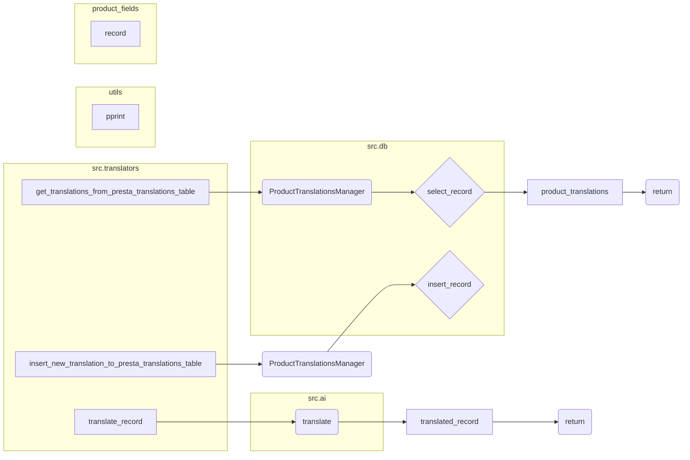

# <input code>

```python
## \file hypotez/src/translators/translate_product_fields.py
# -*- coding: utf-8 -*-\
#! venv/Scripts/python.exe
#! venv/bin/python/python3.12

"""
.. module: src.translators 
	:platform: Windows, Unix
	:synopsis:

"""
MODE = 'dev'


"""
	:platform: Windows, Unix
	:synopsis:

"""


"""
	:platform: Windows, Unix
	:synopsis:

"""


"""
  :platform: Windows, Unix

"""
"""
  :platform: Windows, Unix
  :platform: Windows, Unix
  :synopsis:
"""MODE = 'dev'
  
""" module: src.translators """


""" Модуль управления переводами.
Слой связи между словарем полей товара, таблицей переводов и переводчиками

`get_translations_from_presta_translations_table(product_reference, credentials, i18n)`
    1. получает референс товара, параметры подключения к базе переводов престашоп и язык перевода в формате en_EN, he_HE, ru-RU 
    2. созадет условуе запроса
    3. возвращает результат
    

@todo
    1. Продумать какой нибудж парсер для en_EN, he_HE, ru-RU
"""
...
from pathlib import Path
from typing import List, Dict
...
from src import gs
from src.utils import  pprint
from src.product.product_fields.product_fields import record
from src.db import ProductTranslationsManager
from src.ai import translate
from src.endpoints.PrestaShop import PrestaShop
from src import gs
from src.product.product_fields.product_fields import record
from src.db import ProductTranslationsManager
from src.ai import translate
from src.endpoints.PrestaShop import PrestaShop

def get_translations_from_presta_translations_table(product_reference: str, credentials: dict, i18n: str = None) -> list:
    """Функция возвращает словарь переводов полей товара."""
    with ProductTranslationsManager(credentials) as translations_manager:
        search_filter = {'product_reference': product_reference}
        product_translations = translations_manager.select_record(**search_filter)
    return product_translations

def insert_new_translation_to_presta_translations_table(record, credentials):
    with ProductTranslationsManager(credentials) as translations_manager:
        translations_manager.insert_record(record)

def translate_record(record: dict, from_locale: str, to_locale: str) -> dict:
    """Функция для перевода полей товара."""
    translated_record = translate(record, from_locale, to_locale)
    ... # Добавить обработку переведенной записи
    return translated_record
```

# <algorithm>

**1. Data Input:**  The function `get_translations_from_presta_translations_table` receives `product_reference`, `credentials` (database connection details), and optionally `i18n` (language code).

**2. Database Interaction (get_translations_from_presta_translations_table):**
   * Creates a `ProductTranslationsManager` object with the given credentials.
   * Constructs a `search_filter` dictionary to query the database using the provided product reference.
   * Calls `translations_manager.select_record` to fetch the translations from the database.
   * Returns the `product_translations`.

**3. Translate Record (translate_record):**
   * Takes a `record` (dictionary), `from_locale` (e.g., "en_EN"), and `to_locale` (e.g., "ru_RU") as input.
   * Calls the `translate` function (presumably from the `src.ai` module) to get the translated record.
   * Processes the translated record (`translated_record`) (missing implementation).
   * Returns the `translated_record`.

**4. Insert Record (insert_new_translation_to_presta_translations_table):**
   * Takes a `record` (dictionary) and `credentials` as input.
   * Creates a `ProductTranslationsManager` object.
   * Calls `translations_manager.insert_record` to insert the new translation into the database.

**Example:**
```
product_reference = "12345"
credentials = {"db_host": "localhost", ...}
i18n = "fr_FR"

#Data flow:
# Get translations from DB -> Translated Record (translate_record)-> Insert translated record to DB
translations = get_translations_from_presta_translations_table(product_reference, credentials, i18n)
# ... (translate_record call)
```


# <mermaid>



**Dependencies Analysis:**

* `from pathlib import Path`: Provides path manipulation tools (likely for file system interaction).
* `from typing import List, Dict`: For type hinting, improving code readability and maintainability.
* `from src import gs`: Imports from the `src.gs` module (not further analyzed).
* `from src.utils import pprint`: Imports a potentially custom function for printing (from `src.utils`).
* `from src.product.product_fields.product_fields import record`: Imports a `record` object likely representing product field data.
* `from src.db import ProductTranslationsManager`: Imports a class responsible for interacting with a database for product translations.
* `from src.ai import translate`: Imports a function for translation (likely AI-powered) from the `src.ai` module.
* `from src.endpoints.PrestaShop import PrestaShop`: Imports a module responsible for interactions with PrestaShop endpoints (not directly used in the shown code).
* These imports suggest a modular structure, with separate modules for data access (`src.db`), AI functionality (`src.ai`), utility functions (`src.utils`), and PrestaShop integration (`src.endpoints`).


# <explanation>

**Imports:**

- The imports suggest a well-structured project with modules for different functionalities (database interaction, AI, utilities, and PrestaShop integration).  The use of `from src.*`  indicates the codebase is likely structured as a Python package (`src`).  This promotes modularity and maintainability.

**Classes:**

- `ProductTranslationsManager`: This is a crucial class that likely handles database interactions related to product translations.  The `with` statement suggests it's a context manager, ensuring proper database connection closing.  Methods like `select_record` and `insert_record` are defined for database operations.

**Functions:**

- `get_translations_from_presta_translations_table`: Retrieves translations from the database for a given product reference. Takes the product reference, credentials, and optionally the language. Critically needs error handling (e.g., database connection failures, missing data).
- `insert_new_translation_to_presta_translations_table`: Inserts a new translation record into the database. Needs input validation.
- `translate_record`: The core translation logic.  A crucial piece is missing: how the `translated_record` is handled after translation and before returning.  Robust error handling is needed for potential translation failures.

**Variables:**

- `MODE`, `credentials`, `i18n`:  These are crucial inputs defining the runtime mode (likely for development or production environments), database credentials for access, and language for translation.


**Potential Errors and Improvements:**

- **Error Handling:** The code lacks comprehensive error handling.  Database connection issues, incorrect data formats, and translation failures should be caught and logged appropriately.
- **Translation Logic:** The `translate_record` function has a placeholder.  The critical part of translating the product data, handling the result, and possibly post-processing is missing.
- **Input Validation:** Validate inputs to prevent unexpected behavior or crashes. For example, check if the `product_reference` is valid or if `credentials` are complete.
- **Data Structures:** The exact structure of the `record` dictionary and the output of the `translate` function is unclear, but better documentation/type hints would improve maintainability.


**Relationships:**

The code interacts with `src.db` for database operations, `src.ai` for translation, `src.product.product_fields` for product field definitions, and potentially with `src.utils` for utility functions.  The `PrestaShop` integration suggests a potential interaction with a e-commerce platform.