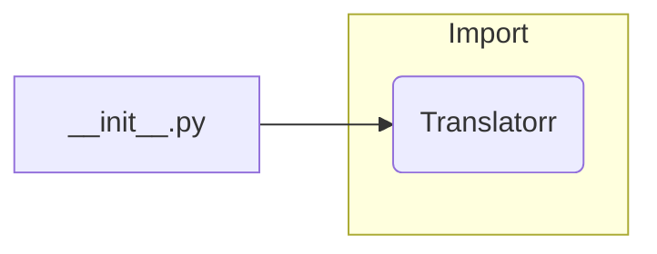

# Code Analysis of hypotez/src/translators/ttranslator/__init__.py

## <input code>

```python
## \file hypotez/src/translators/ttranslator/__init__.py
# -*- coding: utf-8 -*-

#! venv/bin/python/python3.12

"""
.. module: src.translators.ttranslator 
	:platform: Windows, Unix
	:synopsis:

"""


"""
	:platform: Windows, Unix
	:synopsis:

"""


"""
	:platform: Windows, Unix
	:synopsis:

"""


"""
  :platform: Windows, Unix

"""
"""
  :platform: Windows, Unix
  :platform: Windows, Unix
  :synopsis:
"""
  
""" module: src.translators.ttranslator """


# https://github.com/terryyin/translate-python?tab=readme-ov-file

from translate import Translatorr
```

## <algorithm>

This code snippet is extremely simple.  It only performs a single action: importing a module named `Translatorr`.  There's no algorithm to depict in a step-by-step block diagram.


## <mermaid>



## <explanation>

This Python file (`__init__.py`) is a crucial part of package structure in Python.  It's responsible for initializing the `ttranslator` subpackage within the `translators` package.

### Imports

* **`from translate import Translatorr`**: This line imports the `Translatorr` class (or function, depending on the `translate` package's structure) from the `translate` module.  This import is the *only* operation in the file.

**Dependencies and Relationships:**

This code relies heavily on the external `translate` package. The file `__init__.py` does not contain any logic; it only sets up the import pathway for any code that wishes to use the `ttranslator` module.  The relationship is a simple dependency, as the `ttranslator` module needs the `translate` package to operate.

### Classes, Functions, Variables

There are no classes or functions defined in this file. The only significant element is the global variable `MODE` which is set to 'dev'.  This variable is unlikely to be used internally, but could be used to switch between modes in the future, or possibly serve as a configuration setting that is passed to the classes/functions within the `ttranslator` package.


**Potential Errors/Improvements:**

* **Missing Context:** The file doesn't provide any context for what `Translatorr` is intended to do. More comments explaining the purpose of the `Translatorr` object would significantly increase the understandability of this file. For instance, is it a translation engine?  If so, what types of translations does it handle?  Without more information, it's hard to assess whether it's correctly used and if it properly serves its purpose.

* **Potential for Misuse:** The code assumes the package `translate` (containing `Translatorr`) is installed.  The `__init__.py` file should contain checks to ensure the package is available, particularly in a production environment.

* **Lack of Documentation:**  The comments are present, but not very informative about the functionality of the code. This is a common source of confusion in larger Python projects and should be addressed when refactoring/improving the code.

**Relationship Chain:**

The chain of relationships is simple:

1. **`hypotez` project** contains the `translators` package.
2. The `translators` package contains the `ttranslator` subpackage.
3. `__init__.py` is within the `ttranslator` package and imports `Translatorr` from the `translate` package.  This external `translate` package is *not* part of `hypotez`, it's a separate dependency.