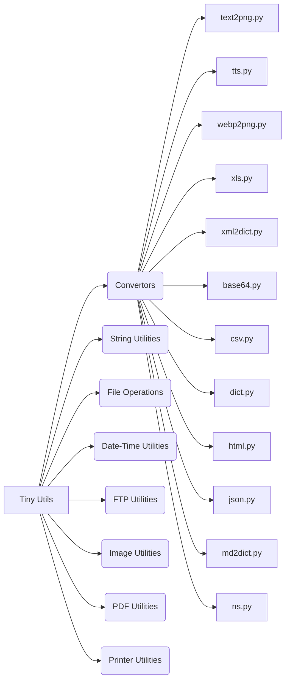

# Tiny Utils Code Explanation

## <input code>

```
# Tiny Utils
# ... (rest of the README.md content)
```

## <algorithm>

No specific algorithm is presented in the code snippet.  The README provides a high-level description of the Tiny Utils library, its modules, and how to use it. It's a documentation file, not executable code.  Therefore, no step-by-step workflow or data flow diagrams can be generated.


## <mermaid>



**Dependencies Analysis:**

The Mermaid diagram illuStartes the structure of the Tiny Utils library by showing the relationship between the overall library (`Tiny Utils`) and its modules (Convertors, String Utilities, etc). Sub-modules within the Convertors module are also linked.  No direct dependencies are shown in the README. The relationships are logical; the library contains modules, and those modules have specific implementations (e.g., `text2png.py`). This is a structural diagram, not a dependency graph of actual Python code.


## <explanation>

The provided code is a README file, not executable code.  It serves as documentation for the Tiny Utils library.

**Imports:**

There are no imports in the provided code snippet. The README describes which modules (files) are included, and the example Python code imports specific modules from the library using syntax like `from tiny_utils.convertors import text2png`.  This would indicate that the `tiny_utils` package is a Python package that contains subpackages like `convertors`.


**Classes:**

No class definitions are presented in the README. The README describes intended functionality, likely involving classes within the various modules (`text2png.py`, `xml2dict.py`, etc.).

**Functions:**

The README describes functions like `convert()` within the various modules. For example, the `text2png.convert(text, output_path)` function is described as performing the text-to-PNG image conversion.


**Variables:**

Variable names, types, and usage are described in the README. For example, `text`, `output_path`, and `xml_data` are mentioned in usage examples.

**Potential Errors/Areas for Improvement:**

* **Lack of precise specifications:** The README lacks precise function signatures (e.g., arguments and return types) and error handling details for the functions, which would be valuable for developers using these functions.
* **Missing code examples:**  The README primarily describes the usage examples but does not provide enough detail or context on how to interact with the library as a developer.


**Relationships with other parts of the project:**

The README suggests that `tiny_utils` is a separate project.  It describes a structure to interact with the library from outside code but does not provide specifics on how or where this library would be used within a larger application.  The relationships are therefore largely conceptual, defined by how external code should interact with the library.