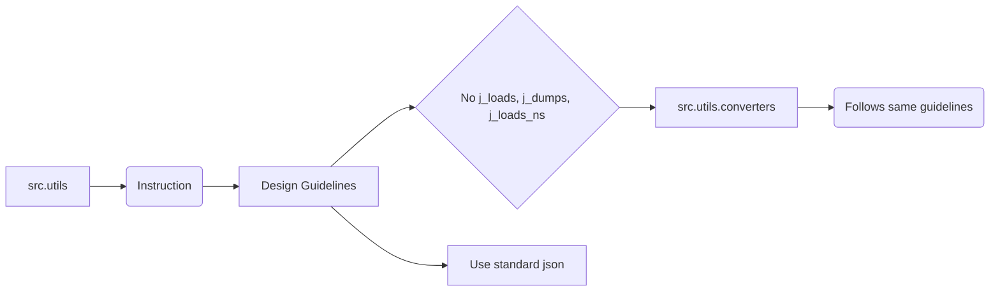

# Code Explanation: src/utils/comments_to_model/about_utils.md

## <input code>

```
# src/utils
## Модуль: src.utils
**Instruction**
1. Модули `src.utils` и `src.utils.converters` — служебные утилиты проекта. Они спроектированы так, чтобы по минимуму использовать внутренние утилиты.
2. В этих модулях **НЕ используется** `j_loads`, `j_loads_ns` и `j_dumps`.
3. Используйте стандартную библиотеку `import json`.
**End of instruction**
```

## <algorithm>

This code snippet is not a functional code block. It's a set of instructions, comments, and documentation explaining the design and usage guidelines for the `src.utils` and `src.utils.converters` modules.  There's no algorithm to describe in a step-by-step manner, no functions or methods to trace, and no data flow to visualize.

## <mermaid>



**Explanation of Dependencies:**

The diagram doesn't show any explicit dependencies. This is because there are no functions or classes to define dependencies between. It's purely a set of design guidelines affecting how code within `src.utils` and `src.utils.converters` should be written.


## <explanation>

This code is a documentation comment, not executable code.  It outlines the design specifications for the `src.utils` and `src.utils.converters` modules.

**Imports**:  No imports are present, as the content is solely documentation about what *should* be imported (e.g., `import json`) for those modules.

**Classes**: There are no classes defined.

**Functions**: There are no functions or methods defined.

**Variables**: There are no variables defined.

**Potential Errors/Areas for Improvement**: The lack of concrete code makes error analysis impossible. The documentation is thorough in specifying the guidelines, which is a good practice but doesn't prevent potential errors if those guidelines aren't adhered to in the actual implementations in `src.utils` and `src.utils.converters` modules.


**Relationship to Other Parts of the Project**:

The directives imply a relationship to other parts of the project that *consume* the `src.utils` modules. Those consuming modules would rely on the fact that the functions, methods, and variables within `src.utils` will not use internal utility functions (`j_loads`, etc.) but instead, utilize the standard `json` module from Python's standard library.


**Overall**: This section of code acts as a contract or specification for the `src.utils` module and related modules.  The importance lies in ensuring consistency in the design of utility functions and avoiding specific external dependencies for improved maintainability and flexibility in the broader project.