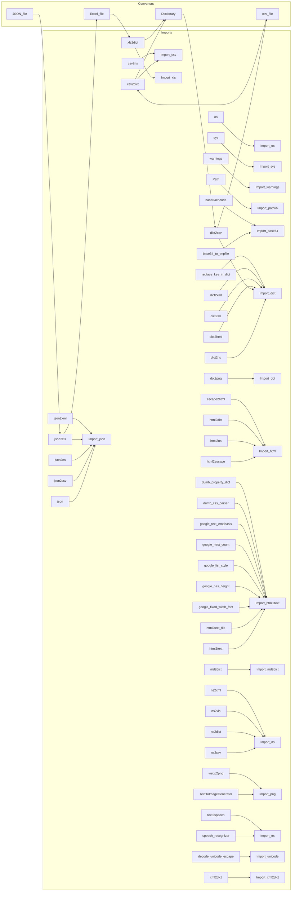

# <input code>

```python
# ## \file hypotez/src/utils/convertors/__init__.py
# # -*- coding: utf-8 -*-\
# #! venv/Scripts/python.exe
# #! venv/bin/python/python3.12

# """
# .. module: src.utils.convertors 
#     :platform: Windows, Unix
#     :synopsis:

# 
# Модуль для конвертации различных форматов данных
# =========================================================================================

# Этот модуль содержит функции для конвертации между различными форматами данных, такими как
# CSV, JSON, XML, HTML, MD, Base64, а также для работы с изображениями и текстом. Он предоставляет
# утилиты для преобразования данных в словари, списки, форматы для работы с таблицами и т.д.

# Пример использования
# --------------------

# Пример использования функций модуля `src.utils.convertors`:

# .. code-block:: python

#     from src.utils.convertors import csv2dict, json2xls

#     # Преобразование CSV в словарь
#     csv_data = csv2dict('data.csv')

#     # Преобразование JSON в XLSX
#     json_data = json2xls('data.json')

# Функции модуля охватывают широкий спектр конвертаций, включая работу с изображениями (например,
# сгенерировать PNG изображение из текста), работу с аудио (речь в текст и наоборот), а также конвертацию
# между различными кодировками и форматами, такими как Base64.

# Доступные функции
# -----------------
# - Работа с CSV: конвертация из CSV в словарь или в пространство имен.
# - Работа с JSON: конвертация из JSON в другие форматы (CSV, XLSX, XML).
# - Работа с HTML: преобразование HTML в текст, создание словаря из HTML.
# - Работа с Base64: кодирование и декодирование данных в формат Base64.
# - Работа с изображениями: генерация изображений, конвертация PNG в WebP.
# - Работа с текстом: преобразование текста в речь и наоборот.

# Включенные форматы
# -------------------
# - CSV
# - JSON
# - XML
# - HTML
# - Markdown
# - Base64
# - PNG
# - WebP


# """
# 


# import json
# import os
# import sys
# import warnings
# from pathlib import Path

# from .base64 import (
#                     base64_to_tmpfile,
#                     base64encode,
#                     )

# from .csv import (
#                     csv2dict, 
#                     csv2ns,
#                     )

# from .dict import ( dict2ns, 
#                     dict2csv,
#                     dict2html,
#                     dict2xls, 
#                     dict2xml,
#                     replace_key_in_dict
#                     )

# from .dot import dot2png

# from .html import (
#                     html2escape, 
#                     html2ns, 
#                     html2dict, 
#                     escape2html,
#                     ) 

# from .html2text import (
#                     html2text,
#                     html2text_file,
#                     google_fixed_width_font,
#                     google_has_height,
#                     google_list_style,
#                     google_nest_count,
#                     google_text_emphasis,
#                     dumb_css_parser,
#                     dumb_property_dict,
#                     )

# from .json import (
#                     json2csv, 
#                     json2ns, 
#                     json2xls, 
#                     json2xml
#                     )

# from .md2dict import (
#                     md2dict, 
#                     )

# from .ns import (
#                     ns2csv, 
#                     ns2dict, 
#                     ns2xls, 
#                     ns2xml
#                     )

# from .png import (TextToImageGenerator, 
#                   webp2png, 
#                     )

# from .tts import (
#                     speech_recognizer, 
#                     text2speech,
#                 )

# from .unicode import decode_unicode_escape

# from .xml2dict import xml2dict  
# from .xls import xls2dict
```

# <algorithm>

This module provides a collection of functions for converting between various data formats (CSV, JSON, XML, HTML, etc.).  It's designed to be a utility library for data manipulation.

**Workflow:**

1. **Import Necessary Modules:** The module imports various libraries and submodules for specific operations (e.g., `json`, `csv`, `html`).
2. **Define Conversion Functions:**  The module defines functions to convert between different formats.
   - Example: `csv2dict` takes a CSV file path as input and returns a dictionary representation of the data.
   - Example: `json2xls` converts a JSON file into an Excel spreadsheet.


# <mermaid>



**Dependencies Analysis:**

The diagram shows various modules being imported, demonStarting the modular structure of the Python project.  Import statements specify dependencies on modules like `json`, `os`, `sys`, `warnings`, `pathlib`, and more, as well as submodules (`csv`, `html`, `html2text`, `json`).  These imports are crucial for the functionality of the conversion functions and illuStarte how the code relies on other parts of the project.


# <explanation>

**Imports:**

- `json`, `os`, `sys`, `warnings`, `pathlib`: Standard Python libraries for various purposes.
- `.base64`, `.csv`, `.dict`, `.dot`, `.html`, `.html2text`, `.json`, `.md2dict`, `.ns`, `.png`, `.tts`, `.unicode`, `.xml2dict`, `.xls`: These are likely submodules within the `hypotez/src/utils` package (as indicated by the `from . ...` syntax).  These modules are custom written packages containing functions related to data conversion, image processing, speech processing, etc. Their presence suggests a modular design and separation of concerns. The structure of these packages (e.g., `csv`, `dict`, `html`) likely contains specific data conversion functions (e.g., functions to convert JSON data to CSV format, or manipulate HTML data) for specific use cases.

**Classes:**

- `TextToImageGenerator`: This class from `.png` suggests the module has functionalities for converting text data or other information to image files.


**Functions:**

- Many conversion functions are present (e.g., `csv2dict`, `json2xls`, `html2text`, etc.). They are likely the core logic for converting between different data formats. The examples provided in the docstrings highlight how to use these functions, including passing filenames or data objects as input.

**Variables:**

- ``: A configuration variable likely used to control behavior during development versus production.


**Potential Errors/Improvements:**

- **Error Handling:** The code lacks explicit error handling.  For robustness, adding `try...except` blocks around file operations (opening, reading, writing) would prevent crashes due to missing or corrupted files.
- **Input Validation:** Input data validation (e.g., checking the format of a CSV file) could prevent unexpected behavior if incorrect input is supplied to a conversion function.
- **Documentation:** While documentation is present, it could be improved by adding more details about parameters, expected input data formats, and potential return values for each function. Adding type hints to functions could significantly enhance readability and maintainability.

**Relationships with other parts of the project:**

- The module is a utility. Other parts of the project (presumably in different subdirectories) likely make use of these functions to format and handle data.