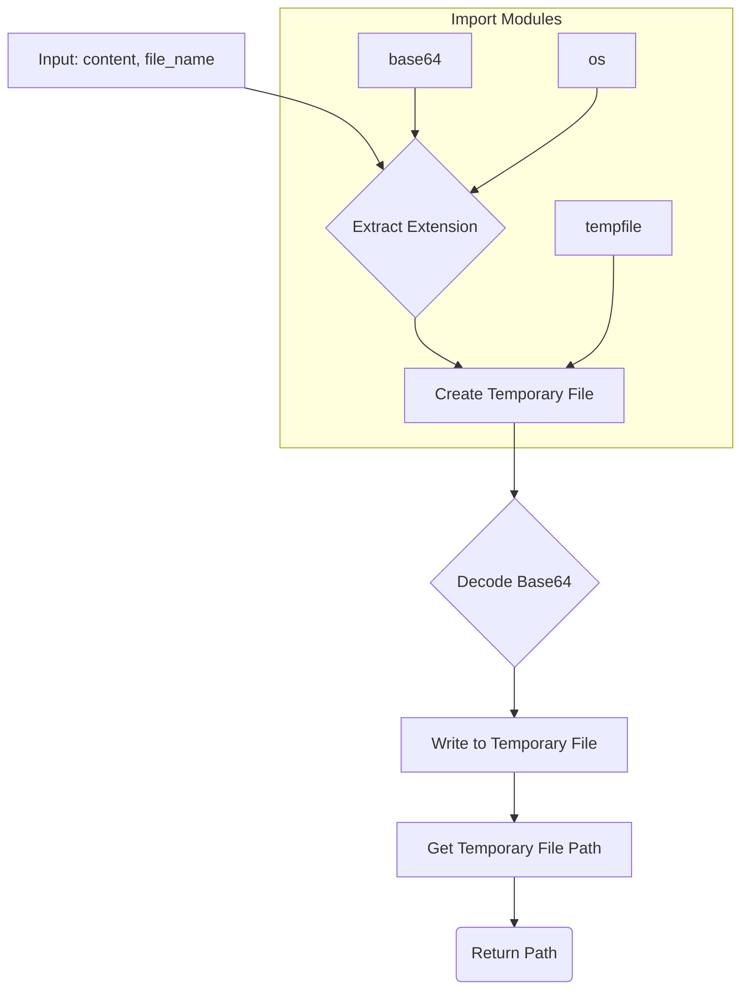

```MD
# <input code>

```python
## \file hypotez/src/utils/convertors/base64.py
# -*- coding: utf-8 -*-
#! venv/Scripts/python.exe
#! venv/bin/python/python3.12

"""
.. module: src.utils.convertors.base64 
	:platform: Windows, Unix
	:synopsis: Convert Base64 encoded content to a temporary file

"""


""" This module provides a function to decode Base64 encoded content and write it to a temporary file with the specified extension.

Functions:
    - `base64_to_tmpfile`: Convert Base64 encoded content to a temporary file.
"""

import base64
import tempfile
import os

def base64_to_tmpfile(content: str, file_name: str) -> str:
    """
    Convert Base64 encoded content to a temporary file.

    This function decodes the Base64 encoded content and writes it to a temporary file with the same extension as the provided file name. 
    The path to the temporary file is returned.

    Args:
        content (str): Base64 encoded content to be decoded and written to the file.
        file_name (str): Name of the file used to extract the file extension for the temporary file.

    Returns:
        str: Path to the temporary file.

    Example:
        >>> base64_content = "SGVsbG8gd29ybGQh"  # Base64 encoded content "Hello world!"
        >>> file_name = "example.txt"
        >>> tmp_file_path = base64_to_tmpfile(base64_content, file_name)
        >>> print(f"Temporary file created at: {tmp_file_path}")
        Temporary file created at: /tmp/tmpfile.txt
    """
    _, ext = os.path.splitext(file_name)
    path = ''
    with tempfile.NamedTemporaryFile(delete=False, suffix=ext) as tmp:
        tmp.write(base64.b64decode(content))
        path = tmp.name

    return path

def base64encode(image_path):
    # Function to encode the image
  with open(image_path, "rb") as image_file:
    return base64.b64encode(image_file.read()).decode('utf-8')
```

# <algorithm>

**Step 1**: Input Base64 encoded `content` and `file_name`.

**Step 2**: Extract the file extension (`ext`) from `file_name` using `os.path.splitext()`.

**Step 3**: Create a temporary file using `tempfile.NamedTemporaryFile` with the extracted extension (`suffix=ext`) and `delete=False` to prevent automatic deletion.

**Step 4**: Decode the Base64 encoded `content` using `base64.b64decode()`.

**Step 5**: Write the decoded content to the temporary file using `tmp.write()`.

**Step 6**: Get the path to the temporary file (`tmp.name`) and store it in `path`.

**Step 7**: Return the path to the temporary file.

**Example:**

Input: `content = "SGVsbG8gd29ybGQh"`, `file_name = "example.txt"`

Output: `/tmp/tmpfile.txt` (or similar temporary file path)


# <mermaid>



**Dependencies:**

- `base64`: For Base64 encoding and decoding. This is a standard Python library.
- `tempfile`: For creating temporary files. Also a standard Python library.
- `os`: For file system operations like getting the file extension. A standard Python library.

These imports are necessary for the functions to perform their intended tasks.

# <explanation>

**Imports:**

- `base64`: Provides functions for Base64 encoding and decoding. Used for converting Base64 string to bytes and vice-versa. Part of Python's standard library.
- `tempfile`: Used to create and manage temporary files. Part of Python's standard library.
- `os`: Provides functions for interacting with the operating system, particularly for accessing file paths and file extensions (`os.path.splitext`). Part of Python's standard library.

**Classes:**

No classes are defined in this code.


**Functions:**

- `base64_to_tmpfile(content: str, file_name: str) -> str`:
    - Takes Base64 encoded `content` (string) and `file_name` (string) as input.
    - Extracts the file extension from `file_name`.
    - Creates a temporary file with the extracted extension using `tempfile.NamedTemporaryFile`. The `delete=False` flag is crucial, as it prevents the temporary file from being automatically deleted.
    - Decodes the Base64 content using `base64.b64decode()`.
    - Writes the decoded bytes to the temporary file using `tmp.write()`.
    - Returns the path to the created temporary file.
    - **Example Usage (as shown in the docstring):**

```python
base64_content = "SGVsbG8gd29ybGQh"  # Base64 encoded content "Hello world!"
file_name = "example.txt"
tmp_file_path = base64_to_tmpfile(base64_content, file_name)
print(f"Temporary file created at: {tmp_file_path}")
```

- `base64encode(image_path)`:
  - Takes the path to an image file as input (`image_path`).
  - Opens the image file in binary read mode (`"rb"`) to read the raw image data.
  - Reads the entire image data using `image_file.read()`.
  - Encodes the image data using `base64.b64encode()` and converts it into a UTF-8 string using `decode('utf-8')`.
  - Returns the Base64 encoded string representation of the image.

**Variables:**

- `MODE`: A string variable with the value 'dev'. It's currently unused but may be used for different modes in a larger application.
- `ext`: Stores the extracted file extension (e.g., ".txt").
- `path`: Stores the path to the temporary file.

**Potential Errors/Improvements:**

- **Error Handling:** The code doesn't include error handling for cases where the Base64 content might be invalid or the file doesn't exist.  Adding `try...except` blocks would make the code more robust.
- **File Closing:**  While `tempfile.NamedTemporaryFile` handles closing the file, it is good practice to explicitly close files in the `with` block to ensure no errors occur.
- **Cleanup:** When the temporary file is no longer needed, the Python program should explicitly delete it (`os.remove(path)`) to avoid resource issues or potential issues if the application exits abnormally.

**Relationships with other parts of the project:**

This module likely serves as a utility for other parts of the `hypotez` project.  It would be called from other modules in `hypotez` to convert Base64-encoded data into temporary files. For example, in a component handling file uploads, this function could be used to store decoded files.