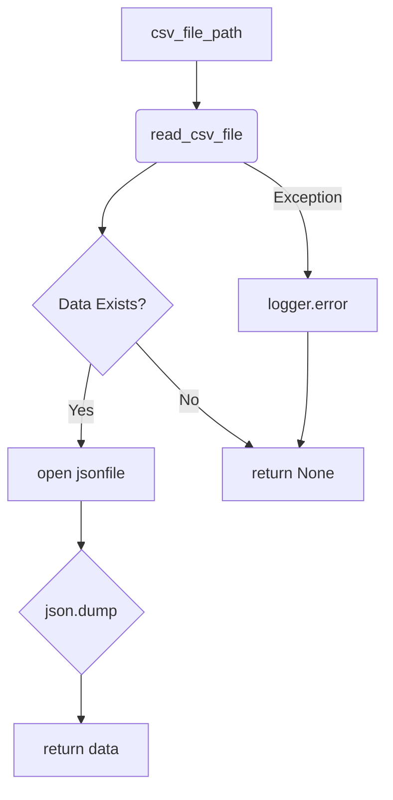

# Code Explanation: hypotez/src/utils/convertors/csv.py

## <input code>

```python
# -*- coding: utf-8 -*-\n\n#! venv/bin/python/python3.12\n\n"""\n.. module: src.utils.convertors.csv \n\t:platform: Windows, Unix\n\t:synopsis: CSV and JSON conversion utilities\n\n"""\nMODE = \'dev\'\n\n""" Functions:\n    - `csv2dict`: Convert CSV data to a dictionary.\n    - `csv2ns`: Convert CSV data to SimpleNamespace objects.\n\n.. code-block:: python\n\n    # Example usage:\n\n    # Using JSON list of dictionaries\n    json_data_list = [{"name": "John", "age": 30, "city": "New York"}, {"name": "Alice", "age": 25, "city": "Los Angeles"}]\n    json_file_path = \'data.json\'\n    csv_file_path = \'data.csv\'\n\n    # Convert JSON to CSV\n    json2csv.json2csv(json_data_list, csv_file_path)\n\n    # Convert CSV back to JSON\n    csv_data = csv2json(csv_file_path, json_file_path)\n    if csv_data:\n        if isinstance(csv_data, list):\n            if isinstance(csv_data[0], dict):\n                print("CSV data (list of dictionaries):")\n            else:\n                print("CSV data (list of values):")\n            print(csv_data)\n        else:\n            print("Failed to read CSV data.")\n"""\n\nimport json\nimport csv\nfrom pathlib import Path\nfrom typing import List, Dict\nfrom types import SimpleNamespace\nfrom src.logger import logger\nfrom src.utils.csv import read_csv_as_dict, read_csv_as_ns, save_csv_file, read_csv_file\n\ndef csv2dict(csv_file: str | Path, *args, **kwargs) -> dict | None:\n    """\n    Convert CSV data to a dictionary.\n\n    Args:\n        csv_file (str | Path): Path to the CSV file to read.\n\n    Returns:\n        dict | None: Dictionary containing the data from CSV converted to JSON format, or `None` if conversion failed.\n\n    Raises:\n        Exception: If unable to read CSV.\n    """\n    return read_csv_as_dict(csv_file, *args, **kwargs)\n\ndef csv2ns(csv_file: str | Path, *args, **kwargs) -> SimpleNamespace | None:\n    """\n    Convert CSV data to SimpleNamespace objects.\n\n    Args:\n        csv_file (str | Path): Path to the CSV file to read.\n\n    Returns:\n        SimpleNamespace | None: SimpleNamespace object containing the data from CSV, or `None` if conversion failed.\n\n    Raises:\n        Exception: If unable to read CSV.\n    """\n    return read_csv_as_ns(csv_file, *args, **kwargs)\n\ndef csv_to_json(\n    csv_file_path: str | Path,\n    json_file_path: str | Path,\n    exc_info: bool = True\n) -> List[Dict[str, str]] | None:\n    """ Convert a CSV file to JSON format and save it to a JSON file.\n\n    Args:\n        csv_file_path (str | Path): The path to the CSV file to read.\n        json_file_path (str | Path): The path to the JSON file to save.\n        exc_info (bool, optional): If True, includes traceback information in the log. Defaults to True.\n\n    Returns:\n        List[Dict[str, str]] | None: The JSON data as a list of dictionaries, or None if conversion failed.\n\n    Example:\n        >>> json_data = csv_to_json(\'dialogue_log.csv\', \'dialogue_log.json\')\n        >>> print(json_data)\n        [{\'role\': \'user\', \'content\': \'Hello\'}, {\'role\': \'assistant\', \'content\': \'Hi there!\'}]\n    """\n    try:\n        data = read_csv_file(csv_file_path, exc_info=exc_info)\n        if data is not None:\n            with open(json_file_path, \'w\', encoding=\'utf-8\') as jsonfile:\n                json.dump(data, jsonfile, indent=4)\n            return data\n        return\n    except Exception as ex:\n        logger.error("Failed to convert CSV to JSON", ex, exc_info=exc_info)\n        return\n```

## <algorithm>

**Step 1:** Input CSV file path.
**Step 2:** Call `read_csv_file` to read CSV file.
**Step 3:** Check if `read_csv_file` returns data.
**Step 4:** If data exists, write data to JSON file using `json.dump`.
**Step 5:** Return the data.
**Step 6:** If any error occurs during the process, log the error using `logger.error`.
**Step 7:** Return None.

**Example:**

Input: `dialogue_log.csv` output `dialogue_log.json`

```
Input File (dialogue_log.csv):
role,content
user,Hello
assistant,Hi there!
```

*Data Flow Diagram*:
`csv_file_path` -> `read_csv_file` -> `data` -> `json.dump` -> `json_file_path` -> `return data`


## <mermaid>



**Dependencies Analysis:**

*   `json`: Used for JSON encoding/decoding.
*   `csv`: Used for CSV file reading/writing.
*   `pathlib`: Used for working with file paths.
*   `typing`: Used for type hinting.
*   `types`: Used for `SimpleNamespace`.
*   `src.logger`: Used for logging errors.  Implies a custom logger is part of the project, likely for handling errors or messages throughout the application.
*   `src.utils.csv`: Likely a package or module within the project that contains functions for interacting with CSV files (e.g., `read_csv_as_dict`, `read_csv_as_ns`, `save_csv_file`, `read_csv_file`).  This points to a higher-level organization of project utility functions.  The dependency indicates a structured organization and the existence of similar tools for handling CSV data elsewhere in the project.


## <explanation>

**Imports:**

*   `json`: Used for encoding and decoding JSON data for converting between CSV and JSON.
*   `csv`: Used for interacting with CSV files.
*   `pathlib`: Provides path-like objects that are more robust and platform-independent than string-based paths, enabling better code organization.
*   `typing`: Used for type hinting, providing clarity and support for static analysis tools.
*   `types`: For working with `SimpleNamespace` objects.
*   `src.logger`: Imports a custom logger likely handling logs for various parts of the application.  The import from a `src` package reinforces a clear modular structure in project organization.
*   `src.utils.csv`: Implies that functions for reading and writing to CSV files exist within another part of the project.  This suggests a layered architecture where utility functions are grouped within a `utils` directory.

**Classes:**

There are no classes defined in this module.


**Functions:**

*   `csv2dict(csv_file: str | Path, *args, **kwargs) -> dict | None`
    *   Purpose: Converts CSV data to a dictionary.
    *   Parameters: `csv_file` (path to CSV). Other parameters are not used in this function.
    *   Return Value: A dictionary representing the CSV data or `None` on failure.
    *   Mechanism: Calls the `read_csv_as_dict` function from the `src.utils.csv` module to handle the actual CSV reading and conversion.


*   `csv2ns(csv_file: str | Path, *args, **kwargs) -> SimpleNamespace | None`
    *   Purpose: Converts CSV data to a `SimpleNamespace` object.
    *   Parameters: `csv_file` (path to CSV). Other parameters are not used in this function.
    *   Return Value: A `SimpleNamespace` object representing the CSV data or `None` on failure.
    *   Mechanism: Calls the `read_csv_as_ns` function from the `src.utils.csv` module to handle the actual CSV reading and conversion.


*   `csv_to_json(csv_file_path: str | Path, json_file_path: str | Path, exc_info: bool = True) -> List[Dict[str, str]] | None`:
    *   Purpose: Converts a CSV file to JSON format and saves it to a JSON file.
    *   Parameters:
        *   `csv_file_path`: Path to the input CSV file.
        *   `json_file_path`: Path to the output JSON file.
        *   `exc_info`: A boolean that determines if traceback information should be included in the log. Defaults to `True`.
    *   Return Value: A list of dictionaries representing the JSON data, or `None` if an error occurs during conversion or file reading.
    *   Mechanism: Attempts to read the CSV file using `read_csv_file`. If successful, it saves the data in JSON format to the specified JSON file and returns the data. If unsuccessful, it logs the error using the `logger` object and returns `None`. This adds crucial error handling and logging.


**Variables:**

*   `MODE`: A string variable with the value 'dev'.  Likely a configuration constant.


**Potential Errors/Improvements:**

*   Error Handling: While the `try...except` block in `csv_to_json` is a good start,  consider more specific exception handling to catch and log different types of errors (e.g., `FileNotFoundError`, `IOError`).

*   `args` and `kwargs`:  Using `*args, **kwargs` in `csv2dict` and `csv2ns` is unnecessary given the function only uses the `csv_file` parameter.


**Relationship to Other Parts of the Project:**

The functions heavily rely on the `src.utils.csv` module for CSV-related operations.  The structure indicates a well-organized project with clear separation of concerns between data handling (`src.utils.csv`) and core functionality (`hypotez`).  This enhances maintainability, readability, and testability.

```
Project Structure (Conceptual):
- hypotez
    - src
        - utils
            - convertors
                - csv.py
            - csv.py (other csv utilities) 
        - logger.py (custom logger)
        - other_modules...