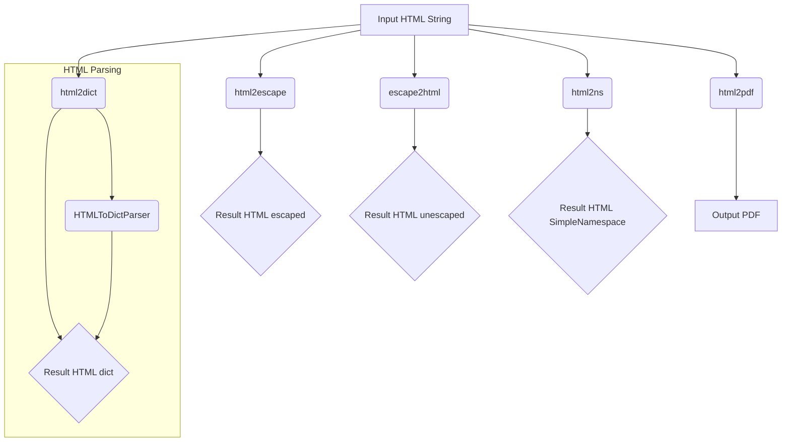
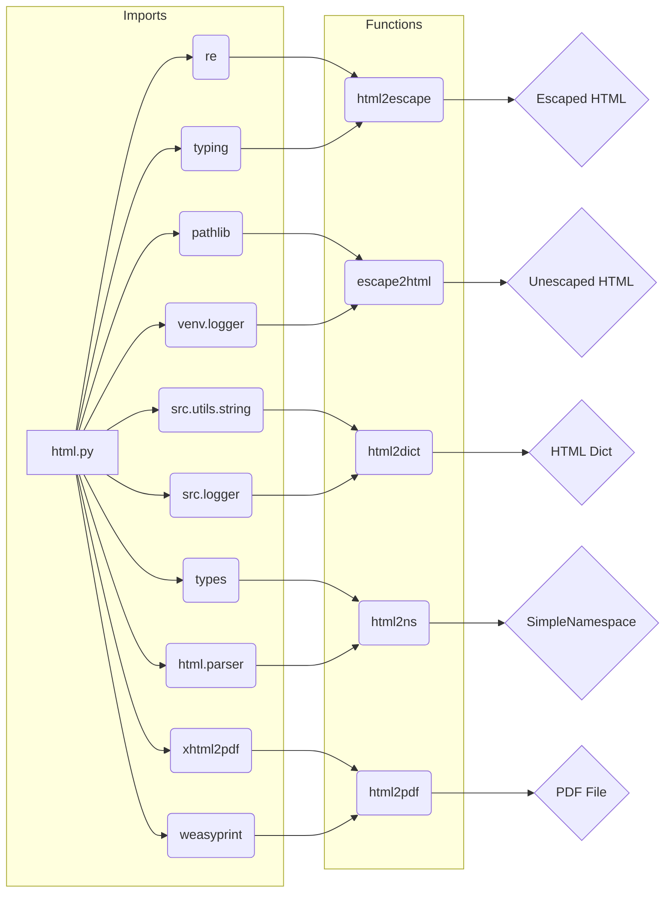

# Code Explanation: hypotez/src/utils/convertors/html.py

## <input code>

```python
# -*- coding: utf-8 -*-\n#! venv/Scripts/python.exe\n#! venv/bin/python/python3.12\n\n"""\n.. module: src.utils.convertors.html \n\t:platform: Windows, Unix\n\t:synopsis: HTML conversion utilities\nFunctions:\n    - `html2escape`: Convert HTML to escape sequences.\n    - `escape2html`: Convert escape sequences to HTML.\n    - `html2dict`: Convert HTML to dictionaries.\n    - `html2ns`: Convert HTML to SimpleNamespace objects.\n    https://stackoverflow.com/questions/73599970/how-to-solve-wkhtmltopdf-reported-an-error-exit-with-code-1-due-to-network-err\nhttps://chatgpt.com/share/672266a3-0048-800d-a97b-c38f647d496b\n"""

import re
from typing import Dict
from pathlib import Path
from venv import logger
from src.utils.string import StringFormatter
from src.logger import logger
from types import SimpleNamespace
from html.parser import HTMLParser
from xhtml2pdf import pisa
try:
    from weasyprint import HTML
except Exception as ex:
    logger.error(ex)
    ...

# ... (rest of the code)
```

## <algorithm>




## <mermaid>



**Dependencies Analysis:**

The mermaid diagram shows that `html.py` imports modules like `re`, `typing`, `pathlib`, `venv.logger`, `src.utils.string`, `src.logger`, `types`, `html.parser`, `xhtml2pdf`, and `weasyprint`.

These imports are crucial for the functionality of the `html.py` module, including:

- `re`: Regular expressions for potentially manipulating or validating HTML structures.
- `typing`: For type hinting, improving code readability and maintainability.
- `pathlib`: For working with file paths (in `html2pdf`).
- `venv.logger`: Likely a custom logger from the virtual environment, used for logging.
- `src.utils.string`: Likely a utility module providing string manipulation functions.
- `src.logger`: Another custom logger, used for reporting errors or status updates.
- `types`: The `SimpleNamespace` object is for creating namespace-like objects.
- `html.parser`: Used for parsing HTML.
- `xhtml2pdf`: For converting HTML to PDF.
- `weasyprint`: Another library for PDF generation.


## <explanation>

**Imports:**

- `re`: Used for regular expressions.  (Likely for pattern matching and manipulation within the HTML).
- `typing`: Used for type hinting. Makes the code more readable and maintainable by specifying the expected types of variables and function parameters.
- `pathlib`: Used to work with file paths. Essential for saving the generated PDF file.
- `venv.logger`: likely custom logging facility within the virtual environment setup.
- `src.utils.string`: This is a custom utility module for string manipulation. Likely contains functions like escaping/unescaping HTML entities.
- `src.logger`: Custom module likely managing logging to specific destinations.
- `types`: Contains `SimpleNamespace` for creating namespace objects (to represent HTML element data conveniently).
- `html.parser`: Provides tools for parsing HTML structures.
- `xhtml2pdf`: For generating PDFs from HTML content, although it's commented out.
- `weasyprint`: An alternative PDF generation library, used for converting HTML to PDF.

**Classes:**

- `HTMLToDictParser(HTMLParser)`: A custom class extending `html.parser.HTMLParser`. It parses HTML to extract tag names and their content as key-value pairs in a dictionary.  This class is essential for `html2dict`.

**Functions:**

- `html2escape(input_str: str) -> str`: Converts HTML entities to their escaped versions (e.g., `<` to `&lt;`). It uses `StringFormatter.escape_html_tags` from the `src.utils.string` module.
- `escape2html(input_str: str) -> str`: Reverses the `html2escape` process, converting escaped entities back to HTML.  It uses `StringFormatter.unescape_html_tags`.
- `html2dict(html_str: str) -> Dict[str, str]`: Parses HTML, extracting tags and their corresponding content into a dictionary. Uses a custom parser class `HTMLToDictParser` to do the parsing.
- `html2ns(html_str: str) -> SimpleNamespace`: Converts the HTML dictionary produced by `html2dict` into a `SimpleNamespace` object.  This is a more concise way to access data.
- `html2pdf(html_str: str, pdf_file: str | Path) -> bool | None`: Converts HTML to a PDF file using `weasyprint`.  It's a more modern approach compared to the older `xhtml2pdf` that was commented out.


**Variables:**

- `MODE`: Stores the current mode ('dev' in this example). It's used to configure certain aspects of the application.


**Potential Errors/Improvements:**

- The commented-out `html2pdf` function using `xhtml2pdf` might have problems with handling complex or unsupported CSS rules.
- Consider error handling and input validation for functions like `html2dict` to make it robust against malformed HTML.
- The current version relies on external libraries (`weasyprint`, `xhtml2pdf`).  If those libraries aren't installed, the script won't run.


**Relationships:**

- The module relies heavily on the `src.utils.string` and `src.logger` modules. It functions as a part of the utilities library handling HTML conversions within a larger application.

**Overall:**

The module provides essential tools for converting HTML to different formats (escaped strings, dictionaries, SimpleNamespace objects), and importantly to PDF. This enhances the overall functionality of the application by enabling the conversion of HTML to PDF format for easier reporting or presentation. The use of `weasyprint` is a step up compared to `xhtml2pdf` as it's generally considered to be more reliable and up-to-date.