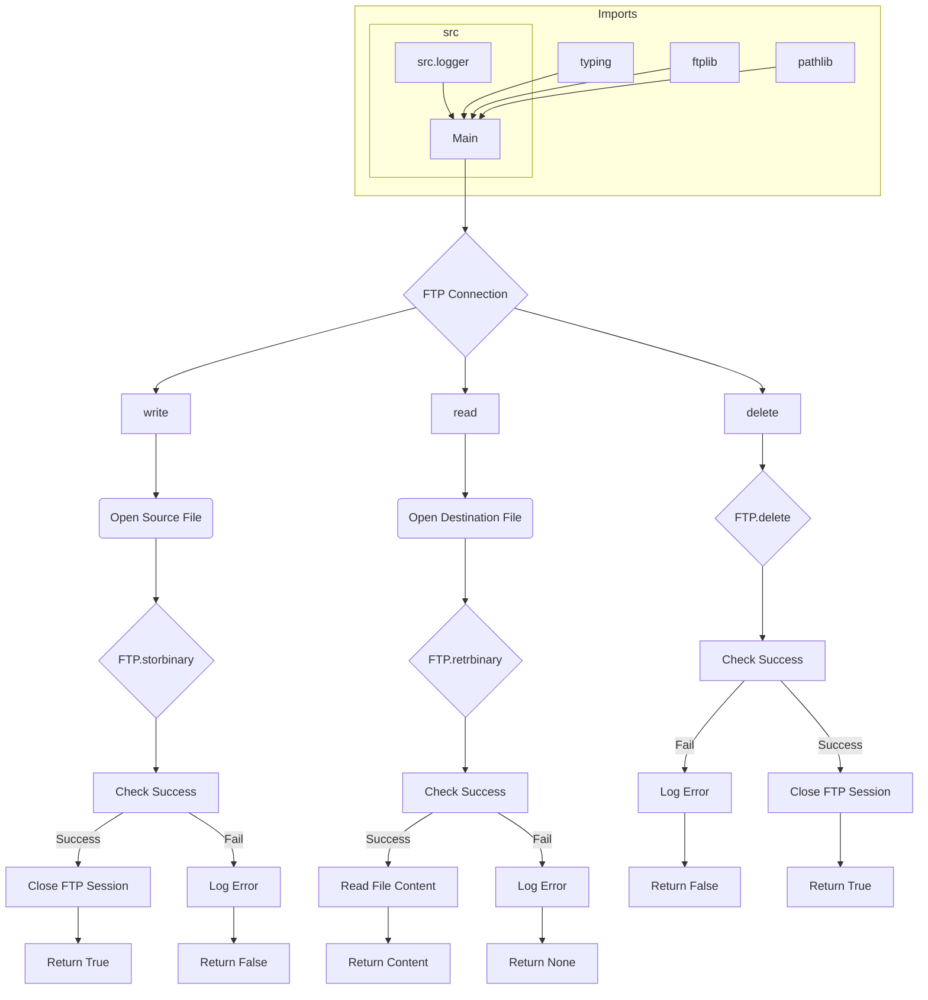

# FTP Utilities for Hypotez Project

## <input code>

```python
## \file hypotez/src/utils/ftp.py
# -*- coding: utf-8 -*-\

#! venv/bin/python/python3.12

"""
.. module: src.utils 
	:platform: Windows, Unix
	:synopsis: interface for interacting with FTP servers
This module provides an interface for interacting with FTP servers. It includes functions to send, receive, and delete files from an FTP server.

** Purpose **:
Allows for sending media files (images, videos), spreadsheets, and other files to and from an FTP server. 

** Modules **:
- helpers (local): Local helper utilities for FTP operations.
- typing: Type hints for function parameters and return values.
- ftplib: Provides FTP protocol client capabilities.
- pathlib: For handling file system paths.

Functions:
    - `write`: Sends a file to an FTP server.
    - `read`: Retrieves a file from an FTP server.
    - `delete`: Deletes a file from an FTP server.
"""

from src.logger import logger
from typing import Union
import ftplib
from pathlib import Path

# Connection configuration (assumed to be defined elsewhere)
_connection = {
    'server': 'ftp.example.com',
    'port': 21,
    'user': 'username',
    'password': 'password'
}

def write(source_file_path: str, dest_dir: str, dest_file_name: str) -> bool:
    """
    Sends a file to an FTP server.

    Args:
        source_file_path (str): The path of the file to be sent.
        dest_dir (str): The destination directory on the FTP server.
        dest_file_name (str): The name of the file on the FTP server.

    Returns:
        bool: True if the file is successfully sent, False otherwise.

    Example:
        >>> success = write('local_path/to/file.txt', '/remote/directory', 'file.txt')
        >>> print(success)
        True
    """
    # ... (rest of the write function)
```

## <algorithm>

**Workflow Diagram**

1. **File Sending (`write` function):**
   - Takes the source file path, destination directory, and destination file name as input.
   - Establishes an FTP connection using `ftplib.FTP`.
   - Changes the working directory on the FTP server to the destination directory (`session.cwd`).
   - Opens the source file in binary read mode (`'rb'`).
   - Uses `session.storbinary` to send the file to the FTP server.
   - Returns `True` if successful, `False` otherwise.  Handles exceptions for connection and transfer failures, logging errors.
   - Closes the FTP session (`session.quit`).

2. **File Retrieving (`read` function):**
   - Takes the destination file path (local), destination directory, and destination file name as input.
   - Establishes an FTP connection using `ftplib.FTP`.
   - Changes the working directory on the FTP server to the destination directory (`session.cwd`).
   - Opens the destination file in binary write mode (`'wb'`).
   - Uses `session.retrbinary` to retrieve the file from the FTP server.
   - Reads the retrieved file content into memory.
   - Returns the file content if successful, `None` otherwise.
   - Handles exceptions for connection and retrieval failures, logging errors.
   - Closes the FTP session (`session.quit`).

3. **File Deletion (`delete` function):**
   - Takes the destination directory and destination file name as input.
   - Establishes an FTP connection using `ftplib.FTP`.
   - Changes the working directory on the FTP server to the destination directory (`session.cwd`).
   - Uses `session.delete` to delete the file from the FTP server.
   - Returns `True` if successful, `False` otherwise.
   - Handles exceptions for connection and deletion failures, logging errors.
   - Closes the FTP session (`session.quit`).


## <mermaid>



## <explanation>

**Imports:**

- `from src.logger import logger`: Imports the logger from the `src.logger` module. This indicates a dependency on a logging system, likely for error handling and informational messages.
- `from typing import Union`: Imports the `Union` type from the `typing` module. This is used to define function return types that can be multiple types.
- `import ftplib`: Imports the `ftplib` module, which is a Python library providing an interface for interacting with FTP servers.
- `from pathlib import Path`: Imports the `Path` class from the `pathlib` module, allowing the use of object oriented file paths, this could be replaced with plain strings and maintain functionality. This module provides a way to interact with paths in a more platform-independent way.


**Classes:**

- This code defines no classes, only functions.


**Functions:**

- `write(source_file_path: str, dest_dir: str, dest_file_name: str) -> bool`: Sends a file to an FTP server. It takes the source file path, destination directory, and destination file name. It returns `True` if the file is successfully sent, `False` otherwise.  Handles potential errors during connection establishment and file transfer.  Crucially, it closes the FTP session using `session.quit()` regardless of success or failure within the `finally` block, preventing resource leaks.
- `read(source_file_path: str, dest_dir: str, dest_file_name: str) -> Union[str, bytes, None]`: Retrieves a file from an FTP server. It takes the destination file path (locally), destination directory, and destination file name. Returns the file content if successful, `None` otherwise.  Again, closes the FTP session in a `finally` block.
- `delete(source_file_path: str, dest_dir: str, dest_file_name: str) -> bool`: Deletes a file from an FTP server. It takes the destination directory and destination file name, returns `True` if successful, `False` otherwise.  Handles potential errors during connection establishment and file deletion.


**Variables:**

- ``: A variable likely used for setting modes in the code (e.g., debug mode). This variable is a placeholder and its use is undefined in the provided snippet.
- `_connection`: A dictionary containing FTP server connection details. This dictionary is assumed to be defined and populated elsewhere in the project. This is a crucial element, as missing or incorrect connection details will prevent the FTP functions from working correctly.

**Potential Errors/Improvements:**

- **Error Handling:** The error handling is improved by logging the errors using `logger`.  Better error handling includes specific exception types (e.g., `ftplib.error_perm`, `FileNotFoundError`).
- **Connection Details:** The `_connection` dictionary relies on external configuration.  It's good practice to load connection details from a dedicated configuration file or environment variables to avoid hardcoding sensitive information in the code.
- **Robustness:** The `finally` block ensures the FTP session is closed, handling exceptions that might prevent closing the session properly.  This is crucial for preventing resource leaks.
- **Data Validation:** The code does not validate user inputs (e.g., file paths, directory names, etc.). Adding input validation would make the code more robust.
- **File Existence Check:** The code does not check if the source file exists in the `write` function. Adding a check (`os.path.exists`) would further improve robustness.
- **Large File Handling:** For large files, the approach used here might lead to memory issues if entire files are loaded into memory.  Consider alternative approaches using `session.storlines` or similar for streamed transfer.
- **Input validation** for file paths, destination directories and file names will prevent unexpected behavior.


**Relationships with Other Project Parts:**

The `logger` import (`from src.logger import logger`) establishes a relationship with a logging system in the `src` package.  The `ftp.py` module relies on `logger` for error reporting and handling, which further suggests a structured logging mechanism throughout the project.