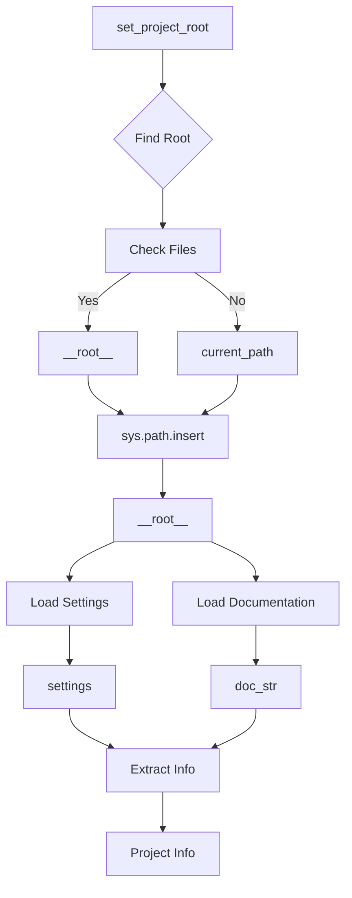

# Code Explanation for hypotez/src/logger/header.py

## <input code>

```python
## \file hypotez/src/logger/header.py
# -*- coding: utf-8 -*-\
#! venv/Scripts/python.exe
#! venv/bin/python/python3.12

"""
.. module: src.logger 
	:platform: Windows, Unix
	:synopsis:

"""
MODE = 'dev'

"""
	:platform: Windows, Unix
	:synopsis: Модуль определяющий корневой путь к проекту. Все импорты строятся относительно этого пути.
    :TODO: В дальнейшем перенести в системную переменную"""

import sys
import json
from packaging.version import Version

from pathlib import Path
def set_project_root(marker_files=('__root__')) -> Path:
    """
    Finds the root directory of the project starting from the current file's directory,
    searching upwards and stopping at the first directory containing any of the marker files.

    Args:
        marker_files (tuple): Filenames or directory names to identify the project root.
    
    Returns:
        Path: Path to the root directory if found, otherwise the directory where the script is located.
    """
    __root__:Path
    current_path:Path = Path(__file__).resolve().parent
    __root__ = current_path
    for parent in [current_path] + list(current_path.parents):
        if any((parent / marker).exists() for marker in marker_files):
            __root__ = parent
            break
    if __root__ not in sys.path:
        sys.path.insert(0, str(__root__))
    return __root__


# Get the root directory of the project
__root__ = set_project_root()
"""__root__ (Path): Path to the root directory of the project"""

from src import gs

settings:dict = None
try:
    with open(gs.path.root / 'src' / 'settings.json', 'r') as settings_file:
        settings = json.load(settings_file)
except (FileNotFoundError, json.JSONDecodeError):
    ...

doc_str:str = None
try:
    with open(gs.path.root / 'src' / 'README.MD', 'r') as settings_file:
        doc_str = settings_file.read()
except (FileNotFoundError, json.JSONDecodeError):
    ...


__project_name__ = settings.get("project_name", 'hypotez') if settings  else 'hypotez'
__version__: str = settings.get("version", '')  if settings  else ''
__doc__: str = doc_str if doc_str else ''
__details__: str = ''
__author__: str = settings.get("author", '')  if settings else ''
__copyright__: str = settings.get("copyrihgnt", '')  if settings else ''
__cofee__: str = settings.get("cofee", "Treat the developer to a cup of coffee for boosting enthusiasm in development: https://boosty.to/hypo69")  if settings else "Treat the developer to a cup of coffee for boosting enthusiasm in development: https://boosty.to/hypo69"
```

## <algorithm>

This code module sets up the project root directory and loads settings and documentation from the `settings.json` and `README.MD` files.

**Step 1:** Define `set_project_root` function.


```
Input: marker_files (tuple)
```

**Step 2:** Determine Project Root Directory.

```
Input: current_path (Path)
Output: __root__ (Path), sys.path
```

**Step 3:** Get Settings from `settings.json`.


```
Input: __root__ (Path)
Output: settings (dict)
```

**Step 4:** Get Documentation from `README.MD`.


```
Input: __root__ (Path)
Output: doc_str (str)
```

**Step 5:** Extract Project Information (project_name, version, etc.).


```
Input: settings (dict), doc_str (str)
Output: __project_name__ (str), __version__ (str), __doc__ (str), __details__ (str),__author__ (str), __copyright__ (str), __cofee__ (str)
```


## <mermaid>



**Dependencies Analysis:**

* `sys`:  Provides access to system-specific parameters and functions, including `sys.path`.
* `json`: Used for handling JSON data.
* `packaging.version`: Allows for sophisticated version handling.
* `pathlib`:  Provides object-oriented way of working with paths.  Critical for navigating file systems.
* `src`: This likely represents a custom package within the project, containing the `gs` module. This is a crucial part of the project's structure and will need a separate analysis to understand its role.  Importantly, this establishes a dependency chain to the `gs` module and implicitly defines the project's package structure.


## <explanation>

* **Imports:**
    * `sys`:  Needed for manipulating the Python path (`sys.path`).
    * `json`: Used to load configuration data from `settings.json`.
    * `packaging.version`:  Likely for handling and comparing software versions.  Crucial for managing project versioning and consistency.
    * `pathlib`:  Modern way of working with file paths in Python, preferred over `os.path` for its object-oriented nature and readability.
    * `src`:  Implements a structured package import, critical for organizing code in larger projects, allowing for compartmentalization of related modules and avoids naming collisions.


* **Classes:**
    * No classes are defined in this file.

* **Functions:**
    * `set_project_root(marker_files)`: This function is crucial for locating the project's root directory. It starts from the current file's location and traverses upward through parent directories until it finds a directory containing one of the specified marker files (e.g., `pyproject.toml`, `requirements.txt`, `.git`). If no such directory is found, it defaults to the current directory. The function also adds the root directory to the `sys.path`, which is essential for importing modules within the project.
        * **Example:** If `__file__` points to `hypotez/src/logger/header.py`, the function will search `hypotez/src/logger`, `hypotez/src`, and `hypotez` until it finds a directory containing one of the `marker_files`, then making sure the root of the project is accessible to the rest of the application.

* **Variables:**
    * `MODE`: A global variable probably for controlling some aspects of the logger.
    * `__root__`: A global variable storing the path to the project's root directory.  Calculated from the `set_project_root` function call, this variable is vital for constructing absolute file paths within the project.
    * `settings`: A dictionary storing project settings (likely loaded from `settings.json`).
    * `doc_str`: Stores the content of the `README.MD` file.  This provides access to project documentation directly within the Python code.
    * `__project_name__`, `__version__`, `__doc__`, `__details__`, `__author__`, `__copyright__`, `__cofee__`:  Variables storing information about the project extracted from the settings.
        * **Note:** Using double underscores (`__`) is a common convention in Python to indicate that these are internal variables that shouldn't be directly accessed or modified from outside the module.

* **Potential Errors/Improvements:**
    * Error handling within the `try-except` blocks is good practice.
    * The use of `...` in the `except` blocks could be considered a placeholder; it's better to provide more specific error handling.  Consider logging the exception to a proper log file for debugging.


* **Relationships:**
    * This module depends on the `gs` module (which is from the `src` package) to determine the project root.  A separate analysis of the `gs` module is needed to understand its role fully.  This `gs` module's purpose is to be used for file/path handling, and this module relies heavily on it to properly discover the project root.  This interaction strongly suggests a hierarchical or structured component relationship in the project.


```