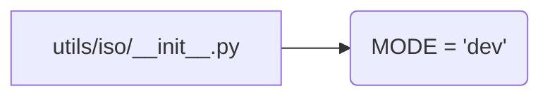

# Code Explanation for hypotez/src/utils/iso/__init__.py

## <input code>

```python
## \file hypotez/src/utils/iso/__init__.py
# -*- coding: utf-8 -*-
#! venv/Scripts/python.exe
#! venv/bin/python/python3.12

"""
.. module: src.utils.iso 
	:platform: Windows, Unix
	:synopsis:

"""
MODE = 'dev'
```

## <algorithm>

There is no algorithm in the sense of a series of steps processing data.  This file appears to be an initialization file for a module named `iso` within the `utils` package.  It primarily defines a constant.

## <mermaid>



## <explanation>

**Imports:**

There are no imports in this file.  Initialization files are often used to set up variables and constants, which can then be used by other parts of the code in a package.

**Classes:**

There are no classes.

**Functions:**

There are no functions.

**Variables:**

*   `MODE = 'dev'`: This is a constant string variable.  It likely defines a mode for the `iso` module (e.g., development, testing, production). This mode could influence how the module operates.

**Potential Errors/Areas for Improvement:**

*   **Lack of documentation:** While the docstring describes the module, it lacks details on how this `MODE` variable is used throughout the module.  If this variable is meant to influence the behavior of other files, the documentation in the related files should clearly explain how.
*   **Meaning of 'dev':**  While `'dev'` is easily understandable, a more explicit description (e.g., "Development mode, uses specific configurations...") would enhance clarity for maintainers.
*   **Possible additional constants:**  If other modes (e.g., 'test', 'prod') are anticipated, this could be a better way to use constants by setting them as constants in a separate file.  Using constants that are referenced in many places is generally better than having that variable scattered in the code.

**Relationships with Other Parts of the Project:**

This file (`hypotez/src/utils/iso/__init__.py`) likely acts as a foundational component within the `utils` package. This constant may influence the behavior of functions or classes within submodules (e.g., `iso/helpers.py`, `iso/validator.py`). These submodules would access and use the value of `MODE`.  For example, if different validation rules are applied in 'dev' and 'prod' modes, the `MODE` variable would be used to determine which set of rules to use.


**Example usage (hypothetical):**

```python
from hypotez.src.utils.iso import MODE

if MODE == 'dev':
    # Perform specific actions for development mode.
    print("Running in development mode.")
elif MODE == 'test':
    # Actions for test mode.
    print("Running in test mode.")
# etc.
```