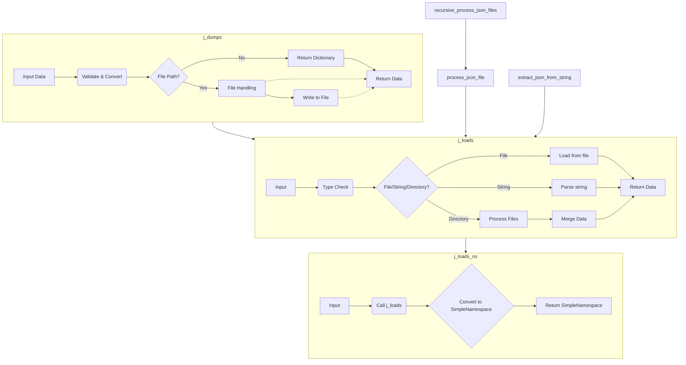

# jjson.py Code Analysis

## <input code>

```python
# -*- coding: utf-8 -*-

#! venv/bin/python/python3.12

"""
.. module: src.utils 
	:platform: Windows, Unix
	:synopsis: Module for handling JSON and CSV files, including loading, dumping, and merging data.
 This module provides functions to:
- **Dump JSON data**: Convert JSON or SimpleNamespace objects into JSON format and write to a file, or return the JSON data as a dictionary.
- **Load JSON and CSV data**: Read JSON or CSV data from a file, directory, or string, and convert it into dictionaries or lists of dictionaries.
- **Convert to SimpleNamespace**: Convert loaded JSON data into SimpleNamespace objects for easier manipulation.
- **Merge JSON files**: Combine multiple JSON files from a directory into a single JSON file.
- **Parse Markdown**: Convert Markdown strings to JSON format for structured data representation.

The functions in this module handle various aspects of working with JSON and CSV data, ensuring that data is loaded, saved, and merged efficiently and effectively.
"""

from datetime import datetime
import copy
from math import log
from pathlib import Path
from typing import List, Dict, Optional, Any
from types import SimpleNamespace
import json
import os
import re
import pandas as pd
from json_repair import repair_json
from typing import Any
from pathlib import Path
import json
import pandas as pd
from types import SimpleNamespace
from collections import OrderedDict

from src.logger import logger
from src.utils.printer import pprint
from .convertors.dict import dict2ns
# from .convertors.ns import ns2dict 

# ... (rest of the code)
```

## <algorithm>

The code provides a set of functions for working with JSON and CSV data, including loading, dumping, merging, and conversion to `SimpleNamespace`.

**j_dumps Function:**

1. **Input Validation:** Checks if the input `data` is a string. If so, attempts to repair it using `repair_json`.
2. **Recursive Conversion:** Converts `SimpleNamespace`, `dict`, or `list` input to a `dict` using the `_convert` function for handling nested structures.
3. **File Mode Handling:** Determines the appropriate file mode, defaulting to "w" if the input is invalid.
4. **Existing Data Handling (Append Mode):** If the file exists and the mode is "a+" or "+a", loads existing data from the file.
5. **Data Update:** Depending on the mode ("a+", "+a", or "w"), merges the new data with the existing data.
6. **File Writing:** Creates the parent directory if needed and writes the data to the file in JSON format.  The data is properly formatted with indentation.
7. **Return Value:** Returns the converted data as a dictionary if file operations are skipped or the operation is successful.


**j_loads Function:**

1. **Input Type Handling:** Handles various input types (file path, string, directory, dict).
2. **String Cleaning:** Cleans the input string if it's a Markdown string containing JSON.
3. **File Loading:** Reads JSON data from a file. If the input is a directory, loads all JSON files from the directory and merges them. If a CSV file, converts it into a list of dictionaries.
4. **Error Handling:** Includes comprehensive error handling for file not found, invalid JSON format, and other exceptions.
5. **Return Value:** Returns the loaded data as a dictionary or a list of dictionaries, or None if an error occurs.

**j_loads_ns Function:**

1. **Data Loading:** Calls `j_loads` to load the JSON data.
2. **Conversion to SimpleNamespace:** Converts the loaded data to `SimpleNamespace` objects if it's a list, otherwise converts it to a single `SimpleNamespace` object.
3. **Return Value:** Returns the converted `SimpleNamespace` object or list of `SimpleNamespace` objects.

**process_json_file Function:**
1. **Loads:** Reads JSON from file using `j_loads`.
2. **Replaces:**  Replaces the key 'name' with 'category_name' within the JSON data.
3. **Saves:** Writes the modified data to the file using `j_dumps`.
4. **Error Handling:** Handles potential exceptions during file processing.


**recursive_process_json_files Function:**
1. **Recursive Search:** Recursively finds all JSON files within a specified directory.
2. **File Processing:** Calls `process_json_file` for each JSON file found.

**extract_json_from_string Function:**
1. **Regular Expression Matching:** Searches for JSON blocks within a Markdown string using a regular expression.
2. **Extraction:** Extracts the JSON content if a match is found.
3. **Return Value:** Returns the extracted JSON string.


## <mermaid>



**Dependencies Analysis:**

The diagram shows the core functions and their interrelationships.  Dependencies like `json`, `pathlib`, `pandas`, `json_repair`, `src.logger`, `src.utils.printer`, and `.convertors.dict` are used implicitly.  These are imported at the top of the file and are crucial for data handling, file operations, and conversions within the `jjson` module itself.


## <explanation>

**Imports:**

- `datetime`, `copy`, `math`, `pathlib`, `typing`, `SimpleNamespace`, `json`, `os`, `re`, `pandas`, `json_repair`: Standard libraries for date manipulation, copying objects, mathematical functions, file path handling, type hinting, JSON processing, operating system interaction, regular expressions, data manipulation, and repairing JSON strings. `pandas` is used for CSV loading.
- `src.logger`, `src.utils.printer`, `.convertors.dict`:  External modules likely part of the Hypotez project.  `src.logger` provides logging functionality, `src.utils.printer` for pretty printing, and `.convertors.dict` is likely a custom module to convert dictionaries to `SimpleNamespace` objects.  The `#` before `from .convertors.ns import ns2dict` indicates that this import is commented out, it might be unused or a possible future addition.

**Classes:**

No classes are defined directly within this module. The `SimpleNamespace` class is used from the standard library for creating objects with attributes.

**Functions:**

- `j_dumps`: Handles dumping JSON data to a file or returning it as a dictionary.
- `j_loads`:  Handles loading JSON or CSV data from a file, directory, or string, merging JSON files from a directory.
- `j_loads_ns`:  Converts the output of `j_loads` into `SimpleNamespace` objects.
- `process_json_file`: Processes a single JSON file to replace the key 'name' with 'category_name'
- `recursive_process_json_files`:  Recursively processes all JSON files within a directory, using `process_json_file`
- `extract_json_from_string`: Extracts JSON content from Markdown strings.


**Variables:**

- `MODE`: A constant string indicating the development mode.
- Other variables are mostly function parameters and intermediate results.


**Potential Errors & Improvements:**

- **Error Handling:**  The error handling is improved with detailed logging messages (using `logger`). However, more specific error types could be handled in `j_loads` for clarity.
- **`repair_json`:** The code relies on an external `repair_json` function, which is not defined in the provided snippet.  This assumes it's part of a larger project and handles malformed JSON.
- **File Locking:**  When reading and writing to files concurrently, there might be race conditions.  This might be acceptable for some use cases, but if so it should be explicitly noted in the documentation and if not it could be improved.
- **Concurrency:**  The lack of concurrency handling could be an issue for processing large directories of files.


**Chain of Relationships:**

The `jjson` module relies on other parts of the project, particularly the `src.logger` and `src.utils.printer` modules.  It also imports `dict2ns`, presumably from a custom converter module in the `.convertors` subfolder, to handle converting dictionaries to `SimpleNamespace` objects.


**Overall:** The code is well-structured, handles various JSON data types, and demonStartes good error handling practices.  However, the reliance on `repair_json` and potential concurrency issues should be carefully considered.