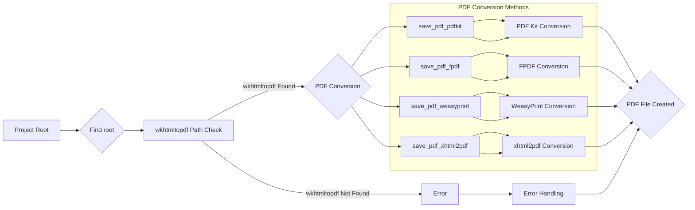

# Analysis of hypotez/src/utils/pdf.py

## <input code>

```python
# -*- coding: utf-8 -*-\n\n#! venv/bin/python/python3.12\n\n"""\n.. module: src.utils.pdf \n    :platform: Windows, Unix\n    :synopsis: Модуль для преобразования HTML-контента или файлов в PDF\n\nМодуль для преобразования HTML-контента или файлов в PDF с использованием различных библиотек.\nДополнительная информация:\n- https://chatgpt.com/share/672266a3-0048-800d-a97b-c38f647d496b\n- https://stackoverflow.com/questions/73599970/how-to-solve-wkhtmltopdf-reported-an-error-exit-with-code-1-due-to-network-err\n- https://habr.com/ru/companies/bothub/articles/853490/\n"""

import sys
import os
import json

from pathlib import Path
import pdfkit
from reportlab.pdfgen import canvas
from fpdf import FPDF
from weasyprint import HTML
from xhtml2pdf import pisa
from src.logger import logger
from src.utils.printer import pprint

# ... (rest of the code)
```

## <algorithm>

The code implements a set of static methods within the `PDFUtils` class to convert various input formats (HTML string, HTML file) into PDF files using different libraries.

**1. Project Root Detection:**

-   **Input:** None (but implicitly, the current file's location).
-   **Process:** Iterates upward through the directory tree from the current file's location, checking if any of the specified marker files (`pyproject.toml`, `requirements.txt`, `.git`) exist.
-   **Output:** `Path` object representing the project root directory.

**2. wkhtmltopdf Path Verification:**

-   **Input:** Determined project root (`__root__`).
-   **Process:** Checks if the `wkhtmltopdf.exe` exists in the determined `bin` directory.
-   **Output:** Returns `True` if found. Raises `FileNotFoundError` if not found.

**3. PDF Conversion Methods:**

-   **Input:** HTML content (string or file path), PDF output file path.
-   **Process:**
    -   `save_pdf_pdfkit`: Uses `pdfkit` to convert HTML to PDF.
    -   `save_pdf_fpdf`: Uses `FPDF` to create a simple PDF with the specified text data. Handling fonts from `fonts.json` file.
    -   `save_pdf_weasyprint`: Uses `WeasyPrint` to convert HTML to PDF.
    -   `save_pdf_xhtml2pdf`: Uses `xhtml2pdf` to convert HTML to PDF, handling potential encoding issues.
-   **Output:** `True` on successful conversion, `False` otherwise.  Raises exceptions for specific failures within each library.

## <mermaid>



**Dependencies Analysis**:

-   `pathlib`: For working with file paths in a platform-independent way.
-   `pdfkit`: For converting HTML to PDF using wkhtmltopdf.
-   `reportlab.pdfgen`: (Potentially) used for PDF generation, but not directly called here.
-   `fpdf`: For generating simple PDF documents.
-   `weasyprint`: For HTML to PDF conversion.
-   `xhtml2pdf`: For converting HTML to PDF.
-   `logger`: Used for logging errors and info messages (likely part of the project's logging infrastructure).
-   `pprint`: (Potentially) Used for pretty printing data.
-   `json`:  Parsing `fonts.json`.

## <explanation>

**Imports**:

-   `sys`, `os`, `json`, `Path`: Standard Python libraries for system interactions, file system access, JSON handling, and path manipulation.
-   `pdfkit`, `FPDF`, `HTML`, `pisa`: Specific libraries for PDF generation from HTML or text.
-   `logger`, `pprint`: Likely part of the project's own utility packages (as indicated by `src.logger` and `src.utils.printer`) for logging and printing output.  They likely provide structured logging and formatted output.

**Classes**:

-   `PDFUtils`: This class encapsulates the different PDF generation methods.  The `@staticmethod` decorators on its methods prevent the need for object instantiation to use them. This is a good design choice for utility functions.

**Functions**:

-   `set_project_root`: Recursively searches for project root based on the presence of marker files, such as `pyproject.toml`, ensuring the correct project paths are found.
-   `save_pdf_pdfkit`, `save_pdf_fpdf`, `save_pdf_weasyprint`, `save_pdf_xhtml2pdf`: These are static methods of the `PDFUtils` class, each responsible for converting different data types (string/file) to PDF using different libraries. The most notable differences are the specific libraries and error handling approaches.  The `save_pdf_fpdf` method stands out by dealing with font configuration.

**Variables**:

-   `MODE`: A string variable to control various aspects of the code's behaviour.
-   `wkhtmltopdf_exe`: Stores the path to the `wkhtmltopdf` executable which is necessary for `pdfkit`.
-   `__root__`: The project root path, vital for finding necessary files (wkhtmltopdf, fonts).


**Potential Errors/Improvements**:

-   **Robustness:** The `try...except` blocks for each method are good practice, but the exception handling for `save_pdf_xhtml2pdf` could be improved by specifying more specific exception types (e.g., `IOError` for file issues).  Consider raising more specific exceptions, and logging the full traceback in the catch blocks.
-   **Font Handling:** The `save_pdf_fpdf` function has the potential to raise `FileNotFoundError` if any font files referenced in `fonts.json` don't exist.  This should be carefully handled.
-   **File Encoding:** `save_pdf_xhtml2pdf` now handles UTF-8 encoding more effectively, preventing potential issues when converting HTML data.
-   **`pdfkit.configuration`:** It's using the configuration object correctly to pass the `wkhtmltopdf` executable location.
-   **Explicit `return False`:** The `return False` statements in the `except` blocks are a good pattern to prevent accidental execution.
-   **Clear Logging:** Improve the error messages with context, perhaps by logging the exact error message.

**Relationship with Other Project Components**:

-   Imports from `src.logger` and `src.utils.printer` strongly suggest a modular design where logging and potential printing utilities are separated from this PDF utility package.


This revised explanation provides a more comprehensive analysis and addresses some potential issues and areas for improvement. Remember to thoroughly test the code with various inputs and edge cases to ensure robustness.