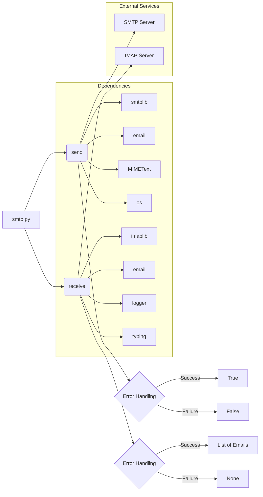

# Code Explanation for hypotez/src/utils/smtp.py

## <input code>

```python
## \file hypotez/src/utils/smtp.py
# -*- coding: utf-8 -*-\
#! venv/Scripts/python.exe
#! venv/bin/python/python3.12

"""
.. module: src.utils 
	:platform: Windows, Unix
	:synopsis: SMTP Email Interface

"""
MODE = 'dev'


""" This module provides functionality to send and receive emails using an SMTP or IMAP server.
It includes functions to send emails using SMTP and retrieve emails using IMAP.

Functions:
    - `send(subject: str = '', body: str = '', to: str = 'one.last.bit@gmail.com') -> bool`
      Sends an email using the SMTP server specified in the `_connection` dictionary.  Returns `True` on success, `False` on failure.  Includes error logging.
    
    - `receive(imap_server: str, user: str, password: str, folder: str = 'inbox') -> Optional[List[Dict[str, str]]]`
      Retrieves emails from an IMAP server and returns them as a list of dictionaries.  Returns `None` on error. Includes error logging.


** Important Considerations for Security and Robustness **:

    - **_connection Dictionary:** Do *not* hardcode credentials in this file.  Move the `_connection` dictionary to environment variables (e.g., using `os.environ`). This is crucial for security.  Avoid storing passwords directly in source code.

    - **Error Handling:** The code includes robust error handling, logging exceptions with details (subject, body, etc.).  This is very helpful for debugging.

    - **Email Parsing:** The `receive` function handles various email formats gracefully, preventing potential issues.

    - **MIME Handling:**  The code correctly uses `MIMEText` for constructing the email message, crucial for sending basic text emails.


"""

import smtplib
import imaplib
import email
import os
from email.mime.text import MIMEText
from typing import List, Dict, Optional

from src.logger import logger

# --- Configuration ---
# DO NOT HARDCODE CREDENTIALS HERE!  Use environment variables instead.
_connection = {
    'server': os.environ.get('SMTP_SERVER', 'smtp.example.com'),
    'port': int(os.environ.get('SMTP_PORT', 587)),
    'user': os.environ.get('SMTP_USER'),
    'password': os.environ.get('SMTP_PASSWORD'),
    'receiver': os.environ.get('SMTP_RECEIVER', 'one.last.bit@gmail.com')
}


def send(subject: str = '', body: str = '', to: str = 'one.last.bit@gmail.com') -> bool:
    """Sends an email.  Returns True if successful, False otherwise. Logs errors."""
    try:
        # Create SMTP connection
        smtp = smtplib.SMTP(_connection['server'], _connection['port'])
        smtp.ehlo()
        smtp.starttls()
        smtp.login(_connection['user'], _connection['password'])

        message = MIMEText(body)
        message["Subject"] = subject
        message["From"] = _connection['user']
        message["To"] = to

        smtp.sendmail(_connection['user'], to, message.as_string())
        smtp.quit()
        return True

    except Exception as ex:
        logger.error(f"Error sending email. Subject: {subject}. Body: {body}. Error: {ex}", exc_info=True)
        return False


def receive(imap_server: str, user: str, password: str, folder: str = 'inbox') -> Optional[List[Dict[str, str]]]:
    """Retrieves emails. Returns a list of email dictionaries if successful, None otherwise. Logs errors."""
    try:
        mail = imaplib.IMAP4_SSL(imap_server)
        mail.login(user, password)
        mail.select(folder)

        status, data = mail.search(None, 'ALL')
        email_ids = data[0].split()

        emails = []
        for email_id in email_ids:
            status, data = mail.fetch(email_id, '(RFC822)')
            raw_email = data[0][1]
            msg = email.message_from_bytes(raw_email)

            email_data = {
                'subject': msg['subject'],
                'from': msg['from'],
                'body': msg.get_payload(decode=True, _charset="utf-8").decode("utf-8", "ignore")  # Decode & handle potential errors
            }
            emails.append(email_data)

        mail.close()
        mail.logout()
        return emails

    except Exception as ex:
        logger.error(f"Error occurred while retrieving emails: {ex}", exc_info=True)
        return None
```

## <algorithm>

**Email Sending (send function):**

1. **Establish Connection:** Connect to SMTP server using provided credentials from the `_connection` dictionary (obtained from environment variables).
2. **Authentication:** Authenticate with SMTP server.
3. **Compose Email:** Construct email message using `MIMEText`.
4. **Send Email:** Send email using `sendmail` method.
5. **Close Connection:** Close SMTP connection.
6. **Error Handling:** Catch exceptions and log errors with details.

**Example:**
```
subject = "Hello"
body = "Testing email"
to = "recipient@example.com"
result = send(subject, body, to)  # Returns True or False based on success
```

**Email Receiving (receive function):**

1. **Connect to IMAP Server:** Connect to IMAP server using provided `imap_server`, `user` and `password`.
2. **Select Folder:** Select the inbox folder.
3. **Search for Emails:** Search for all emails in the specified folder.
4. **Fetch Email Data:** Fetch each email's raw data.
5. **Parse Email Data:** Parse raw email data to extract subject, sender, and body.  Handle potential decoding errors.
6. **Store Email Data:** Store the parsed email data in a list of dictionaries.
7. **Close Connection:** Close IMAP connection.
8. **Error Handling:** Catch exceptions and log errors.

**Example:**
```
imap_server = "imap.example.com"
user = "user@example.com"
password = "password"
emails = receive(imap_server, user, password) # Returns a list of email dictionaries or None
```

## <mermaid>



**Dependencies Explanation:**

- `smtplib`: For interacting with SMTP servers.
- `imaplib`: For interacting with IMAP servers.
- `email`: For handling email messages (parsing and composing).
- `os`: For interacting with the operating system (environment variables).
- `MIMEText`: For creating email messages.
- `typing`: For type hinting.
- `logger`: (imported from `src.logger`)  Likely for logging exceptions and important messages. This indicates a dependency on a logging module within the `src` package.


## <explanation>

**Imports:**

- `smtplib`, `imaplib`, `email`: Standard libraries for interacting with email servers.
- `os`: For interacting with environment variables.
- `MIMEText`: A specific class for creating email messages, part of the `email` module.
- `typing`: Allows for type hints to improve code readability and maintainability.
- `logger`: An imported module from the `src.logger` package, likely for handling logs and errors related to email operations.

**Classes:**

- No custom classes are defined. The code uses standard Python libraries' classes.

**Functions:**

- `send(subject, body, to)`: Sends an email with a specified subject, body, and recipient. Returns `True` on success, `False` on failure, logging errors.
- `receive(imap_server, user, password, folder)`: Retrieves emails from an IMAP server, returning a list of email dictionaries if successful, or `None` on failure. This handles email parsing.

**Variables:**

- `_connection`: A dictionary containing SMTP server details (host, port, username, password).  Crucially, it's populated using environment variables to improve security.  If environment variables are not set, default values are used (e.g., `smtp.example.com` for the server).

**Potential Errors and Improvements:**

- **Security:** Hardcoded credentials are avoided by using environment variables. However, the code still expects them to be set; consider a check to ensure these environment variables are set (e.g., printing a message if they are not) to provide better error handling.
- **Robustness:** The `receive` function correctly handles decoding email bodies with error handling to deal with various email formats.  
- **Error Logging:** Using `logger` for error handling is an improvement over printing to the console; consider adding more descriptive messages in the logs (e.g., indicating the specific email ID that caused an error if applicable).
- **Advanced Email Handling:**  While this code works well for basic text emails, consider adding support for handling attachments and different MIME types if the application requires it.

**Relationship with other parts of the project:**

The `logger` module imported from `src.logger` suggests a broader project structure with a dedicated logging system. This module is likely part of the application's infrastructure and used for central logging and potentially for various parts of the project.