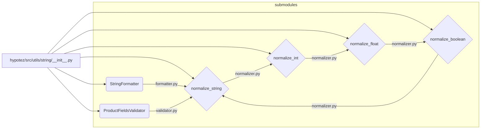

# Code Explanation for hypotez/src/utils/string/__init__.py

## <input code>

```python
## \file hypotez/src/utils/string/__init__.py
# -*- coding: utf-8 -*-\

#! venv/bin/python/python3.12

"""
.. module: src.utils.string 
	:platform: Windows, Unix
	:synopsis:

"""


from .formatter import StringFormatter
from .validator import ProductFieldsValidator
from .normalizer import (
		normalize_string,
		normalize_int,
		normalize_float,
		normalize_boolean,
)
```

## <algorithm>

This file acts as an entry point for the `string` utility module.  It imports necessary components from submodules within the `utils/string` directory.  No significant logic or processing happens in this file itself.  It simply provides access points to the functionalities defined in the other modules.

There is no algorithm involving multiple steps or data flow, since it's only importing modules.

## <mermaid>



**Dependency Analysis:**

The diagram shows the dependencies within the `utils/string` package. The `__init__.py` file imports functionalities from the `formatter.py`, `validator.py`, and `normalizer.py` files.


## <explanation>

* **Imports:**
    * `from .formatter import StringFormatter`: Imports the `StringFormatter` class from the `formatter.py` module within the same directory.  Likely for formatting strings.
    * `from .validator import ProductFieldsValidator`: Imports the `ProductFieldsValidator` class from the `validator.py` module within the same directory. This is likely for validating product-related fields based on defined rules.
    * `from .normalizer import normalize_string, normalize_int, normalize_float, normalize_boolean`: Imports several functions for normalizing different data types (strings, integers, floats, booleans). This is suggestive of a data preprocessing/sanitization task.

    The `.` in the import statements indicates that the modules are located within the same directory as `__init__.py`.  This is a common way to structure packages in Python.


* **Classes:**
    * `StringFormatter`: (Implied) A class responsible for formatting string values.
    * `ProductFieldsValidator`:  (Implied) A class designed for verifying the structure and correctness of data fields related to product information.


* **Functions:**
    * `normalize_string`, `normalize_int`, `normalize_float`, `normalize_boolean`: (Implied) Functions are likely for transforming different data types into a consistent or suitable format for the system's use. These functions are likely part of a data preprocessing/cleaning pipeline.


* **Variables:**
    * ``: A global variable likely used to control the behavior of the modules based on the current operating mode (development, testing, production). This is typical of setting flags for different modes of operation.


* **Potential Errors/Improvements:**

    * No explicit error handling is present, which could be a drawback.   The imports are straightforward. Consider adding error handling and input validation for input robustness.
    * Comments could be enhanced to improve understanding, especially for clarifying the purpose of the imported modules.


* **Relationship to other parts of the project:**

    The `utils/string` module is likely a supporting module for other parts of the project, potentially involved in processing and validating user inputs or data related to products in the main application.


This analysis highlights that the provided file provides essential access points to functionality in other modules within the project for string formatting, validation, and normalization.