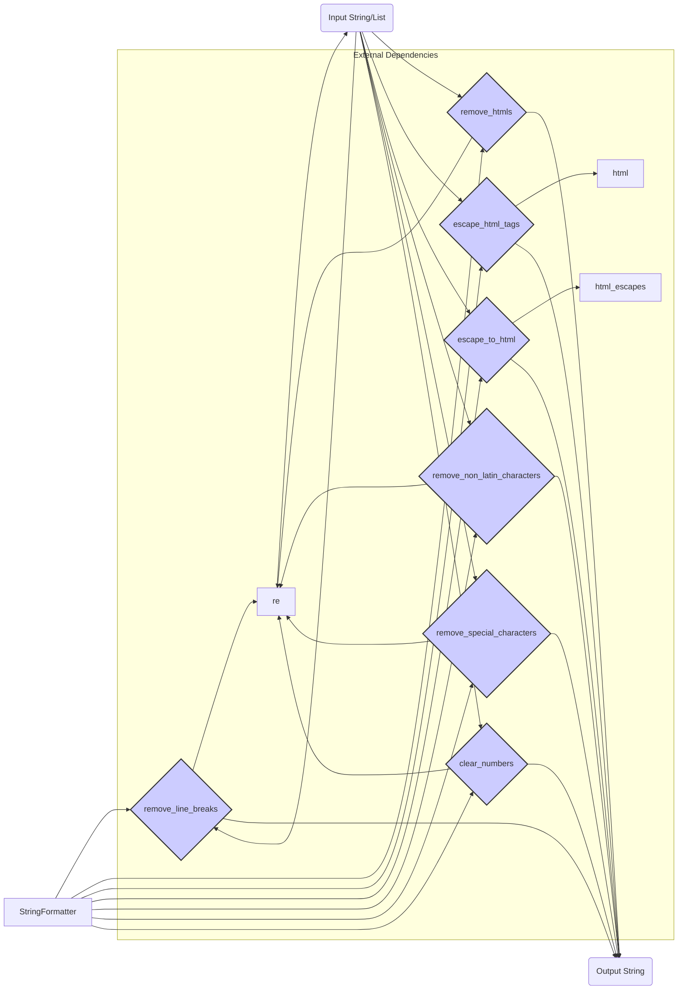

# <input code>

```python
## \file hypotez/src/utils/string/formatter.py
# -*- coding: utf-8 -*-\

#! venv/bin/python/python3.12

"""
.. module: src.utils.string 
	:platform: Windows, Unix
	:synopsis: String formatting functions.

Functions:
    - remove_line_breaks(input_str: str) -> str
    - remove_htmls(input_html: str) -> str
    - escape_html_tags(input_html: str) -> str
    - escape_to_html(text: str) -> str
    - remove_non_latin_characters(input_str: str) -> str
    - remove_special_characters(input_str: str | list) -> str
    - clear_numbers(input_str: str) -> str

Data transformation:
    - convert_to_list(input: str | list[str, dict, list[dict]], delimiter: str = ',') -> list
    - extract_value_from_parentheses_with_lead_dollar(input_str: str) -> str | list | bool
    - clean_url_from_protocols(url: str) -> str
"""

import re
import html
from typing import List, Dict
from urllib.parse import urlparse, parse_qs
from src.logger import logger
from .html_escapes import html_escapes

class StringFormatter:
    """
    StringFormatter (String Formatting):

    Provides utility functions for formatting strings, such as removing line breaks, HTML tags, non-Latin characters, and special characters.
    """

    @staticmethod
    def remove_line_breaks(input_str: str) -> str:
        """ Removes line breaks from the input string.

        Args:
            input_str (str): Input string.

        Returns:
            str: A string with line breaks removed.
        """
        return input_str.replace("\\n", " ").replace("\\r", " ").strip()

    @staticmethod
    def remove_htmls(input_html: str) -> str:
        """ Removes HTML tags from the input string.

        Args:
            input_html (str): Input HTML string.

        Returns:
            str: A string with HTML tags removed.
        """
        return re.sub(r'<.*?>', '', input_html).strip()

    @staticmethod
    def escape_html_tags(input_html: str) -> str:
        """ Replaces `<` and `>` with `&lt;` and `&gt;` in the input HTML string.

        Args:
            input_html (str): Input HTML string.

        Returns:
            str: An escaped HTML string.
        """
        return html.escape(input_html)

    @staticmethod
    def escape_to_html(text: str) -> str:
        """ Replaces characters with their HTML escape sequences.

        Args:
            text (str): Input text.

        Returns:
            str: Text with characters replaced by HTML escape sequences.
        """
        return ''.join(html_escapes.get(char, char) for char in text)

    @staticmethod
    def remove_non_latin_characters(input_str: str) -> str:
        """ Removes non-Latin characters from the input string.

        Args:
            input_str (str): Input string.

        Returns:
            str: A string with non-Latin characters removed.
        """
        return re.sub(r'[^a-zA-Z\s]', '', input_str).strip()

    @staticmethod
    def remove_special_characters(input_str: str | list) -> str | list:
        """ Removes special characters not allowed in specific contexts.

        Args:
            input_str (str | list): Input string or list of strings.

        Returns:
            str | list: Processed string or list with special characters removed.
        """
        if isinstance(input_str, list):
            return [re.sub(r'[^a-zA-Z0-9\s]', '', s) for s in input_str]
        return re.sub(r'[^a-zA-Z0-9\s]', '', input_str)

    @staticmethod
    def clear_numbers(input_str: str) -> str:
        """ Clears the input string, leaving only decimal numbers and points.

        Args:
            input_str (str): Input string.

        Returns:
            str: Cleared string containing only decimal numbers and points.

        Example:
            >>> input_str = 'aaa123.456 cde'
            >>> output_str = StringFormatter.clear_numbers(input_str)
            >>> print(output_str)
            123.456
        """
        return re.sub(r'[^\\d\\.]', '', input_str)
```

# <algorithm>

**Algorithm Workflow:**

The code defines a `StringFormatter` class containing static methods for various string manipulation tasks.

1. **Initialization:** The class doesn't require any initialization. All operations are performed through static methods.

2. **String Formatting Methods:** Each static method handles a specific formatting task:
    * **`remove_line_breaks`**: Replaces newline (`\n`) and carriage return (`\r`) characters with a space and removes leading/trailing whitespace.
    * **`remove_htmls`**: Removes HTML tags using a regular expression.
    * **`escape_html_tags`**: Escapes `<` and `>` characters to `&lt;` and `&gt;` using the `html` module.
    * **`escape_to_html`**: Escapes other characters using a predefined dictionary `html_escapes`.
    * **`remove_non_latin_characters`**: Removes characters that are not Latin letters or whitespace using a regular expression.
    * **`remove_special_characters`**: Removes special characters not allowed in specific contexts. Accepts strings or lists of strings. If a list is provided, it processes each string individually.
    * **`clear_numbers`**: Removes all characters except decimal numbers and periods using a regular expression.

3. **Return Values:** Each method returns the processed string or list, as appropriate.

# <mermaid>



**Explanation of Dependencies:**

* **`re`**: The regular expression module is used for pattern matching and replacement in several string manipulation functions (`remove_htmls`, `remove_non_latin_characters`, `remove_special_characters`, `clear_numbers`).
* **`html`**: The `html` module is used for HTML escaping (`escape_html_tags`).
* **`html_escapes`**: This is likely a local module (`./html_escapes.py`) containing a dictionary for mapping characters to their HTML escape sequences used by the `escape_to_html` function. This is a crucial dependency within the project, likely handling a broad set of character mappings.
* **`src.logger`**: This is a custom logger used for logging purposes, likely a part of the project's logging framework. Its presence highlights a chain of dependencies with other parts of the project.

# <explanation>

* **Imports:**
    * `re`: Used for regular expression operations, crucial for pattern matching and replacing parts of strings.
    * `html`: Used for HTML escaping, essential for securely generating HTML output by replacing characters that could be interpreted as HTML markup.
    * `typing`: Provides type hints for clarity and type checking.
    * `urllib.parse`: Used for parsing URLs, but only `urlparse` and `parse_qs` are used in this file.
    * `src.logger`: Used for logging information relevant to the string formatting process. This highlights a connection to a wider logging system within the project.
    * `.html_escapes`:  Imports a local module or data structure (`html_escapes.py`) containing a dictionary of characters and their corresponding HTML escape sequences.
* **Classes:**
    * `StringFormatter`: This class encapsulates the string formatting utilities. The use of `@staticmethod` means these methods operate independently of any instance of the class; therefore, no `self` parameter is required. This is a common practice in utility classes.
* **Functions:** Each function performs specific tasks in string formatting. The methods are well-documented with detailed docstrings explaining their purpose, arguments, return types, and use cases. The use of type hints clarifies the expected input and output types, promoting code readability and maintainability.
* **Variables:**
    * `MODE`: A string variable likely used for configuration purposes or setting different modes of operation within the project.
* **Potential Errors/Improvements:**

    * **Error Handling:** The code lacks error handling. It assumes input strings are valid.  Adding `try...except` blocks could prevent crashes when the input is unexpected (e.g., `None`, a malformed string).
    * **`html_escapes`**:  The `html_escapes` module is not defined within the provided code. It's a potential dependency or custom data structure that needs to be checked.


* **Relationship with Other Parts of the Project:** The `src.logger` import indicates a dependency on a logging mechanism.  The project likely has other parts that rely on this formatted string output. The use of regular expressions and HTML escaping indicates the code's probable use within a larger system that interacts with and manipulates textual data.