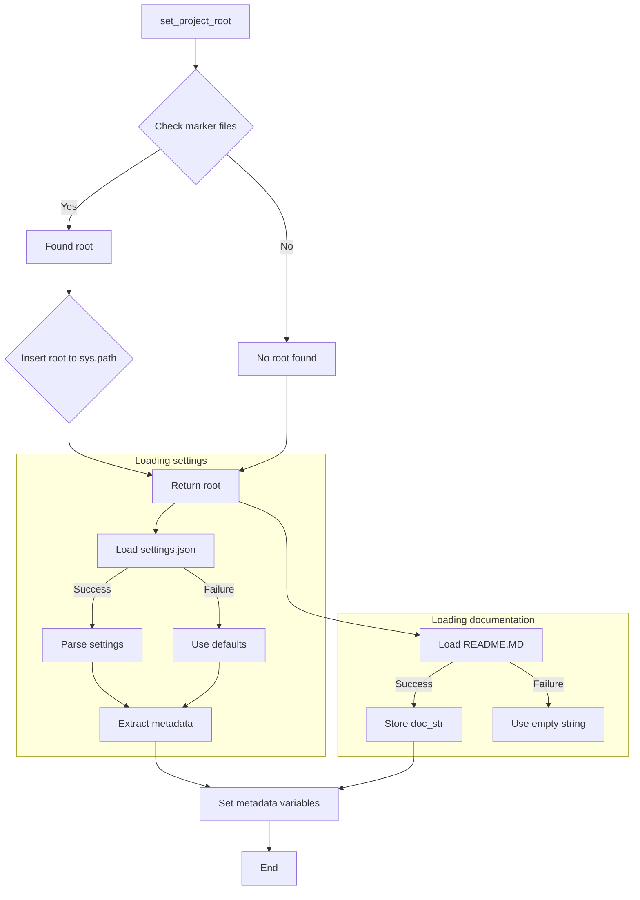

# Code Explanation for hypotez/src/utils/string/header.py

## <input code>

```python
## \file hypotez/src/logger/header.py
# -*- coding: utf-8 -*-\
#! venv/Scripts/python.exe
#! venv/bin/python/python3.12

"""
module: src.logger 
	:platform: Windows, Unix
	:synopsis: Модуль определяющий корневой путь к проекту. Все импорты строятся относительно этого пути.
    :TODO: В дальнейшем перенести в системную переменную"""


import sys
import json
from packaging.version import Version

from pathlib import Path
def set_project_root(marker_files=('__root__','.git')) -> Path:
    """
    Finds the root directory of the project starting from the current file's directory,
    searching upwards and stopping at the first directory containing any of the marker files.

    Args:
        marker_files (tuple): Filenames or directory names to identify the project root.
    
    Returns:
        Path: Path to the root directory if found, otherwise the directory where the script is located.
    """
    __root__:Path
    current_path:Path = Path(__file__).resolve().parent
    __root__ = current_path
    for parent in [current_path] + list(current_path.parents):
        if any((parent / marker).exists() for marker in marker_files):
            __root__ = parent
            break
    if __root__ not in sys.path:
        sys.path.insert(0, str(__root__))
    return __root__


# Get the root directory of the project
__root__ = set_project_root()
"""__root__ (Path): Path to the root directory of the project"""


from src import gs

settings:dict = None
try:
    with open(gs.path.root / 'src' /  'settings.json', 'r') as settings_file:
        settings = json.load(settings_file)
except (FileNotFoundError, json.JSONDecodeError):
    ...

doc_str:str = None
try:
    with open(gs.path.root / 'src' /  'README.MD', 'r') as settings_file:
        doc_str = settings_file.read()
except (FileNotFoundError, json.JSONDecodeError):
    ...


__project_name__ = settings.get("project_name", 'hypotez') if settings  else 'hypotez'
__version__: str = settings.get("version", '')  if settings  else ''
__doc__: str = doc_str if doc_str else ''
__details__: str = ''
__author__: str = settings.get("author", '')  if settings  else ''
__copyright__: str = settings.get("copyrihgnt", '')  if settings  else ''
__cofee__: str = settings.get("cofee", "Treat the developer to a cup of coffee for boosting enthusiasm in development: https://boosty.to/hypo69")  if settings else "Treat the developer to a cup of coffee for boosting enthusiasm in development: https://boosty.to/hypo69"
```

## <algorithm>

1. **`set_project_root(marker_files)`**:
    * Takes a tuple of marker files as input.
    * Starts from the directory of the current file (`__file__`).
    * Iterates through parent directories until a directory containing at least one of the marker files is found.
    * If found, sets `__root__` to that directory.
    * Inserts `__root__` into `sys.path` if it's not already there.
    * Returns the `__root__` directory.
    * **Example:** If `__file__` is in `/path/to/project/src/utils/string/header.py` and `pyproject.toml` exists in `/path/to/project`, the function will return `/path/to/project`.

2. **Initialization**:
   * Calls `set_project_root` to get the root directory.
   * **Example:** If the project root is `/path/to/project`, `__root__` will be `/path/to/project`.

3. **Loading settings**:
    * Tries to load `settings.json` from `/path/to/project/src/settings.json`.
    * **Example:**  If the file exists and is valid JSON, `settings` will be a dictionary.
    * Uses a `try...except` block to gracefully handle `FileNotFoundError` and `json.JSONDecodeError` if the file doesn't exist or is invalid JSON.

4. **Loading documentation**:
    * Tries to load `README.MD` from `/path/to/project/src/README.MD`.
    * **Example:** If the file exists, `doc_str` will contain the README's content.
    * Uses a `try...except` block to gracefully handle `FileNotFoundError` and `json.JSONDecodeError`.

5. **Extracting metadata**:
    * Extracts `project_name`, `version`, `author`, `copyright`, and other metadata from the loaded `settings` if available.
    * Defaults to fallback values if `settings` is `None` or the key isn't present.
    * **Example:** If `project_name` is not found in `settings`, `__project_name__` will be 'hypotez'.

## <mermaid>



**Dependencies Analysis:**

* `sys`: Provides access to system-specific parameters and functions.
* `json`: Used for encoding and decoding JSON data.
* `packaging.version`: Used to handle different version formats (likely not crucial for this specific part).
* `pathlib`: Used for path manipulation in a platform-independent way.

## <explanation>

* **Imports**:
    * `sys`: Used for manipulating the Python path (`sys.path`).
    * `json`: Used for reading and parsing the `settings.json` file.
    * `packaging.version`: Used for handling different version formats.  While not directly used in this header, it's a good practice to include it if the project deals with version numbers.
    * `pathlib`: Provides a more object-oriented and platform-independent way to work with file paths.

* **Classes**: No classes are defined in this code.


* **Functions**:
    * `set_project_root(marker_files)`:
        * **Arguments:** `marker_files` (tuple): A tuple of filenames or directory names used to locate the project root.
        * **Return value:** `Path`: The path to the project root directory.
        * **Functionality:** This function is crucial for ensuring that the code can find the project's root directory regardless of the current working directory.

* **Variables**:
    * `__root__`: Stores the path to the project root.
    * `settings`: Stores the loaded data from `settings.json`.
    * `doc_str`: Stores the content of `README.MD`.
    * `__project_name__`, `__version__`, etc.: Store extracted metadata from `settings.json` (or defaults if not found).

* **Potential Errors/Improvements**:
    * **Error Handling:** The `try...except` blocks are good for robustness, preventing the script from crashing if `settings.json` or `README.MD` is missing or corrupted.
    * **Explicit type hints:** Using type hints (`-> Path`, `:dict`, etc.) improve code readability and maintainability.
    * **`gs` module**: The code depends on a `gs` module (not shown). It's unclear how it's defined or used. This could be a source of confusion or potential issues if `gs.path` is not correctly defined. Adding the definition of `gs.path` would significantly improve understanding and maintainability.
    * **Settings file format:**  The JSON format of `settings.json` is expected.  Adding validation or a different parsing method would improve robustness if other data types are possible.


**Relationship with other parts of the project:**

The `gs` module and the `settings.json` file are crucial for how this code interacts with other parts of the project. The structure implicitly expects a project-wide convention for finding and storing configuration.